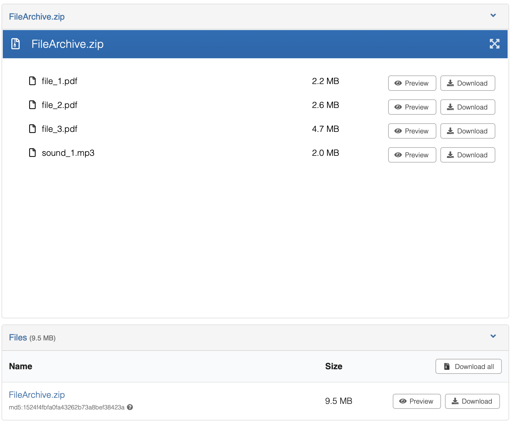

# ZIP and container files

_Introduced in InvenioRDM v14_

InvenioRDM v14 adds support for ZIP archives as **container files**: record files whose internal structure the 
system understands and can expose. Users can browse the contents of a ZIP directly in the record landing page, 
preview individual files inside the archive, and download specific files or folders without retrieving the entire archive.



The feature is designed to be extensible. Additional container formats can be supported by implementing the 
`FileExtractor` interface and registering the handler for the relevant extension. See the 
[architecture documentation](../../../maintenance/architecture/records.md#container-files) for an overview of how the 
component model works.

## Enabling the ZIP previewer

By default, ZIP files are treated as opaque binary blobs and offered only for download. To enable container browsing 
and in-UI preview, replace the original `zip` previewer with `previewable_zip` in your `PREVIEWER_PREFERENCE` list in 
`invenio.cfg`:

```python
PREVIEWER_PREFERENCE = [
    "csv_papaparsejs",
    "pdfjs",
    "iiif",
    "simple_image",
    "json_prismjs",
    "xml_prismjs",
    "mistune",
    "video_videojs",
    "audio_videojs",
    "ipynb",
    "previewable_zip",  # replaces the old "zip" entry
    "txt",
]
```

Adding `previewable_zip` tells InvenioRDM to render ZIP files using the container browser UI on the record landing page,
rather than offering a plain download link.


## Configuring previews inside archives

A new configuration variable, `CONTAINER_ITEM_PREVIEWER_PREFERENCE`, holds previewers that work for items contained 
inside ZIP files. Currently, all standard previewers except IIIF are supported. IIIF requires additional image server 
links that are not available for container items.

This variable follows the same format as `PREVIEWER_PREFERENCE` but is applied to container items rather than top-level 
record files.

```python
CONTAINER_ITEM_PREVIEWER_PREFERENCE = [
    "csv_papaparsejs",
    "pdfjs",
    "simple_image",
    "json_prismjs",
    "xml_prismjs",
    "mistune",
    "video_videojs",
    "audio_videojs",
    "ipynb",
    "zip",
    "txt",
]
```

## ZIP processing limits

In invenio-records-resources, new configuration variables have been added to configure ZIP formats and provide defaults 
for ZIP validity checks, maximum listing entries, maximum header size, and extracted-stream chunk size. These are 
checked at upload time.

| Variable | Default | Description |
| -------- | ------- | ----------- |
| `RECORDS_RESOURCES_ZIP_FORMATS` | `[".zip"]` | File extensions treated as ZIP archives by the ZIP extractor. |
| `RECORDS_RESOURCES_ZIP_MAX_LISTING_ENTRIES` | `1000` | Maximum entries returned in a single listing response. Listings are truncated beyond this limit. |
| `RECORDS_RESOURCES_ZIP_MAX_ENTRIES` | `10000` | Maximum total entries allowed in a ZIP archive. Archives exceeding this limit cannot be listed or extracted via the API. |
| `RECORDS_RESOURCES_ZIP_MAX_TOTAL_UNCOMPRESSED` | `524288000` | Maximum total uncompressed size of all entries, in bytes (500 MB). |
| `RECORDS_RESOURCES_ZIP_MAX_HEADER_SIZE` | `65536` | Maximum size of the ZIP central directory preloaded into memory, in bytes (64 KB). |
| `RECORDS_RESOURCES_ZIP_MAX_RATIO` | `200.0` | Maximum allowed compression ratio (uncompressed / compressed size). Protects against ZIP bomb attacks. |
| `RECORDS_RESOURCES_EXTRACTED_STREAM_CHUNK_SIZE` | `65536` | Chunk size in bytes used when streaming extracted content (64 KB). |

Override any of these in `invenio.cfg`:

```python
RECORDS_RESOURCES_ZIP_MAX_LISTING_ENTRIES = 500
RECORDS_RESOURCES_ZIP_MAX_ENTRIES = 5000
RECORDS_RESOURCES_ZIP_MAX_TOTAL_UNCOMPRESSED = 200 * 1024 * 1024  # 200 MB
RECORDS_RESOURCES_ZIP_MAX_HEADER_SIZE = 128 * 1024  # 128 KB
RECORDS_RESOURCES_ZIP_MAX_RATIO = 100.0
RECORDS_RESOURCES_EXTRACTED_STREAM_CHUNK_SIZE = 128 * 1024  # 128 KB
```

## Supported formats and extensibility

By default, files with extensions listed in the RECORDS_RESOURCES_ZIP_FORMATS configuration (default: [".zip"]) are 
automatically processed as ZIP containers.

Support for additional container formats can be added by implementing the `FileExtractor` interface in 
`invenio-records-resources` and registering it for the relevant file extension. See the 
[architecture documentation](../../../maintenance/architecture/records.md#container-files) for details.