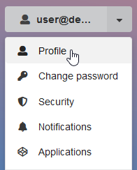
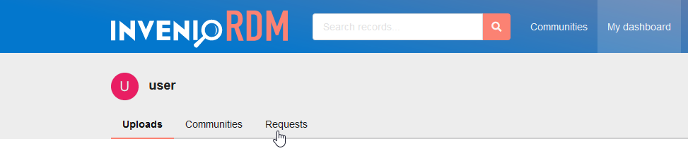
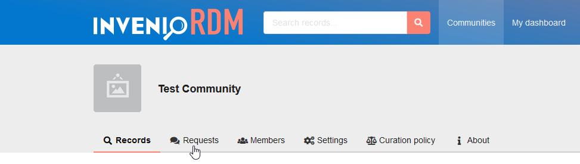

# Change Menus/Tabs

For navigation, InvenioRDM often uses menus or tabs. For example, one such menu is the user-dropdown menu:



And one such set of tabs is at the top of the user-dashboard:



In the codebase, menus and sets of tabs like those are referred as *menus*, so we do so here for the remainder of this how-to as well.
Their options (e.g., "Uploads", "Profile") are referred as *submenus*.

These *menus* can be configured in the following ways:

- which submenus to show
- what title-text to show in those submenus
- which endpoint to request when clicking them
- how to dynamically show/hide them (e.g. depending on currently logged-in user)

## Configurable Properties

Properties of existing submenus can be overridden,
properties of newly added submenus can be freely chosen.
All submenus share the following properties:

| Name           | Example values                       | Notes                                               |
|----------------|--------------------------------------|-----------------------------------------------------|
| `endpoint`     | `"invenio_app_rdm_users.uploads"`    | flask-endpoint requested when clicking this submenu |
| `order`        | `1`, `2`, `10`, `-1`, `1.5`          | lower ordered submenus are shown further left       |
| `text`         | `_("Uploads")`, `_("Communities")`   | title-text shown on submenus                        |
| `visible_when` | `flask_menu.menu.CONDITION_TRUE`     | when to show this submenu<br />- must be of type `callable[[], bool]`<br />- `CONDITION_TRUE` is just a named `lambda: True`<br />- use `CONDITION_FALSE` to hide a submenu |
| ...            | ...                                  | in addtion to the above properties, all arguments for `flask_menu.menu:MenuNode.register` are configurable |

For example, consider the user-dashboard pictured above.
Its *Uploads* submenu has the following default configuration:
```python
{
    "endpoint": "invenio_app_rdm_users.uploads",
    "order": 1,  # small number as to show this submenu left-most
    "text": _("Uploads"),
    "visible_when": flask_menu.menu.CONDITION_TRUE,  # always show this submenu
    ...,  # advanced configuration properties omitted for brevity
}
```

## Add new submenus to existing menu

Existing menus can be extended by custom-configured submenus.
To add a new submenu to an existing menu:

1. Get the name of the to-be-added-to menu from the [list of menus](#list-of-menus)
  For example, the user-dashboard is named `"dashboard"` (most names of menus/submenus are straightforward).
2. Write a function that registers the new submenu
  ```python
  # ext.py  # ext.py is commonly used, you may use another file though

  from flask_menu import current_menu
  from invenio_i18n import lazy_gettext as _  # for translations

  def finalize_app():
      # get the user-dashboard menu via its name "dashboard":
      user_dashboard_menu = current_menu.submenu("dashboard")

      # register a new submenu to the user-dashboard:
      user_dashboard_menu.register(
          "name-of-submenu",
          endpoint="my_blueprint.my_endpoint",
          order=4,  # the three already existing submenus have `order` 1 through 3
          text=_("Title of new Submenu"),  # could also use an untranslated bare string
          # note: could add other properties here, otherwise their default is used
          # note: `visible_when` defaults to always visible
      )

      ...  # could .register more submenus here (or do so in another package)
  ```
3. Register your function with the `invenio_base.finalize_app` entrypoint.
  This will make your function be called at the app-finalization build-step.
  For example, when using setuptools' `setup.cfg` with your python package, add:
  ```ini
  # setup.cfg

  [options.entry_points]
  invenio_base.finalize_app =
      my_package_name = my_package_name.ext:finalize_app
  ```

!!! info "For entrypoints to take effect"
    For entrypoint changes to be picked up, you will need to reinstall the python package.
    *This is necessary even if the package is installed editably!*

    After entrypoint changes are picked up,
    you will further need to restart the server for changes to take effect:
    ```shell
    <CTRL+C>
    invenio-cli run
    ```

## Modify existing submenus

The defaults of submenus' properties are selectively overridable via config-variables.
To modify an existing submenu's properties:

1. find the name of the corresponding override-variable in the [list of menus](#list-of-menus)
  For example, the override-variable for the user-dashboard is named `USER_DASHBOARD_MENU_OVERRIDES`.
2. find the name of the to-be-overridden submenu in that same [list of menus](#list-of-menus)
  For example, the user-dashboard has a submenu for communities.
  This submenu is named (obviously enough) `"communities"`.
3. Add to your `invenio.cfg`:
  ```python
  # invenio.cfg

  from flask_menu.menu import CONDITION_FALSE

  USER_DASHBOARD_MENU_OVERRIDES = {
      "communities": {
          "visible_when": CONDITION_FALSE,
          # other properties will be left unchanged
      }
      # other submenus will be left unchanged
  }
  ```

The above example hides the *Communities* submenu from the user-dashboard menu
by overriding its `visible_when` property.
For other overridable properties see [configurable properties](#configurable-properties).

!!! info "Have you tried to turn it off and on again?"
    You will need to restart the server for changes to take effect:
    ```shell
    <CTRL+C>
    invenio-cli run
    ```

!!! warning "On overriding user-added submenus: DON'T"
    Currently, (sub)menu-overrides are adopted at app-finalization.
    Users adding their own submenus (as described above) is also done at app-finalization.
    Hence attempting to override submenus added by (other) users depends on
    loading order of app-finalization entrypoints and might break anytime.

## List of menus

The following list of menus is non-exhaustive.
Not all menus are overridable, but all menus can be extended by additional submenus.

| Image | Description | Name of menu and its submenus | Name of override-variable |
|-------|-------------|-------------------------------|---------------------------|
|  | Dashboard on user's personal page | `"dashboard"`<br />├─`"uploads"`<br />├─`"communities"`<br /> └─`"requests"` | `USER_DASHBOARD_MENU_OVERRIDES` |
|  | Dashboard on communities page | `"communities"`<br />├─`"home"`<br />├─`"search"`<br />├─`"requests"`<br />├─`"submit"`<br />├─`"members"`<br />├─`"settings"`<br />├─`"curation_policy"`<br />└─`"about"` | No associated override-variable |
|  | User settings menu | `"settings"`<br />├─`"profile"`<br />├─`"change_password"`<br />├─`"security"`<br />├─`"notifications"`<br />├─`"oauthclient"`<br />└─`"applications"` | No associated override-variable |
