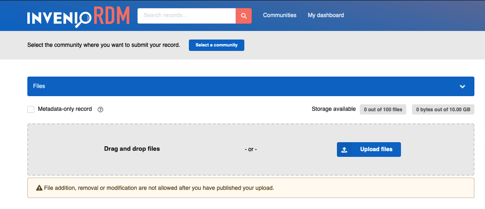
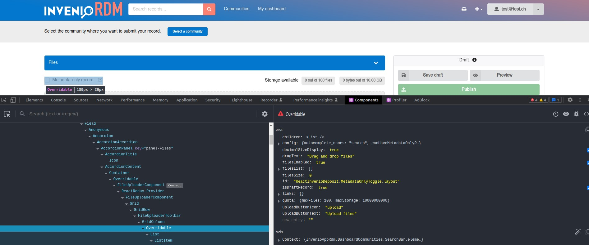
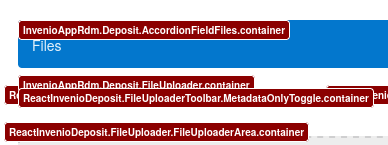

# How to override UI React components

*Introduced in InvenioRDM v11*

This documentation is targeted to developers who want to customize specific UI React components in an instance.
For this guide, we assume that you are familiar with React and JavaScript.

## Override React components

!!! warning "Experimental feature"

    You can now override React components following this guide. However, the overriding mechanism in InvenioRDM v11 is not finalized
    and it has a few limitations. Be aware that future releases of InvenioRDM might introduce breaking changes. We will document them
    as extensively as possible.

    **Use it at your own risk!**

The UI of InvenioRDM is composed of classic HTML web pages for mostly static content, and React web apps for very dynamic content to enhance the user experience.
While a [dedicated guide](./templates.md) describes how to override HTML web pages (Jinja templates), this guide focus on how to override React components.

InvenioRDM uses the React library [`react-overridable`](https://github.com/indico/react-overridable). The library provides a mechanism to mark React components as "overridable" by ID.
Developers can define a mapping which is then applied when each React component is rendered.
The override can be specified in one of three ways:

- completely replacing a component with a custom one
- a static override of the props passed to the component
- a 'dynamic' override of the props based on the form's state

As example for this guide, you will learn how to override the UI React component **in the upload form that marks a record as "Metadata only"**. More specifically, you will replace the "Metadata-only record" checkbox with a toggle, a "switch-like" component.



## Guided example

### 1. Identify which component to override

At the moment, the easiest way to understand how to identify if the component that you want to override is a classic HTML component or a React component is to use the Developer Tools in your browser (e.g. [Chrome](https://developer.chrome.com/docs/devtools/) or [Firefox DevTools](https://firefox-source-docs.mozilla.org/devtools-user/)). You can inspect the code and take advantage of some useful [React browser extensions](https://beta.reactjs.org/learn/react-developer-tools) to select and inspect elements:



You can then find the component in the InvenioRDM modules source code, searching it in your local development environment or using the search feature in GitHub in the [inveniosoftware organization](https://github.com/search?q=org%3Ainveniosoftware+FileUploaderToolbar&type=code).

You can always [ask for help](../../../install/troubleshoot.md#getting-help)!

### 2. Find the React Overridable ID

The easiest way to to find the ID of an overridable component is to use `react-overridable`'s built-in developer tool.
Simply open a browser console on your local instance and call the global function `reactOverridableEnableDevMode()`.
All overridable components will display a small red overlay tag showing their ID.
You can click a tag to copy its ID to your clipboard.



The React component's overridable ID for the '`Metadata-only record`' checkbox component is `InvenioRdmRecords.DepositForm.FileUploaderToolbar.MetadataOnlyToggle`. It can be found in the [`invenio-rdm-records`](https://github.com/inveniosoftware/invenio-rdm-records/blob/dd72962b713f07b81699f7d5c9a8a673d585466a/invenio_rdm_records/assets/semantic-ui/js/invenio_rdm_records/src/deposit/fields/FileUploader/FileUploaderToolbar.js#L56) module.

### 3. Find or create the mapping file

In new InvenioRDM v11 or above installations, a near-empty file named `mapping.js` is available at the following path in your `assets` folder:

```terminal
├── assets
|   ├── js
|   |   ├── invenio_app_rdm
|   |   |   ├── overridableRegistry
|   |   |   |   ├── mapping.js
```

For existing installations, you will have to create it. It is a very simple file:

```javascript
export const overriddenComponents = {};
```

The `const overriddenComponents` is the map that will contain all your future overridden components.

### 4. Create a new component creation

Let's create a new React component, very similar to the default `FileUploaderToolbar`, changing the UI component that will render. In the same file `mapping.js`, add the following code above the `const overriddenComponents`:

```javascript
  import React from "react";
  import { Checkbox } from "semantic-ui-react";
  import { useFormikContext } from "formik";
  import PropTypes from "prop-types";

  const MetadataToggle = (props) => {
    const { filesEnabled } = props;
    const { setFieldValue } = useFormikContext();

    const handleOnChangeMetadataOnly = () => {
      setFieldValue("files.enabled", !filesEnabled);
      setFieldValue("access.files", "public");
    };

    return (
      <Checkbox
        toggle
        label="Metadata-only record"
        onChange={handleOnChangeMetadataOnly}
      />
    );
  };

  export default MetadataToggle;

  MetadataToggle.propTypes = {
    filesEnabled: PropTypes.bool.isRequired,
  };
```

Now, change the map by adding your new component:

```javascript
...

export const overriddenComponents = {
  "InvenioRdmRecords.DepositForm.FileUploaderToolbar.MetadataOnlyToggle": MetadataToggle,
};
```

Lastly, rebuild your assets and run the instance:

```terminal
cd my-site
invenio-cli assets build
invenio-cli run
```

When navigating to the upload form, you should now see your new React component instead of the default:


## Overriding props only

In many cases, you simply want to make a small modification to a component by changing one of its props instead of recreating the component from scratch by yourself.
This can either be done by specifying the desired prop overrides statically, or by expressing them as a function of the form state.

### Static

You can use the `parametrize` function built into `react-overridable`, into which you need to pass the component you wish to override and an object containing your props.
These props will be 'merged' with the existing props, with yours taking precedence over existing ones of the same name.

```javascript
import { parametrize } from "react-overridable"
import { TitlesField } from "@js/invenio_rdm_records"

export const overriddenComponents = {
  "InvenioRdmRecords.DepositForm.TitlesField": parametrize(
    TitlesField,
    {
      helpText: "Describe your resource in a few words"
    }
  )
}
```

### Dynamic

To implement more complex functionality in the deposit form, you can override the props of components by using a custom function.
This allows you to express a range of behaviours:

- hiding fields that are inapplicable to a certain resource type
- changing the label of fields to be more contextually relevant
- marking a field as disabled when its value has been made obvious by the value of another field
- showing certain fields only when a specific community is selected
- etc.

For this, you can use the `dynamicParametrize` function in `react-invenio-forms`, which behaves similarly to `parametrize`.
The callback you pass will be evaluated whenever the form state changes, and the object you return will override the props
passed to the component.

```javascript
import { dynamicParametrize } from "react-invenio-forms"
import { RelatedWorksField } from "@js/invenio_rdm_records"

export const overriddenComponents = {
  "InvenioRdmRecords.DepositForm.TitlesField": dynamicParametrize(
    TitlesField,
    ({ formValues }) => {
      return {
        helpText: `Enter the title of your ${formValue.metadata.resource_type}`
      }
    }
  )
}
```

The callback function is currently passed an object as its single argument, containing the following values:

- `formValues`: the raw values of the entire deposit form as given by Formik. The majority of field values are under the `metadata` key.
- `existingProps`: the props passed to the element before your override.

### Deposit form field props

The built-in fields in the deposit form (e.g. title, description, etc.) have a number of common props to make customizing basic functionality easier.

The following props may be overriden on all built-in fields:

- `label`: the user-facing short label
- `labelIcon`: the ID of the [Semantic UI Icon](https://semantic-ui.com/elements/icon.html) to include in the label
- `helpText`: a small optional text generally shown below the field, providing additional context to the user
- `placeholder`: same as the [HTML attribute](https://developer.mozilla.org/en-US/docs/Web/HTML/Reference/Attributes/placeholder)

Additionally, the following props may be overriden on fields that are not mandatory. 
At the moment, this is all fields except the Resource Type, Title, Publication Date, and Creatibutors.

- `hidden`: if `true`, the field is not rendered at all
    - If a field already had a value before being hidden, this will still be included in the model and will be sent to the server when the form is submitted.
    - Fields retain their values when they are hidden and later re-shown.
- `disabled`: same as the [HTML attribute](https://developer.mozilla.org/en-US/docs/Web/HTML/Reference/Attributes/disabled)
- `required`: if `true`, shows a red asterisk in the field label
    - This does not affect the form validation model on the frontend or the backend, and is purely a stylistic setting.

Many fields have their own props in addition to these. 
Please [view the source code](https://github.com/inveniosoftware/invenio-rdm-records/tree/master/invenio_rdm_records/assets/semantic-ui/js/invenio_rdm_records/src/deposit/fields) for more details.

## Other examples

### Showing/hiding

You can completely hide a field in the deposit form, based on either a static `true`/`false` value or in response to the current state of the form.

To simply permanently hide the field, you can use something like this:

```javascript
export const overriddenComponents = {
  "InvenioRdmRecords.DepositForm.RelatedWorksField": () => null,
};
```

The expression `() => null` above is defining an "empty" component, thus removing it from the deposit form.

To dynamically only show the field when the `image` resource type is selected, you can use the `dynamicParametrize` function.

```javascript
import { dynamicParametrize } from "react-invenio-forms"
import { RelatedWorksField } from "@js/invenio_rdm_records"

export const overriddenComponents = {
  "InvenioRdmRecords.DepositForm.RelatedWorksField": dynamicParametrize(
    TitlesField,
    ({ formValues }) => {
      return {
        hidden: formValues.metadata.resource_type !== "image"
      }
    }
  )
}
```

In order to see more examples in action, you can check the [zenodo-rdm](https://github.com/zenodo/zenodo-rdm) repository!
