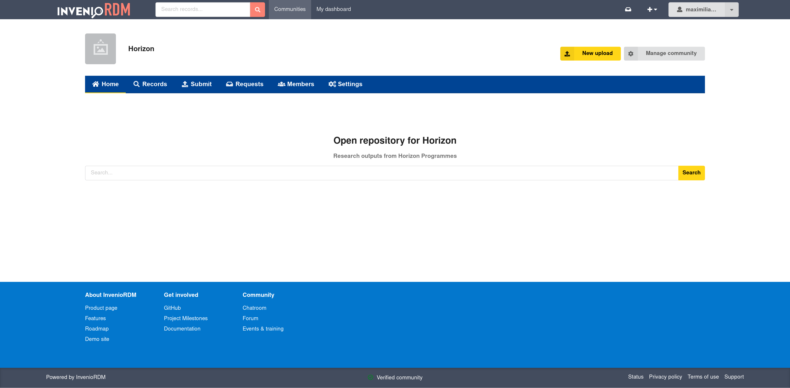

#Themed communities

_Introduced in v13_

Themed Communities allow individual communities on the InvenioRDM platform to have custom visual identities while preserving the overall repository brand. This feature is particularly useful for communities who want their presence on InvenioRDM to reflect their brand identity. Each themed community can customize:

- Customize visual styles
- Override layouts
- Have custom static assets and pages

This document describes how theming and branding can be applied to individual communities in InvenioRDM.

!!! warning
    This feature currently lacks a user-friendly interface for easy configuration and require manual setup.

## How to set up a themed community

### **Step 1: Branding Configuration**

A community's theme is configured via the `theme` field in its metadata. For a community with a identifier `horizon`, we can set up the theme by running the following script in `invenio shell`:

!!! tip
    You can customize the **"theme"** in accordance with your community brand guidelines

```python
from invenio_communities.proxies import current_communities
from invenio_access.permissions import system_identity

service = current_communities.service
horizon = service.read(system_identity, "horizon")
horizon_theme = {
"theme":
    {"brand": "horizon",
     "enabled": True,
     "style":
         {"primaryColor": "#004494",
           "tertiaryColor": "#e3eefd",
           "secondaryColor": "#FFD617",
           "primaryTextColor": "#FFFFFF",
           "tertiaryTextColor": "#1c5694",
           "secondaryTextColor": "#000000",
           "mainHeaderBackgroundColor": "#FFFFFF",
           "font": {"size": "16px", "family": "Arial, sans-serif", "weight": 600},
         }
     }
}

service.update(system_identity, "horizon", {**horizon.data, **horizon_theme})

```

### **Step 2: Template Overriding**

#### For the Community Homepage

All the themed communities have a homepage. To customize the homepage for a themed community with an identifier `horizon`, place your custom template at:

```
templates/themes/horizon
└── invenio_communities/details/home/index.html
```

##### Example template:

```jinja





  {{ super() }}
  <div class="ui rel-m-2 rel-pt-1">
    <div class="ui centered stackable theme-font grid container rel-mt-4 rel-mb-4">
      <div class="thirteen centered wide column">
        <h1 class="ui large header">{{ _("Open repository for Horizon") }}</h1>
        <p class="text-muted ui small header">
          {{ _("Research outputs from Horizon Programmes") }}
        </p>
        <form action="{{ url_for('invenio_app_rdm_communities.communities_detail', pid_value=community.slug) }}" class="ui form" role="search">
          <div class="ui fluid action input">
            <input type="text" name="q" class="form-control" placeholder="{{ _('Search...') }}" aria-label="{{ _('Search') }}">
            <button type="submit" class="ui icon search button" aria-label="{{ _('Search') }}">
              {{ _('Search') }}
            </button>
          </div>
        </form>
      </div>
    </div>
  </div>

```



!!! tip
    You can also override:

    - Community
        - Header/Footer
    - Site
        - Header/Footer

**Example:**

#### For the Header

To override the header, copy the base template from **invenio-communities**:

Default template location in **invenio-communities**:

```
invenio_communities/templates/semantic-ui
└── /invenio_communities/details/header.html
```

Override in your instance:

```
templates/themes/horizon
└── invenio_communities/details/header.html
```

### **Step 3: Add Static Pages (Optional)**

Themed communities can also have fully themed static pages.

!!! note
    The default template to be used is `invenio_communities/default_static_page.html`

In order to add a new static page see [Static pages](../static_pages.md).
