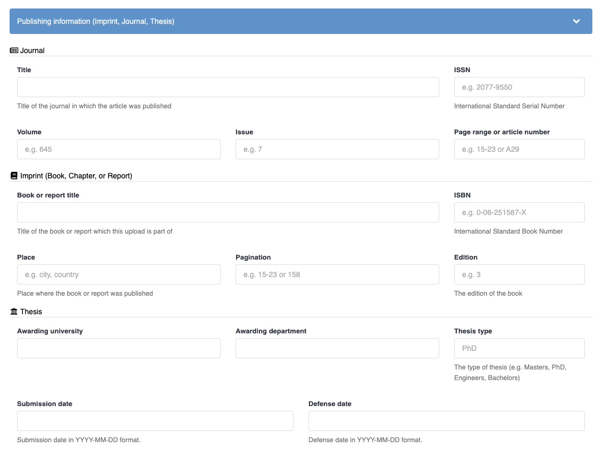

To add publishing information to your record metadata add the following in your `invenio.cfg` file: 


```python
from invenio_rdm_records.contrib.imprint import IMPRINT_CUSTOM_FIELDS_UI, IMPRINT_CUSTOM_FIELDS, IMPRINT_NAMESPACE
from invenio_rdm_records.contrib.journal import JOURNAL_CUSTOM_FIELDS_UI, JOURNAL_CUSTOM_FIELDS, JOURNAL_NAMESPACE
from invenio_rdm_records.contrib.thesis import THESIS_CUSTOM_FIELDS_UI, THESIS_CUSTOM_FIELDS, THESIS_NAMESPACE
from invenio_i18n import lazy_gettext as _

RDM_NAMESPACES = {
    **JOURNAL_NAMESPACE,
    **IMPRINT_NAMESPACE,
    **THESIS_NAMESPACE,
}

# defines data model and configuration
RDM_CUSTOM_FIELDS = [
    *JOURNAL_CUSTOM_FIELDS,
    *IMPRINT_CUSTOM_FIELDS,
    *THESIS_CUSTOM_FIELDS,
]

# define a new section for publishing information
RDM_CUSTOM_FIELDS_UI = {
    "section": _("Publishing information (Imprint, Journal, Thesis)"),
    "active": True, # defines if section is collapsed by default to save space
    "fields": [
        # journal
        *JOURNAL_CUSTOM_FIELDS_UI["fields"],
        # imprint
        *IMPRINT_CUSTOM_FIELDS_UI["fields"],
        # thesis
        *THESIS_CUSTOM_FIELDS_UI["fields"],
    ],
}

```

The values in publishing information fields will be displayed on the published records landing pages and require no additional configuration. 