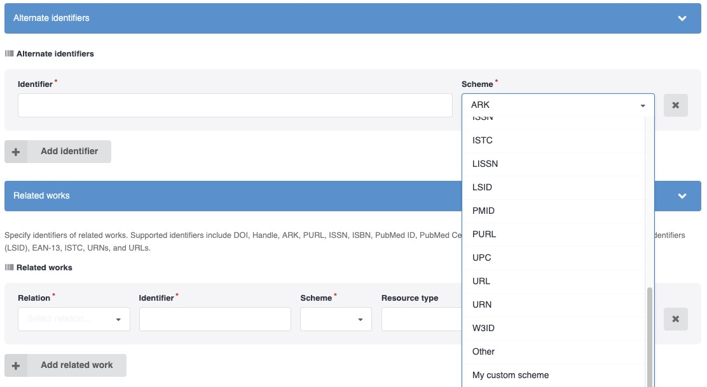

# Custom schemes for persistent identifiers

_Introduced in v13_

InvenioRDM allows you to extend the list of existing schemes to detect and validate persistent identifiers and add your owns.

In order to define your own custom schemes, you can now use the following entrypoint to register them:

```python
    [options.entry_points]
    idutils.custom_schemes =
        my_custom_scheme = my_module.get_scheme_config_func
```



Have a look at the [existing scheme functions](https://github.com/inveniosoftware/idutils/tree/master/idutils) for reference.
The entry point `'my_custom_scheme = my_module.get_scheme_config_func'` defines an entry point named `my_custom_scheme` pointing to the function `my_module.get_scheme_config_func` which returns the config for your new registered scheme.

That function must return a dictionary with the following format:

```python
def get_scheme_config_func():
    return {
        "validator": lambda value: True else False,
        "normalizer": lambda value: normalized_value,
        "filter": ["list_of_schemes_to_filter_out"],
        "url_generator": lambda scheme, normalized_pid: "normalized_url",
    }
```

Each key is optional and if not provided a default value is used (defined in the `idutils.ext._set_default_custom_scheme_config()` function).

!!! info "You can only add new schemes but not override existing ones."
