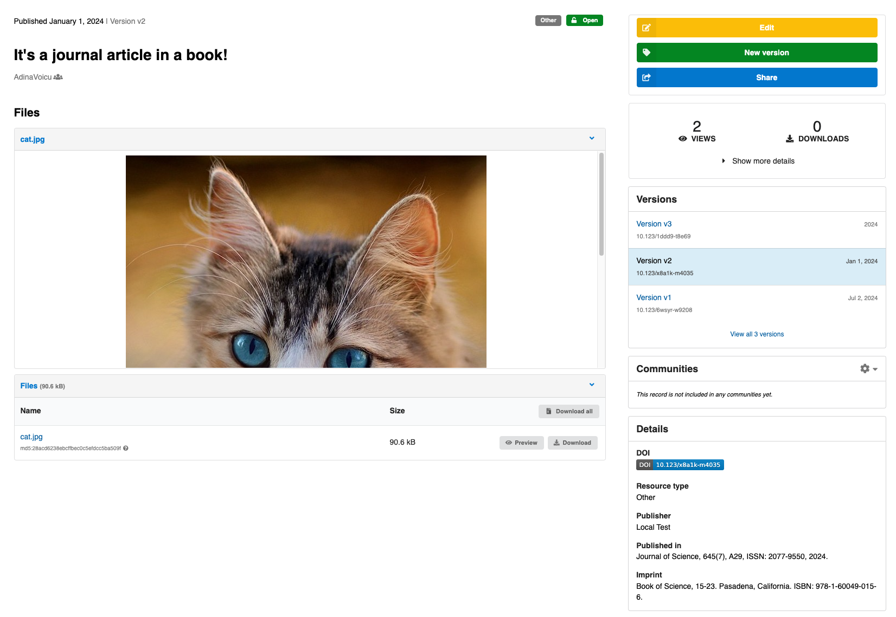

# Include optional metadata fields

_Introduced in v12_

InvenioRDM comes with a base [metadata schema](../../../reference/metadata.md), which is used for every record in the system and includes many common fields. InvenioRDM also includes *optional* metadata fields, which can be activated by an administrator. These fields may not be applicable to every instance, but if they are applicable we recommend you use them instead of creating your own custom fields.

The current optional fields are:

- Journal (Publication)
- Imprint (Book, Chapter or Report)
- Thesis (_introduced in v13_)
- Meeting (Conference)
- Software (CodeMeta)

You can see more details about each field group in [the metadata documentation](../../../use/records/custom-fields.md)

Metadata fields in InvenioRDM are defined by three configuration variables:

- `RDM_NAMESPACES` - Defines fields namespaces to avoid name clashes.
- `RDM_CUSTOM_FIELDS` - Defines the name, type, and validation rules of your fields.
- `RDM_CUSTOM_FIELDS_UI` - Defines how the fields are displayed in the uploads form UI.

For optional metadata fields, each of these configurations is already defined. You simply need to import the configuration. For example, if you wanted to add meeting metadata to your instance, you would edit your `invenio.cfg` file and add:

```python
from invenio_rdm_records.contrib.meeting import (
    MEETING_CUSTOM_FIELDS,
    MEETING_CUSTOM_FIELDS_UI,
    MEETING_NAMESPACE,
)
```

Then you need to add the imported configurations to the configuration variables.

```python
RDM_NAMESPACES = {
    **MEETING_NAMESPACE,
}
RDM_CUSTOM_FIELDS = [
    *MEETING_CUSTOM_FIELDS,
]

RDM_CUSTOM_FIELDS_UI = [
    MEETING_CUSTOM_FIELDS_UI
]
```

You'll need to initialize the field by typing `pipenv run invenio rdm-records custom-fields init`. Restart your instance, and you should see the fields appear in the deposit form. If you create a record, the metadata will also appear in the UI. By default, much of the optional field metadata will appear in both the "Additional details" section and in a condensed citation style form in the "Details" sidebar of the landing pages. This is a bit repetitive, and you can remove the metadata from the "Additional details" section with the configuration.

```python
MEETING_CUSTOM_FIELDS_UI["hide_from_landing_page"] = True
```

You can also combine optional fields in the deposit form into sections. For example, we usually combine the journal, imprint, and thesis fields into a "Publishing Information" section. You'll need to import internationalization and all the fields like:

```python
from invenio_i18n import lazy_gettext as _
from invenio_rdm_records.contrib.imprint import (
    IMPRINT_CUSTOM_FIELDS,
    IMPRINT_CUSTOM_FIELDS_UI,
    IMPRINT_NAMESPACE,
)
from invenio_rdm_records.contrib.journal import (
    JOURNAL_CUSTOM_FIELDS,
    JOURNAL_CUSTOM_FIELDS_UI,
    JOURNAL_NAMESPACE,
)
from invenio_rdm_records.contrib.thesis import (
    THESIS_CUSTOM_FIELDS,
    THESIS_CUSTOM_FIELDS_UI,
    THESIS_NAMESPACE,
)
```

Then add the namespace and fields

```python
RDM_NAMESPACES = {
    **JOURNAL_NAMESPACE,
    **IMPRINT_NAMESPACE,
    **THESIS_NAMESPACE,
}

RDM_CUSTOM_FIELDS = [
    *JOURNAL_CUSTOM_FIELDS,
    *IMPRINT_CUSTOM_FIELDS,
    *THESIS_CUSTOM_FIELDS,
]
```

And finally make a new section in the UI

```python
RDM_CUSTOM_FIELDS_UI = [
    {
        "section": _("Publishing information"),
        "hide_from_landing_page": True,
        "fields": [
            # journal
            *JOURNAL_CUSTOM_FIELDS_UI["fields"],
            # imprint
            *IMPRINT_CUSTOM_FIELDS_UI["fields"],
            # thesis
            *THESIS_CUSTOM_FIELDS_UI["fields"],
        ],
    },
]
```

You'll need to initialize the field by typing `pipenv run invenio rdm-records custom-fields init`. Restart your instance, and you should see the fields appear in the deposit form.

You can activate both the meeting and publishing fields at once, with this full configuration:

```python
from invenio_i18n import lazy_gettext as _
from invenio_rdm_records.contrib.imprint import (
    IMPRINT_CUSTOM_FIELDS,
    IMPRINT_CUSTOM_FIELDS_UI,
    IMPRINT_NAMESPACE,
)
from invenio_rdm_records.contrib.journal import (
    JOURNAL_CUSTOM_FIELDS,
    JOURNAL_CUSTOM_FIELDS_UI,
    JOURNAL_NAMESPACE,
)
from invenio_rdm_records.contrib.thesis import (
    THESIS_CUSTOM_FIELDS,
    THESIS_CUSTOM_FIELDS_UI,
    THESIS_NAMESPACE,
)
from invenio_rdm_records.contrib.meeting import (
    MEETING_CUSTOM_FIELDS,
    MEETING_CUSTOM_FIELDS_UI,
    MEETING_NAMESPACE,
)

RDM_NAMESPACES = {
    **JOURNAL_NAMESPACE,
    **IMPRINT_NAMESPACE,
    **THESIS_NAMESPACE,
    **MEETING_NAMESPACE,
}

RDM_CUSTOM_FIELDS = [
    *MEETING_CUSTOM_FIELDS,
    *JOURNAL_CUSTOM_FIELDS,
    *IMPRINT_CUSTOM_FIELDS,
    *THESIS_CUSTOM_FIELDS,
]

RDM_CUSTOM_FIELDS_UI = [
    {
        "section": _("Publishing information"),
        "hide_from_landing_page": True,
        "fields": [
            # journal
            *JOURNAL_CUSTOM_FIELDS_UI["fields"],
            # imprint
            *IMPRINT_CUSTOM_FIELDS_UI["fields"],
            # thesis
            *THESIS_CUSTOM_FIELDS_UI["fields"],
        ],
    },
    # meeting
    MEETING_CUSTOM_FIELDS_UI,
]

MEETING_CUSTOM_FIELDS_UI["hide_from_landing_page"] = True
```

You'll need to initialize the field by typing `pipenv run invenio rdm-records custom-fields init`. Restart your instance, and you should see the fields appear in the deposit form like:


and the landing page should look like:


