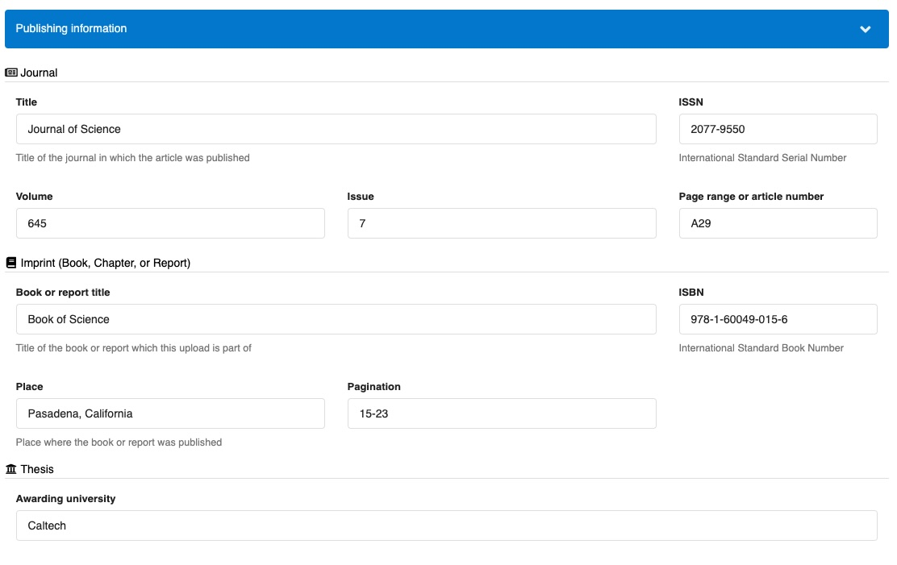

# List of optional metadata fields

_Introduced in InvenioRDM v12_

The following document is a reference guide for the instance-level optional metadata fields available in InvenioRDM.

!!!tip "How to add a field to an instance?"
    If you want to add one of the fields below to an instance, please refer to the [optional field customization page](./optional_fields.md).

## Publishing information

This group of fields contains the metadata for "Journal", "Imprint" and "Thesis". Each set of fields can be used independently, but the normal configuration is to group them in the UI.

**Deposit form**

**Landing page**

Publishing information is typically displayed in the section "Details", on the right side bar, under "Published in", "Imprint", or "Awarding university".

### Journal

This field implements a journal's metadata. It can be used to describe a journal where an article was published.

**Metadata**

- **title** `String`: The title of the journal.
- **issn** `ISSN`(defined by [idutils](https://github.com/inveniosoftware/idutils/blob/10b05b702b06e93f02774426df59a217035b1cee/idutils/__init__.py#L408)): The ISSN of the journal.
- **volume** `String`: The volume where the article was published.
- **issue** `String`: The issue within the volume.
- **pages** `String`: The pages within the issue where the article was published. It can be a number or a range in any format.

### Imprint

This nested field implements an imprint's metadata. It can be used to describe a book, chapter, report, or conference proceedings where a record was published.

**Metadata**

- **title** `String`: The title of the book, report, or proceedings where the record was published.
- **isbn** `ISBN`(defined by [idutils](https://github.com/inveniosoftware/idutils/blob/10b05b702b06e93f02774426df59a217035b1cee/idutils/__init__.py#L400)): The book's International Standard Book Number. Applies if the imprint is a book.
- **place** `String`: Location where the book (or report) was published.
- **pages** `String`: The pages within the book or report. It can be a number or a range in any format.

### Thesis

This field implements thesis metadata, more specifically an awarding university. A thesis supervisor can be found in the list of contributors whose role is "Supervisor".

**Metadata**

- **university**: Name of the awarding university.
