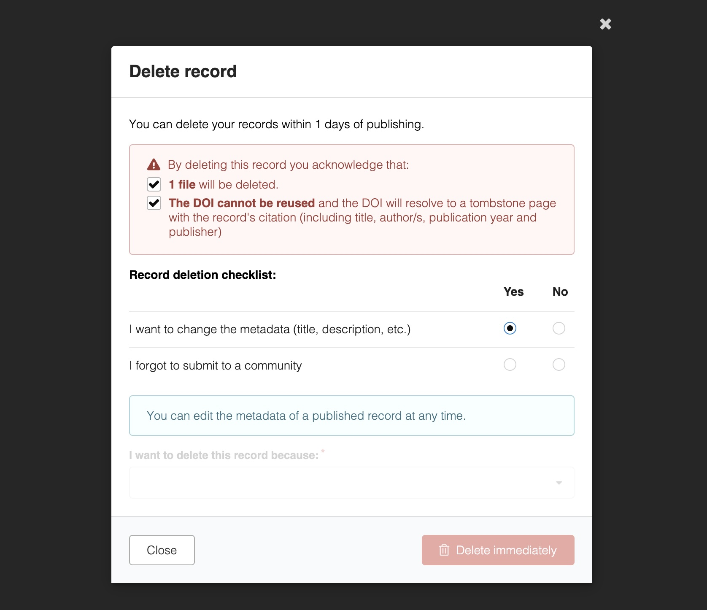

# Record deletion

_Introduced in vNext_

Records could always be deleted through the admin panel, but this feature allows records to be deleted by users themselves. Specifically, you can choose whether and under which criteria that records can be immediately deleted and user's ability to request deletion.

## Enable

Both `IMMEDIATE` deletion and `REQUEST` record deletion can be enabled independently.

```python
RDM_IMMEDIATE_RECORD_DELETION_ENABLED = True # default False
RDM_REQUEST_RECORD_DELETION_ENABLED = True # default False
```

## Configure policies

A deletion policy is a class of type BasePolicy implementing

* `is_allowed(self, identity, record)`: Whether the identity is allowed to delete the record.
* `evaluate(self, identity, record)`: Whether the record meets the conditions to be deleted.

These are independent and do not depend on permissions as this feature was designed to be maximally customisable. For more details about execution, these policies are evaluated by `RDMRecordDeletionPolicy`.

Each type of deletion can have a list of policies which are executed **in order** (the first which is allowed is used for the record deletion and is stored in the tombstone). By default these are:

``` python
RDM_IMMEDIATE_RECORD_DELETION_POLICIES = [GracePeriodPolicy()] # by owner within 30 days
RDM_REQUEST_RECORD_DELETION_POLICIES = [RequestDeletionPolicy()] # by owner
```

As such if you have criteria based upon resource type, community membership, etc., you will create a new `Policy` and add it to the respective list/s of policies.

## Configure checklists

Perhaps you:

* Are aware of a common misconception which usually leads users to delete their records. For example, users who forget to submit to a community before publishing and think that they have to delete and resubmit.
* Have an internal process which you would prefer users use rather than deleting records. For example, replacing the file for a user via email instead of deleting the record.
* Have introduced a new feature that the user might not be familiar with. For example, DOIs are now optional in your instance and can be changed by editing the record.

For all these cases, you can redirect the user by defining a checklist which will present the correct behaviour to the user. 

```python
RDM_IMMEDIATE_RECORD_DELETION_CHECKLIST = [
    {
        "label": _("I want to change the metadata (title, description, etc.)"),
        "message": _(
            "You can edit the metadata of a published record at any time."
        ),
    },
    {
        "label": _("I forgot to submit to a community"),
        "message": _(
            "You can submit a published record to a community by going to the "
            "record landing page and selecting the cog in the communities sidebar."
        ),
    },
]

RDM_REQUEST_RECORD_DELETION_CHECKLIST = []
```

Which will be rendered like so:


