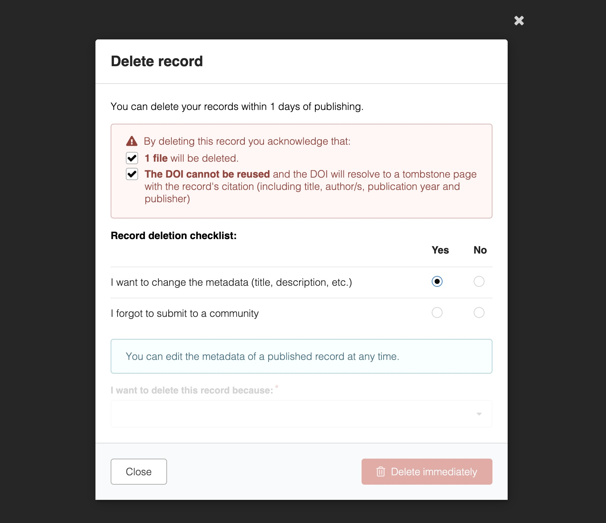

# Record deletion

_Introduced in v14_

This feature lets users delete their records within a defined policy, immediately or via a request reviewed by repository's administrators.
Administrators can delete records from the administration panel.

## Enable

Immediate deletions and deletion requests are independent features and can be enabled separately.

```python
RDM_IMMEDIATE_RECORD_DELETION_ENABLED = True  # default False
RDM_REQUEST_RECORD_DELETION_ENABLED = True  # default False
```

## Configure policies

You can customize rules for record's deletion by implementing your own policy. By default, these are:

```python
RDM_IMMEDIATE_RECORD_DELETION_POLICIES = [GracePeriodPolicy()]  # by owner within 30 days after publication
RDM_REQUEST_RECORD_DELETION_POLICIES = [RequestDeletionPolicy()]  # by owner after the 30 days
```

To change the default immediate allowed time, set:

```python
RDM_IMMEDIATE_RECORD_DELETION_POLICIES = [GracePeriodPolicy(grace_period=timedelta(days=15))]
```

You can define your own policies, by implementing a class with these 2 methods:

* `is_allowed(self, identity, record)`: Whether the identity is allowed to delete the record.
* `evaluate(self, identity, record)`: Whether the record meets the conditions to be deleted.

```python
class MyGracePeriodPolicy(BasePolicy):
    def is_allowed(self, identity, record):
        is_record_owner = identity.user.id == record.parent.access.owned_by.owner_id
        return is_record_owner

    def evaluate(self, identity, record):
        ...
        # evaluate time
        ...
        return ...  # True or False
```

These policies are independent of permissions; the feature is designed to be highly customizable.

Each type of deletion can have an ordered list of policies. Policies are evaluated in order; the first policy that allows the deletion is applied and recorded in the tombstone.

If your criteria depend on resource type, community membership, or other factors, create a new `Policy` and add it to the appropriate policy list(s).

## Configure modal checklists

The deletion modal can present a checklist to guide users toward alternatives to deleting a record. For example, deletion is usually unnecessary in these situations:
- The user forgot to submit the record to a community before publishing — the record can be added to the community afterwards.
- The user wants to replace a file — files can be replaced by the user after publication (if allowed) or by administrators.
- The user wants to change the DOI — the DOI can be updated by editing the record (if allowed).

{: .screenshot}

You can configure your checklist in your `invenio.cfg`:

```python
RDM_IMMEDIATE_RECORD_DELETION_CHECKLIST = [
    {
        "label": _("I want to change the metadata (title, description, etc.)"),
        "message": _(
            "You can edit the metadata of a published record at any time."
        ),
    },
    {
        "label": _("I forgot to submit to a community"),
        "message": _(
            "You can submit a published record to a community by going to the "
            "record landing page and selecting the cog in the communities sidebar."
        ),
    },
]
```

By default, the checklist is disabled:

```python
RDM_REQUEST_RECORD_DELETION_CHECKLIST = []
```


