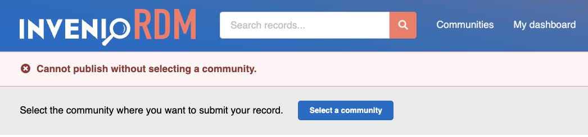
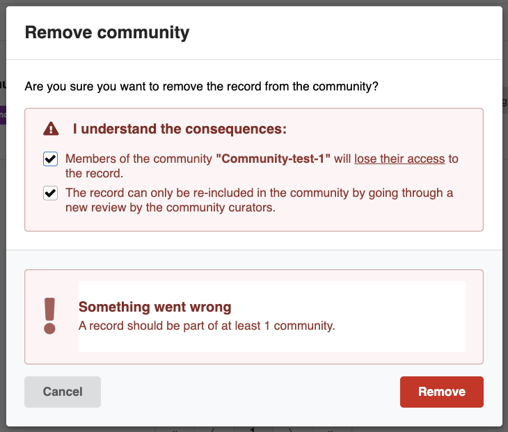

# Require community for record publication

_Introduced in v13_

Institutional policies may require all published records to belong to at least one community. InvenioRDM enforces this requirement through the `RDM_COMMUNITY_REQUIRED_TO_PUBLISH` configuration parameter.
To activate this feature, open your `invenio.cfg` and add:

```python
# Require community membership for all published records
RDM_COMMUNITY_REQUIRED_TO_PUBLISH = True
```

Default State: Disabled `False`

## Behavior

When this feature is enabled, you cannot publish a record unless a community is selected in the upload page. Attempts to publish records without a community will fail, providing you with an explicit error message.



When a record is published, you will be prevented from removing the last community.



Only users with specific privileges (by default, administrators with `superuser` access) can bypass this requirement and publish records without community or remove the last community.

## Customizing permissions

### Granting Community Creation Rights

When enabling `RDM_COMMUNITY_REQUIRED_TO_PUBLISH`, note that community creation permissions remain separate. By default, anyone can create communities. Institutions have different requirements for who can create communities, and InvenioRDM provides flexible configuration. Below is one example approach using custom roles to restrict community creation to a specific role, such as "community-curator".
To implement this, follow these steps:

1- Create permission generators:

```python

# site/yourmodule/permissions.py

from flask import current_app
from flask_principal import RoleNeed
from invenio_administration.generators import Administration
from invenio_communities.permissions import CommunityPermissionPolicy
from invenio_records_permissions.generators import Generator, SystemProcess

class CommunityCreator(Generator):
    """Grant permissions to custom community-creator role"""
    def needs(self, record=None, **kwargs):
        role_name = current_app.config.get(
            "COMMUNITY_CREATOR_ROLE", "community-creator"
        )
        return [RoleNeed(role_name)]


class CustomCommunitiesPermissionPolicy(CommunityPermissionPolicy):
    """
    Custom permission policy for communities.

    This class overrides the default `CommunityPermissionPolicy` to provide
    a tailored permission model for community-related actions.

    This policy demonstrates how to grant specific permissions for community creation actions:

    - Community creation (`can_create`) is allowed for:
        - Users with the custom 'community-creator' role
        - Users with administration role
        - System processes

    - Direct inclusion of records (`can_include_directly`) is allowed for:
        - Users with administration role
        - System processes
    """
    can_create = [CommunityCreator(), Administration(), SystemProcess()]
    can_include_directly = [Administration(), SystemProcess()]
```

2- Configure in `invenio.cfg`:

```python
# Enable community requirement
RDM_COMMUNITY_REQUIRED_TO_PUBLISH = True

from yourmodule.permissions import CustomCommunitiesPermissionPolicy
# Apply custom permissions
COMMUNITIES_PERMISSION_POLICY = CustomCommunitiesPermissionPolicy
COMMUNITY_CREATOR_ROLE = "community-curator"  # Customizable role name
```

3- Create and assign roles via CLI:

```bash
# Create role (name must match COMMUNITY_CREATOR_ROLE)
# You only need to create this role once for your instance
invenio roles create community-curator
```

4- To assign the role to a user, run:

```bash
invenio roles add <useremail> community-curator
```
