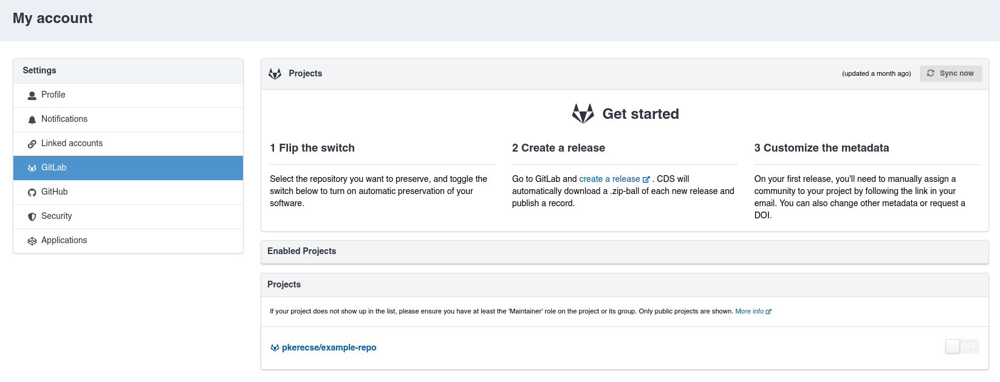
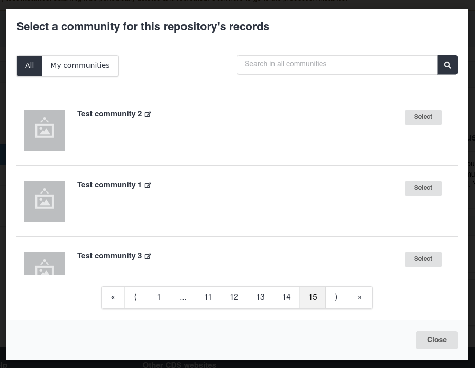

# Archive software as records

_Introduced in v14_

{: .screenshot}

With the optional [Invenio-VCS](https://github.com/inveniosoftware/invenio-vcs) module,
you can let users connect their accounts from various Version Control System (VCS) code
forges and sync their repositories.

Each new release is published as a record in InvenioRDM with metadata imported automatically.

## Install the module

Invenio-VCS is an optional module and is not included by default.
To start using it, install it.

1. Add the dependency to your `pyproject.toml` file via `uv` or your chosen package manager.

    ```bash
    uv add invenio-vcs
    ```

2. Install the dependencies:

    ```bash
    invenio-cli install
    ```

3. Run database migrations:

    ```bash
    invenio alembic upgrade head
    ```

## Configure

Currently, the following code forges are officially supported:

- GitHub.com and Enterprise
- GitLab.com and self-hosted instances

You can also add support for any other provider (including non-Git ones) by implementing its integration.

To enable the module, configure it in your `invenio.cfg`:

1. Configure the integration by following [quick start steps](https://github.com/inveniosoftware/invenio-vcs/blob/master/docs/usage.rst#quick-start) in the documentation.

2. Add the following:

    ```python
    # enable notifications to users on release

    from invenio_rdm_records.notifications.vcs import (
        RepositoryReleaseCommunityRequiredNotificationBuilder,
        RepositoryReleaseCommunitySubmittedNotificationBuilder,
        RepositoryReleaseFailureNotificationBuilder,
        RepositoryReleaseSuccessNotificationBuilder
    )
    from invenio_app_rdm.config import NOTIFICATIONS_BUILDERS

    NOTIFICATIONS_BUILDERS = {
        **NOTIFICATIONS_BUILDERS,
        RepositoryReleaseSuccessNotificationBuilder.type: RepositoryReleaseSuccessNotificationBuilder,
        RepositoryReleaseFailureNotificationBuilder.type: RepositoryReleaseFailureNotificationBuilder,
        RepositoryReleaseCommunityRequiredNotificationBuilder.type: RepositoryReleaseCommunityRequiredNotificationBuilder,
        RepositoryReleaseCommunitySubmittedNotificationBuilder.type: RepositoryReleaseCommunitySubmittedNotificationBuilder,
    }

    # Configure records classes and service components
    from invenio_rdm_records.services.vcs.release import RDMVCSRelease
    from invenio_rdm_records.services.components.vcs import VCSComponent
    from invenio_rdm_records.services.components import DefaultRecordsComponent

    VCS_RELEASE_CLASS = RDMVCSRelease

    RDM_RECORDS_SERVICE_COMPONENTS = [
        **DefaultRecordsComponent,
        VCSComponent
    ]
    ```

That's it! Your configured provider(s) will be ready to use.

## Default community configuration

On instances where [a community is required to publish a record](./require_community.md), users must select the
target community for their releases when enabling a repository. They are prompted to do this via a modal that
appears when they click the toggle switch.

{: .screenshot}

A repository cannot be enabled without selecting a community. For repositories that were enabled before
`RDM_COMMUNITY_REQUIRED_TO_PUBLISH` was set to `True`, new releases will fail. The user will receive an email
notification and can then select a community, after which the record will be published.

## Upgrading from Invenio-GitHub

As of InvenioRDM v14, [Invenio-GitHub](https://github.com/inveniosoftware/invenio-github) has been deprecated.
You can continue to use it for now, but support will be removed in InvenioRDM v15.

If your instance was actively using Invenio-GitHub (with at least one user having connected their GitHub account) and you want to preserve existing data, follow [these steps](https://github.com/inveniosoftware/invenio-vcs/blob/master/docs/upgrading.rst)
to migrate to Invenio-VCS.

If you were not using Invenio-GitHub or do not need to preserve existing data, you can skip these steps.

## Further customization

The behaviour of the Invenio-VCS module can be customized via configuration variables or by overriding code.
Refer to the [module's documentation](https://github.com/inveniosoftware/invenio-vcs/tree/master/docs) for more details.
