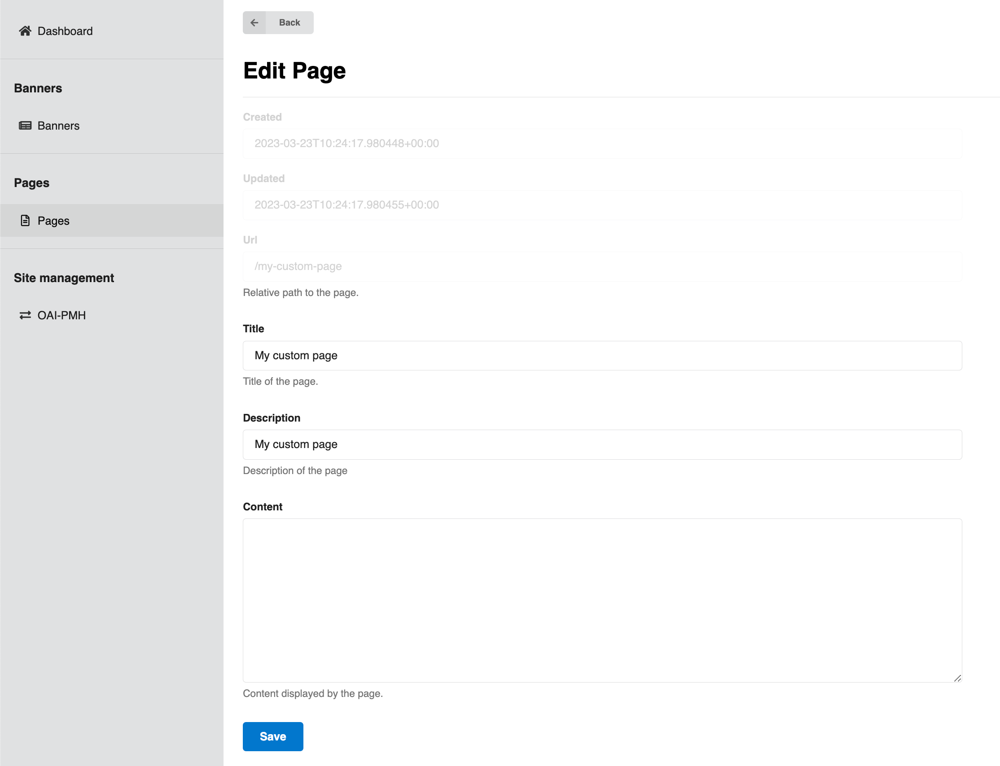

# Static pages

_Introduced in v11_

InvenioRDM supports an easy "out-of-the-box" way of creating static pages, basically web pages for which the HTML content is stored in the database.
And you can change them using the administration panel in v12.

## Define pages

To add the new static pages, create a file named `pages.yaml` in the `app_data` folder:

```bash
app_data/
└── pages.yaml
```

Then, inside the file, define the URL, the title, the description and the HTML template of each static page:

```yaml
# list of pages:
- url: /my-custom-page
  title: My custom page
  description: My custom page
  template: my_custom_page.html
```

InvenioRDM will look for the content of each static page in the `template` HTML file, located in a new sub-folder named `pages`:

```bash
app_data/
└── pages
    └──my_custom_page.html
```

The template file content is what will be imported in the database and rendered to the user when navigating to the page's URL.

_Introduced in v13_

If you have configured additional languages via the setting `I18N_LANGUAGES` you may now also add a translated version of your page, too:

```bash
app_data/
└── pages
    └──my_custom_page.html.<lng>
```

Where `<lng>` is any of the languages you defined. If you don't add a translated page, the original template file content will be imported in the database instead.

## Register Pages

_Introduced in v12_

InvenioRDM now allows for dynamic registration of static pages through configuration. After doing the steps above, Add the `APP_RDM_PAGES` variable to your `invenio.cfg` to map the page identifiers to URLs, this enables the application to serve these pages dynamically, For example:

```py
APP_RDM_PAGES = {
    "my-custom-page": "/my-custom-page",
    "about": "/about",
}
```

Each key represents a page identifier while the value specifies the URL path under which the page will be accessible.

## Load pages

To load the new static page to your instance, you have 2 options:

1. Run the instance setup command `invenio-cli services setup`: the command will find the pages defined as above and load them. **Warning: this command will delete all your data!**

2. In a previously created instance folder, run:

```bash
pipenv run invenio rdm pages create
```

For updating existing templates:

```bash
pipenv run invenio rdm pages create --force
```

This will wipe out all previously created static pages and load them again. In other words, it will delete the templates you have removed from your `pages.yaml` and update the existing templates with the changes you have made, if any.

## Changing the base template

Your custom template will be an extension of the base template [defined in `invenio-app-rdm`](https://github.com/inveniosoftware/invenio-app-rdm/blob/9f1ba6a646362ff80de6b0c9cd092209e9190c44/invenio_app_rdm/theme/templates/semantic-ui/invenio_app_rdm/default_static_page.html). If you want to create your own base template, you can do it by setting the following variables in your `invenio.cfg` file:

```py
PAGES_DEFAULT_TEMPLATE = "my_site/my_custom_base_template.html"

PAGES_TEMPLATES = [
    ("invenio_pages/dynamic.html", "Default dynamic"),
    ("my_site/my_custom_base_template.html", "Default")
]
```

This implies that your new template was created in

```bash
templates
└── my_site/my_custom_base_template.html
```

After making this change, you will have to restart your instance and run

```bash
pipenv run invenio rdm pages create --force
```

## Edit pages

_Introduced in v12_

Now that your custom page is configured, you can access it from the path you defined in the first step, in our case `/my-custom-page`. Since we didn't add any content yet, what you will see is an empty page with only a title.


While adding or removing pages can only be done by the developer of an instance, editing a page can be done by an admin user, in the admin-panel at `/administration/pages`.

Once configured, you can access the pages in the administration panel from the side menu.


Here you will see a list of the pages you configured in the previous steps.


To edit one of your pages, you can click the edit button in the "Actions" column.

This will take you to the edit-form of the page, which will look like this:



As you can see, the title and description we added in the configuration step is already defined in the form. To add some content to the page, you can fill in the "Content" field and click save:


Now we can go to our custom page again and see the content displayed on the page.


## Changing the base template

Your custom template will be an extension of the base template [defined in `invenio-app-rdm`](https://github.com/inveniosoftware/invenio-app-rdm/blob/9f1ba6a646362ff80de6b0c9cd092209e9190c44/invenio_app_rdm/theme/templates/semantic-ui/invenio_app_rdm/default_static_page.html). If you want to create your own base template, you can do it by setting the following variables in your `invenio.cfg` file:

```py
PAGES_DEFAULT_TEMPLATE = "my_site/my_custom_base_template.html"

PAGES_TEMPLATES = [
    ("invenio_pages/dynamic.html", "Default dynamic"),
    ("my_site/my_custom_base_template.html", "Default")
]
```

This implies that your new template was created in

```
templates
└── my_site/my_custom_base_template.html
```

After making this change, you'll have to restart your instance and run

```bash
pipenv run invenio rdm pages create --force
```

## Static Pages Content HTML Sanitization

_Introduced in v12_

InvenioRDM version 12 introduces enhanced HTML sanitization for static pages content. This update provides greater security and integrity of the content.
The changes involve extending the list of allowed HTML tags and attributes for static page content.
If you find certain tags absent in your static page, you have the option to incorporate these configurations into your instance.

### Configuration

Two new configurations have been introduced:

`PAGES_ALLOWED_EXTRA_HTML_TAGS`: This configuration extends the [list of HTML tags](https://github.com/inveniosoftware/invenio-config/blob/2a52eafe3c44bc162538d2f65817332cfadfa168/invenio_config/default.py#L16) permitted in static pages content. By default, it extends tags like `img` and `button`, if you like to add more tags you can override this in your `invenio.cfg`, or remove the extra tags by provide empty list:

```python
PAGES_ALLOWED_EXTRA_HTML_TAGS = []
```

`PAGES_ALLOWED_EXTRA_HTML_ATTRS`: Accompanying the tags, this configuration specifies the allowed attributes for each tag. For instance, for img tags, attributes like `src, alt, title, width, height, loading`, are permitted. Similarly, button tags can have attributes like `type, name, value, disabled, onclick`.

**example**

```python
# invenio.cfg

PAGES_ALLOWED_EXTRA_HTML_TAGS = ["video", "audio"]
"""Extend allowed HTML tags list for static pages content."""

PAGES_ALLOWED_EXTRA_HTML_ATTRS = {
    "video": ["src", "controls", "autoplay", "loop", "muted"],
    "audio": ["src", "controls", "autoplay", "loop"],
}
"""Extend allowed HTML attrs list for static pages content."""

```

After adding these configs, you'll have to restart your instance and run

```bash
pipenv run invenio rdm pages create --force
```
