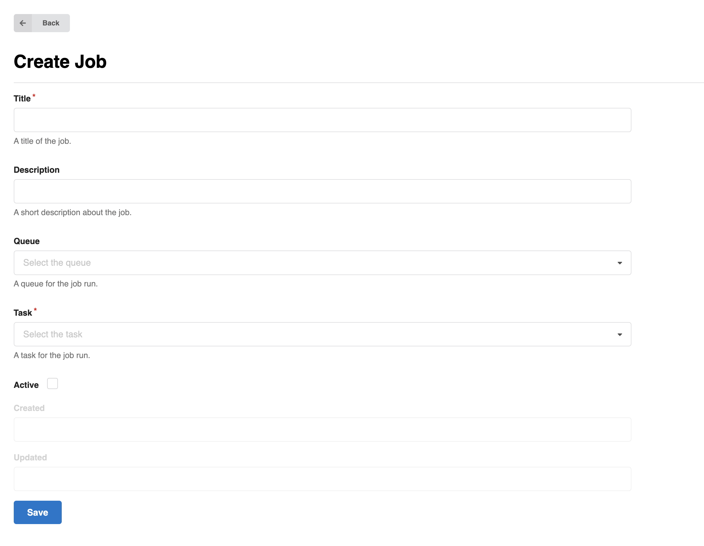

# Affiliations

The Affiliations vocabulary is used to associate creators and contributors to
an organization. With a loaded Affiliations vocabulary, depositors can *search-as-you-type*
to find the relevant affiliation for creators and contributors.

The recommended source for that vocabulary is the [ROR](https://ror.org) affiliations dataset.
InvenioRDM prepared it for easy import if you choose to use it; a new installation of InvenioRDM doesn't load affiliations by default and you need to deliberately import that dataset in order to use it. InvenioRDM provides two ways to do so: importing it [via the Administration panel's Jobs interface](#import-via-a-job) or importing it [via the command-line](#import-via-the-command-line). If you want to use a different or custom source for affiliations, the [traditional fixtures approach](#alternative-fixtures-approach) is possible too.


## Import via a Job

_Introduced in v13_

You can set up a job to import the ROR affiliations dataset directly by going
to the [Administration panel's Jobs section](../../../use/administration.md#jobs)
and clicking "**Create**".



Fill out the fields as follows:

- **Title**: "Load Affiliations" (or other title of your liking)
- **Queue**: "Default"
- **Task**: "Load ROR affiliations"
- **Active**: Checked

and click "**Save**".

Then click the "**Configure and run**" button, and fill out the fields per your liking (can be left blank). Then click "**Run now**". The ROR affiliations will be loaded.

You can also use the "**Schedule job**" button to download the latest version of
the ROR vocabulary on a regular schedule.

!!! info "Loading time"

    The ROR vocabulary consists of over 100,000 records and with an ingestion
    speed around 100-200 records/s it usually takes between around 8-15 minutes
    to load the full vocabulary.

    You can follow the progress by connecting to the RabbitMQ management web interface.


## Import via the command line

_Introduced in v13_

If you prefer to work on the command line, you can type

```bash
(venv) invenio vocabularies update \
  --vocabulary affiliations \
  --origin ror-http
```

That's it. The same note as above about the time required to fully ingest the vocabulary applies: expect the procedure to take a couple minutes.

### Alternative: fixtures approach

Like other vocabularies it is also possible to load the affiliations vocabulary via
fixtures. This method has the drawback that you have to generate the vocabulary file yourself, but
the advantage that you can fully customize it. A starting vocabulary file used to be provided, but would become out of date quickly, so it is not anymore.

With the fixtures approach, first, provide the `affiliations` section in your `app_data/vocabularies.yaml` file. For example:

```yaml
affiliations:
  pid-type: aff
  data-file: vocabularies/affiliations_ror.yaml
```

The `affiliations_ror.yaml` file should be of the form:

```yaml
- acronym: ANU
  id: 019wvm592
  identifiers:
  - identifier: 019wvm592
    scheme: ror
  name: Australian National University
  title:
    en: Australian National University
- id: 02bfwt286
  identifiers:
  - identifier: 02bfwt286
    scheme: ror
  name: Monash University
  title:
    en: Monash University
...
```

with the entries of your choosing.

Afterwards you will need to import the affiliations. To do so, run the following command
from your instance's folder:

```bash
(venv) invenio rdm-records fixtures
```

If you need to add new affiliation entries down the road, you can add them to that file and run:

```bash
(venv) invenio rdm-records add-to-fixture affiliations
```
