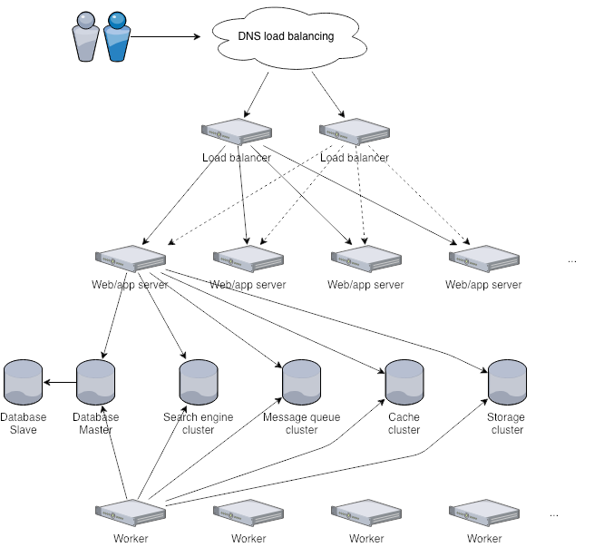

# Infrastructure architecture

This guide provides a high-level overview of the InvenioRDM infrastructure architecture.
For detailed subsystem documentation, refer to the official documentation of each component.

InvenioRDM follows a standard web application infrastructure pattern. A typical production deployment consists of:

- **(Optional) Load balancer:** [HAProxy](https://www.haproxy.com)
- **Web server (reverse proxy):** [Nginx](https://nginx.org)
- **Application web nodes:** [uWSGI](https://uwsgi-docs.readthedocs.io/en/latest/) running the InvenioRDM Python application
- **Application worker nodes:** [Celery](https://docs.celeryq.dev) daemon running the InvenioRDM Python application for background tasks
- **Database:** [PostgreSQL](https://www.postgresql.org)
- **Search engine:** [OpenSearch](https://opensearch.org)
- **Message queue:** [RabbitMQ](https://www.rabbitmq.com)
- **Cache system:** [Redis](https://redis.io/)
- **Storage system:** Local filesystem, S3, XRootD, WebDAV, and more

The application web nodes and worker nodes run **exactly the same InvenioRDM application and codebase**.
For consistency, inject the same configuration variables into both.

## Request handling

Client requests to InvenioRDM typically first reach a load balancer (when deployed).
For high availability, you can deploy multiple load balancers and distribute traffic between them using DNS load balancing.

## Load balancer

**Request types**

A load balancer with SSL termination capability can categorize traffic into three request types:

- **Static file requests:** JavaScript assets, CSS, images
- **Application requests:** API calls, search queries
- **Record file requests:** Large file downloads

Categorizing requests allows you to allocate connection slots based on available resources.
Static files can be served very efficiently, while application requests require more memory and processing time.

Large file downloads depend on client bandwidth and can occupy connection slots for extended periods.
If your storage system supports it, InvenioRDM can offload serving large files directly to the storage system (e.g., S3).

The load balancer's primary role is traffic management according to available resources.
During traffic surges, it queues requests to prevent overloading the web servers.

## Web servers

The load balancer proxies traffic to one or more web servers.
By default, InvenioRDM uses [Nginx](https://nginx.org) as a reverse proxy, which:

- Forwards backend requests to application servers (e.g., API endpoints like `/api/records`)
- Serves static assets directly with optional caching
- Blocks malicious requests by IP address or User Agent
- Configures rate-limiting for bots and search engines

For all available configuration options, see the official Nginx documentation.

## Application servers

The application server handles all application requests.
As a Python application, InvenioRDM uses the WSGI standard.
While multiple WSGI-compatible servers exist, InvenioRDM defaults to [uWSGI](https://uwsgi-docs.readthedocs.io/en/latest/).

## Storing records

InvenioRDM stores records as JSON documents in an SQL database.
Most modern SQL databases support a JSON type for efficient binary storage of JSON documents.
By default, InvenioRDM uses [PostgreSQL](https://www.postgresql.org).

**Transactional databases**

SQL databases provide transactions, which are critical for data consistency.
They can handle large datasets when properly scaled and configured.
Compared to many NoSQL solutions, SQL databases also offer high reliability.

**Primary key lookups**

Most InvenioRDM database access uses primary key lookups, which are highly efficient.
Complex search queries are handled by the search engine cluster, which provides better performance than direct database queries.

## Search and indexing

InvenioRDM uses [OpenSearch](https://opensearch.org) as its search engine.
As a fully JSON-based system, it integrates seamlessly with records stored as JSON documents in the database.
OpenSearch is highly scalable and provides powerful search and aggregation capabilities, including geospatial queries.

**Direct indexing**

InvenioRDM can index records directly in OpenSearch while handling a request,
making them immediately available for searches.

**Bulk indexing**

For large datasets, InvenioRDM supports bulk indexing, which is significantly more efficient.
The application sends a message to the message queue, and at regular intervals,
a background job consumes the queue and indexes the records.
Multiple bulk indexing jobs can run concurrently on different worker nodes,
enabling very high indexing throughput.

## Background processing

InvenioRDM uses [Celery](https://docs.celeryq.dev) for distributed background processing.
To enable faster response times, the application can offload tasks to asynchronous jobs.
The application sends a message to the message queue (e.g., RabbitMQ), which Celery worker nodes continuously consume.

Examples of background tasks include sending emails or registering DOIs.

**Multiple queues**

Celery supports multiple queues and advanced workflows.
For example, you could have a low-priority queue for periodic file integrity checks,
and a normal-priority queue for tasks like DOI registration.

**Scheduled jobs and retries**

Celery supports scheduled jobs (cron-like functionality) and automatic retries
if tasks fail (e.g., when a remote service is temporarily unavailable).

## Caching and temporary storage

InvenioRDM uses an in-memory cache for fast temporary storage.
By default, it uses [Redis](https://redis.io/).

Common use cases for caching include:

- User session storage
- Background job results
- Rendered page caching

## Storing files

InvenioRDM provides a default object storage REST API for file access.
Through its storage abstraction layer, it can store files in multiple storage systems:
Local filesystem, S3, XRootD, WebDAV, and more.

You can also bypass InvenioRDM's object storage entirely and use external storage systems like S3 directly.
In this case, ensure you manage access permissions correctly on the external system.

**Multiple storage systems**

InvenioRDM supports storing files on multiple systems simultaneously.
This is useful when using multiple storage backends or performing live migrations between systems.
