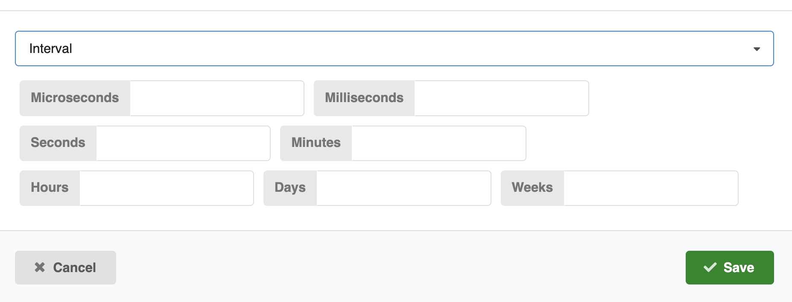

# Jobs

## Running a Job

Once a job is created, you can configure it for its first run.

There are two ways to run a job:

1. **Configure and Run (Manual):** Trigger the job immediately using the added configuration.
2. **Schedule and Run (Automatic):** Set up a recurring schedule and let the job run automatically based on that.

<figure>
  
</figure>

After each run, check the logs and output to confirm that the job executed successfully.

### Configure a Job

When creating a new job, you'll need to configure several key parameters in the **Configure and run** dialog:

#### Basic Configuration

- **Title:** Give your job a descriptive name

- **Queue:** Select the appropriate queue for your job execution

- **Args:** Specify any command-line arguments your job requires

- **Since:** Optional timestamp in `YYYY-MM-DD HH:mm` format to continue processing from that particular timestamp. _Uses the last successful run if left empty._

#### Advanced Configuration

This section defines the job’s workflow using JSON. It consists of three key parts:

- **Readers:** Specify how and where the job reads input data, including file patterns or sources.

- **Transformers:** Define the processing or transformation steps applied to the data after reading.

- **Writers:** Determine the output destination and how the processed data is saved.

Each component lets you customize the job’s data flow to suit your specific needs.

##### Custom Arguments

Use the Custom args field to provide additional arguments that will override any arguments specified in the configuration above.

!!! warning "Configuration Override"

    When custom args are provided, they take precedence over the arguments specified in the advanced configuration section.

### Schdule a Job

Once your job is created and active, click on **Schedule** to configure the timing. You can schedule jobs using either of the following methods:

- **Interval**
  

- **Crontab**
  

!!! tip "When to use which?"

    | Use Case                               | Recommended | Example                          |
    |---------------------------------------|-------------|---------------------------------|
    | Run a task every fixed amount of time | Interval    | Every 10 minutes, every 2 hours |
    | Run on a specific day/time schedule   | Crontab     | Every day at 3 AM, every Monday at 5 PM |

!!! note

    - Check the job **Active** status – The job must be marked as active, or it won't run.

After clicking **Save**, the job will be scheduled. The first run will occur within the first 5 minutes, and subsequent runs will follow the schedule you specified.
