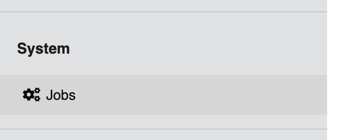
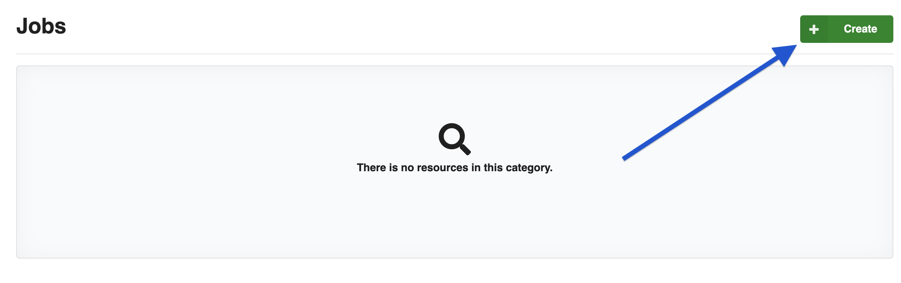
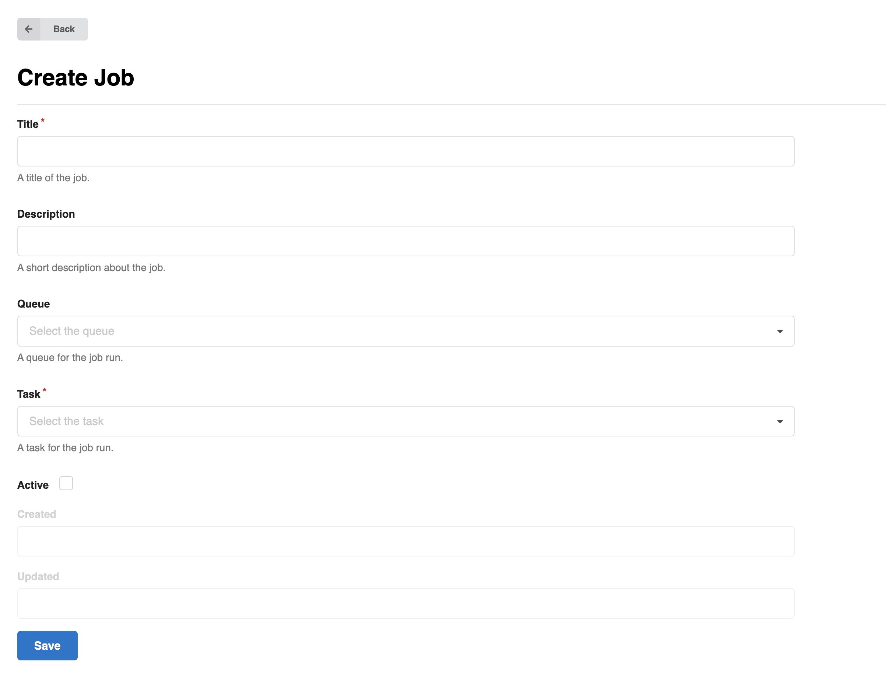
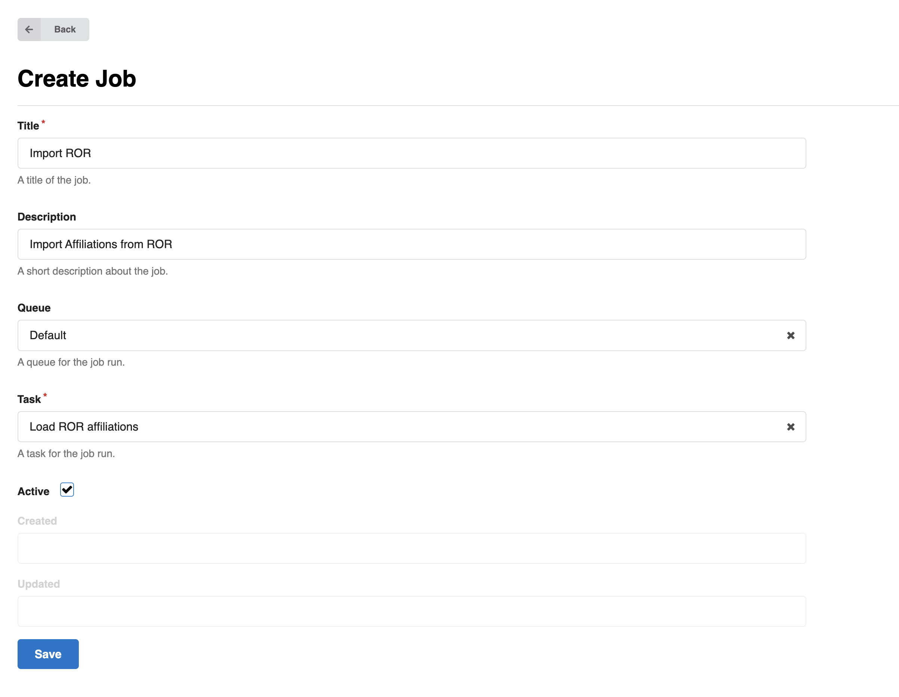
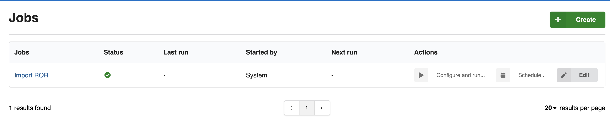
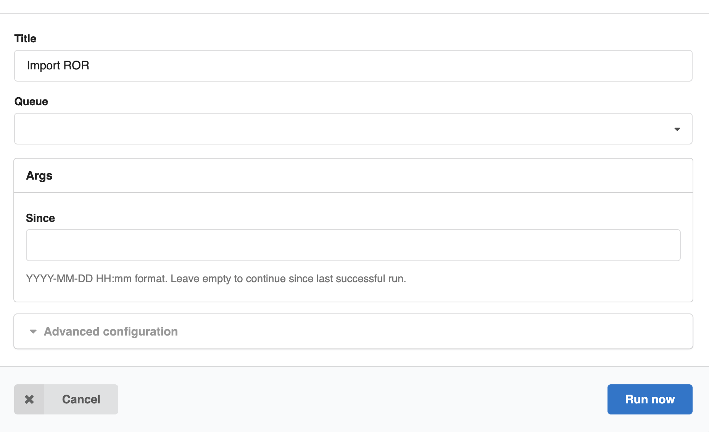
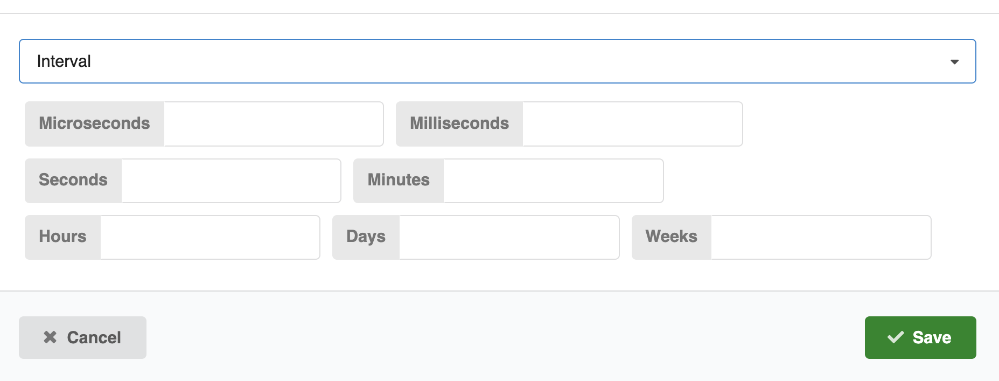
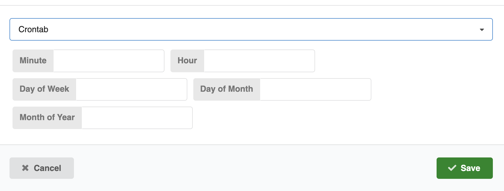

_Introduced in v13_

## Creating a Job

!!! note "Info"

    Creating a job will **not execute it**. It will only be executed when scheduled or run manually. If you already have an existing Job and want to run it, see [running a job](#running-a-job).

1. Head to the administration interface and navigate to the "Jobs" section.

    

2. Click the create button on the top right.

    

3. Here, you can define a new job by specifying the following:
    - **Name**: A descriptive name for the job.
    - **Description**: A brief description/notes of what the job does.
    - **Queue**: The Celery queue to which the job will be submitted. This is useful for categorizing jobs based on their priority or type.
    - **Task**: Select the task from the available Jobs.
    - **Active**: Whether the job is currently active or not. Inactive jobs will not be executed automatically even if scheduled but they can can be [executed manually](#configure-and-run-manual-run).
    <figure markdown="span">
        
        <figcaption>Create Job form</figcaption>
    </figure>
    <figure markdown="span">
        
        <figcaption>Create Job form filled</figcaption>
    </figure>

4. Once you have filled in the details, click `Save` to save the job. Now you should see the job in the Jobs list page.

    

## Running a Job

Once a job is created, you can configure it for its first run.

There are two ways to run a job:

1. **Configure and Run (Manual):** Trigger the job immediately using the added configuration.
2. **Schedule and Run (Automatic):** Set up a recurring schedule and let the job run automatically based on that.

<figure>
  
</figure>

After each run, check the logs and output to confirm that the job executed successfully.

### Configure and Run (Manual run)

When creating a new run, you'll need to configure several key parameters in the **Configure and run** dialog:

#### Basic Configuration

- **Title:** Give your run a descriptive name

- **Queue:** Select the appropriate queue for your run execution

- **Args:** Specify any command-line arguments your Job requires

- **Since:** Optional timestamp in `YYYY-MM-DD HH:mm` format to continue processing from that particular timestamp. _Uses the last successful run if left empty._

#### Advanced Configuration

This section explains how to define your job's workflow directly using JSON, bypassing the UI form. You should use this method for advanced configurations when you need more powerful and granular control over your job's input parameters and have a clear understanding of its setup.

##### Custom Arguments

Use the Custom args field to provide additional arguments that will override any arguments specified in the configuration above.

!!! warning "Configuration Override"

    When custom args are provided, they take precedence over the arguments specified in the advanced configuration section.

### Schedule a Job

Once your job is created and active, click on **Schedule** to configure the timing. You can schedule jobs using either of the following methods:

- **Interval**
  

- **Crontab**
  

!!! tip "When to use which?"

    | Use Case                              | Recommended | Example                         |
    |---------------------------------------|-------------|---------------------------------|
    | Run a task every fixed amount of time | Interval    | Every 10 minutes, every 2 hours |
    | Run on a specific day/time schedule   | Crontab     | Every day at 3 AM, every Monday at 5 PM |

!!! note

    - Check the job **Active** status – The job must be marked as active, or it won't run.

After clicking **Save**, the job will be scheduled. The first run will occur within the first 5 minutes, and subsequent runs will follow the schedule you specified.
