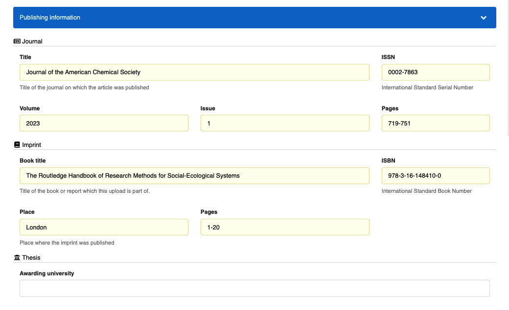
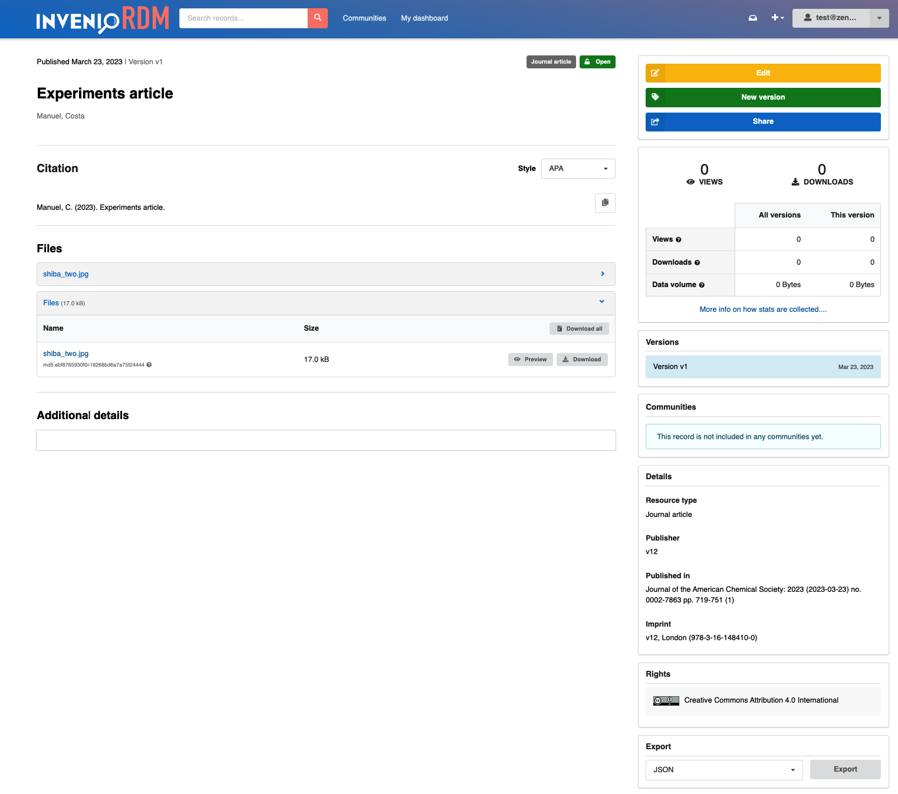
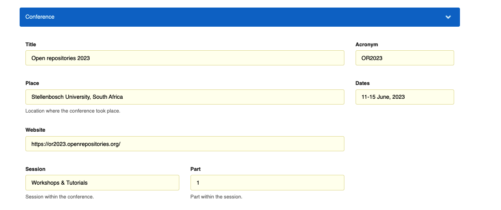
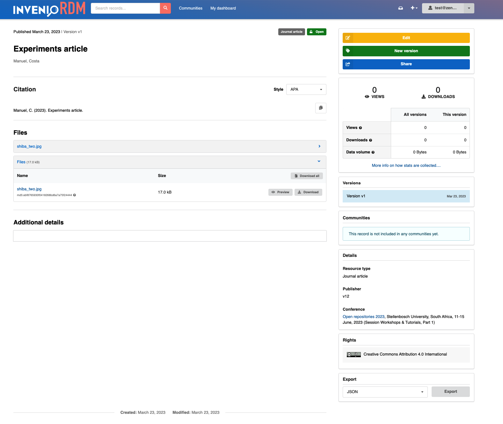
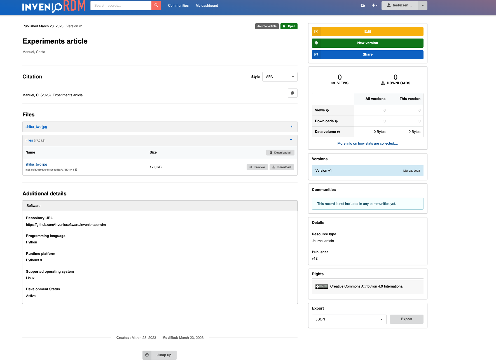

# Optional metadata fields list

_Introduced in InvenioRDM v12_

The following document is a reference guide for the instance-level optional metadata fields available in InvenioRDM.

!!!tip "How to add a field to an instance?"
    If you want to add one of the fields below to an instance, please refer to the [optional field customization page](../../customize/metadata/optional_fields.md).

## Publishing information

This group of fields contains the metadata for "Journal", "Imprint" and "Thesis". Each set of fields can be used independently, but the normal configuration is to group them in the UI.

**Deposit form**

**Landing page**

Publishing information is typically displayed in the section "Details", on the right side bar, under "Published in", "Imprint", or "Awarding university".

### Journal

This field implements a journal's metadata. It can be used to describe a journal where an article was published.

**Metadata**

- **title** `String`: The title of the journal.
- **issn** `ISSN`(defined by [idutils](https://github.com/inveniosoftware/idutils/blob/10b05b702b06e93f02774426df59a217035b1cee/idutils/__init__.py#L408)): The ISSN of the journal.
- **volume** `String`: The volume where the article was published.
- **issue** `String`: The issue within the volume.
- **pages** `String`: The pages within the issue where the article was published. It can be a number or a range in any format.

### Imprint

This nested field implements an imprint's metadata. It can be used to describe a book, report or chapter where a record was published.

**Metadata**

- **title** `String`: The title of the book or report where the record was published.
- **isbn** `ISBN`(defined by [idutils](https://github.com/inveniosoftware/idutils/blob/10b05b702b06e93f02774426df59a217035b1cee/idutils/__init__.py#L400)): The book's International Standard Book Number. Applies if the imprint is a book.
- **place** `String`: Location where the book (or report) was published.
- **pages** `String`: The pages within the book or report. It can be a number or a range in any format.

### Thesis

This field implements thesis metadata, more specifically an awarding university. A thesis supervisor can be found in the list of contributors whose role is "Supervisor".

**Metadata**

- **university**: Name of the awarding university.

## Meeting

This field can be used to describe a meeting, e.g. a conference.

**Deposit form**

**Landing page**

Meeting information is displayed in the section "Details", under "Conference".

**Metadata**

- **title** `String`: Meeting or conference title.
- **acronym** `String`: Acronym that represents the conference.
- **dates** `String`: Dates when the meeting took place.
- **place** `String`: Location where the meeting took place.
- **session** `String`: Session within the meeting or conference.
- **session_part** `String`: Part within the session.
- **url** `URL`: Link of the conference website.

## CodeMeta

This group of fields contains metadata to describe a software record based on the [CodeMeta standard](https://codemeta.github.io/index.html).

**Deposit form**

**Landing page**

Software information is displayed in the section "Additional details", under the tab "Software".

**Metadata**

- **codeRepository** `URL`: Link to the repository where the related code is located (e.g. Github).
- **programmingLanguage** `Vocabulary`: Name of the programming language used to develop the software from the [vocabulary](https://github.com/inveniosoftware/invenio-rdm-records/blob/e64dd0b81757a391584e63d162d5e6caf6780637/invenio_rdm_records/fixtures/data/vocabularies/contrib/codemeta/programming_languages.yaml).
- **developmentStatus** `Vocabulary`: Description of the development status (e.g. "Active"). Uses a controlled vocabulary defined in [repostatus](http://www.repostatus.org/).
