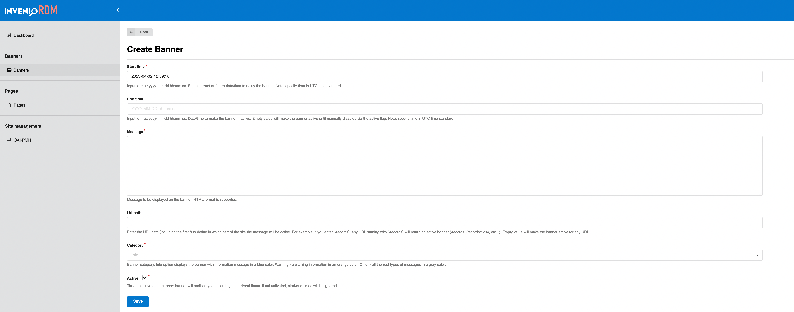

# InvenioRDM v12.0.0b1

_2023-04-13_

_Beta release_

We're happy to announce the release of InvenioRDM v12.0.0b1. The release is a beta release which is an interim release until v12.0.

## Try it

- [Demo site](https://inveniordm.web.cern.ch)

- [Installation instructions](https://inveniordm.docs.cern.ch/install/)

## What's new?

### Usage statistics

A major new feature in this release is the integration of `invenio-stats`, a powerful and flexible extension for measuring usage statistics of InvenioRDM records. With `invenio-stats`, you can gain valuable insights into how your InvenioRDM records are being used, which can help you make informed decisions about how to improve your application and better serve your users. Usage statistics that are compliant with the [MakeDataCount](https://makedatacount.org/) and [COUNTER](https://www.projectcounter.org/) standards. This allows for better tracking and reporting of usage metrics for research data, helping to ensure transparency and accountability in research data management.

Some of the key advantages of using invenio-stats for measuring usage statistics include:

- Detailed information: With invenio-stats, you can track a wide variety of usage statistics, including downloads, views, and citations. You can also view statistics broken down by date range, and other parameters, giving you detailed insights into how your records are being used.

- Customizable metrics: In addition to the default metrics provided by invenio-stats, you can also define your own custom metrics to track specific usage patterns or behaviors.

Usage statistics are displayed in the record landing page and records' search:


#### Unique views and downloads

If it seems like the view and download counts on the landing page are a bit low, that's
probably because the landing page shows the *unique views/downloads* per default.
They deduplicate events for each record that are coming from the same source.
This is simply the more honest metric, even if it can be a little bit disappointing.

#### Only records have stats

Out of the box, InvenioRDM only collects statistics for records but not drafts.
As a consequence, only the record search supports display of and sorting by views
and downloads.

#### Only UI visits are counted as view

Currently, InvenioRDM will generate but immediately discard `record-view` events
generated via REST API accesses.
Thus, only landing page visits will count towards the record views.

For more details about usage statistics, consult the documentation [page](../../reference/statistics.md)

### Community submission and required review

With InvenioRDM v12.0.0b1, you can now change if a review is always required when submitting a new record to your community, or if curators, managers and owners can submit a record without the review process. In this case, a review will be created anyway, but it will be automatically accepted. Community manager or owner have the ability to enable or disable this feature for their communities through the community manager interface.


When enabled, the community submission without required review option will be available to users when submitting their research outputs to the community. If disabled, this option will not be available, and users will need to go through the traditional peer review process in order to publish their work.

### Multiple communities submission

One of the new features included in the InvenioRDM v12.0.0 release is the ability to include a record in multiple communities.


!!! note 
    You can include a record to multiple communities only **after** having published the record.

Once a record has been included in a community, it becomes visible and editable by the community curators. This means that members of the community who have been granted the appropriate permissions can view and modify the record metadata, add related files or links, and perform other actions related to the record.


### Banners - communication with users

One of the key new features is the addition of invenio-banners, a powerful and flexible extension for creating and managing banner notifications in your InvenioRDM instance. With invenio-banners, you can easily add important alerts and messages to your application, such as system maintenance notifications or announcements.

The extension provides an easy-to-use API for creating and managing banners, and supports various types of banners, including fixed, floating, and dismissible banners. It also allows banners to be customized with different colors, icons, and animations.



### Static pages - administration panel

Another notable addition is the integration of invenio-pages administration panel, a powerful and flexible extension for creating and managing static pages in your InvenioRDM instance. With invenio-pages, you can easily create custom pages for your application, such as About Us, Contact Us, or Terms of Service pages.

Some of the key advantages of using invenio-pages to manage static pages include:

- Easy customization: With invenio-pages, you can quickly and easily create custom pages using a simple, user-friendly interface. You can customize the layout, formatting, and content of your pages, and even add custom CSS and JavaScript code.

- Version control: Invenio-pages includes built-in version control, so you can easily track changes to your pages and roll back to previous versions if needed - this feature is available only for developers


### File uploads and restricted records


#### Metadata-only 

InvenoRDM v12.0.0b1 introduces two new configuration variables to control whether metadata-only records and restricted files of a record are allowed in the system.

A metadata-only record is a record that contains only descriptive metadata, without any associated files or content. These types of records can be useful in cases where you want to provide metadata for a resource that does not have a corresponding digital object or content file.

By default, InvenioRDM allows metadata-only records. However, with the addition of the RDM_ALLOW_METADATA_ONLY_RECORDS configuration variable, you can now choose to disallow metadata-only records if desired, and any attempt to create or update a record without files or content will result in an error.

To use this configuration variable, add it to your `invenio.cfg`:

```python
RDM_ALLOW_METADATA_ONLY_RECORDS = False
```

With this configuration option set to `False`, users cannot anymore create metadata-only records by omitting the files field when creating or updating a record.

It's worth noting that allowing metadata-only records may have implications for data management and preservation, as well as for editing existing records (users will not be required to provide a file for each record. Therefore, it's recommended to carefully consider the use case and its potential consequences, before disabling this configuration option.

#### Restricted records

A restricted record is a record that contains sensitive or confidential information, and is not publicly accessible. Restricted records can be useful in cases where you want to provide access to certain information or resources to only a select group of users or organizations.

By default, InvenioRDM allows restricted records. However, with the addition of the RDM_ALLOW_RESTRICTED_RECORDS configuration variable, you can now choose to disallow restricted records if desired, and any attempt to create or update a record with restricted access will result in an error.

To use this configuration variable, add it to your `invenio.cfg`:

```
RDM_ALLOW_RESTRICTED_RECORDS = False
```

With this configuration option set to `False`, users cannot create records with restricted access by setting the access field to "restricted". The user interface will no longer show the option to restrict the record, and the rest API will return an error if the user has no sufficient permissions to perform this action. This will disable the restricted access and the users will be able to create only open access records.


### New export formats

We are pleased to announce that the latest release includes several new export formats to facilitate sharing and dissemination of research data. These new export formats offer a wider range of options for exporting metadata, making it easier to integrate with various third-party systems and to meet different requirements for data publication. The new export formats are available in addition to the existing export formats, providing more flexibility and options for researchers and data managers. We believe that these new additions will help advance the goal of open science and data sharing, and we hope that they will be useful to the research community.

Detailed documentation of export formats is available [here](../../reference/export_formats.md) 

### Metadata extensions 

The regular data model of InvenioRDM provides a set of core metadata fields that are commonly used to describe research data. These fields are designed to be generic enough to cover a wide range of research data, while still providing enough detail to describe the research in a meaningful way.

However, there are situations where additional metadata fields are needed to capture more specific information about the research data. InvenioRDM provides the ability to add custom fields to the data model to accommodate these specific needs.

The custom fields, such as journal, thesis, conference, imprint, and notes, are
not included in the regular data model because they are not commonly used for
describing research data. These fields are more specific to certain types of
research or publications, and therefore, may not be relevant or necessary for
all research data - however they are now provided as possible extensions to the
data model. Instance manages is able to include these fields by configuration.
For more details on how to configure the aforementioned fields, visit
[reference page](../../reference/metadata/optional_metadata.md).


## Other changes

- deprecated dependency `flask-babelex` was replaced with flask babel. Check [upgrade guide](./upgrade-v12.0.0b1.md) for more details
- communities REST endpoint accepts both UUID and slug in the URL


#### Python and Node.js versions

While you can run InvenioRDM with Python version 3.7, 3.8 and 3.9, the recommended version for development and deployment is 3.9. We suggest switching to **Python 3.9**.

We recommend upgrading **Node.js** to **v16**. Next InvenioRDM releases will support more recent versions.

## Upgrading to v12.0b1

We support upgrading from v11 to v12b1. Please see the [upgrade notice](./upgrade-v12.0.0b1.md).

## Maintenance policy

InvenioRDM v12.0.0b1 is a beta release which is interim release until InvenioRDM v12.0. See our [Maintenance Policy](../maintenance-policy.md).

If you plan to deploy InvenioRDM as a production service, please use InvenioRDM v9.1 Long-Term Support (LTS) Release.

## Requirements

InvenioRDM v12 supports:

- Python 3.9
- Node.js 14 and 16
- PostgreSQL 10+
- OpenSearch v1 and v2 (Elasticsearch 7 deprecated)

## Questions?

If you have questions related to these release notes, don't hesitate to jump on our chat and ask questions: [Getting help](../../develop/getting-started/help.md)

## Credit

The development work in this release was done by:

- CERN: Alex, Anna, Javier, Jenny, Karolina, Lars, Manuel, Nicola, Pablo G., Pablo P., Zacharias, Martin
- Northwestern University: Guillaume
- TU Graz: Christoph, David
- TU Wien: Max
