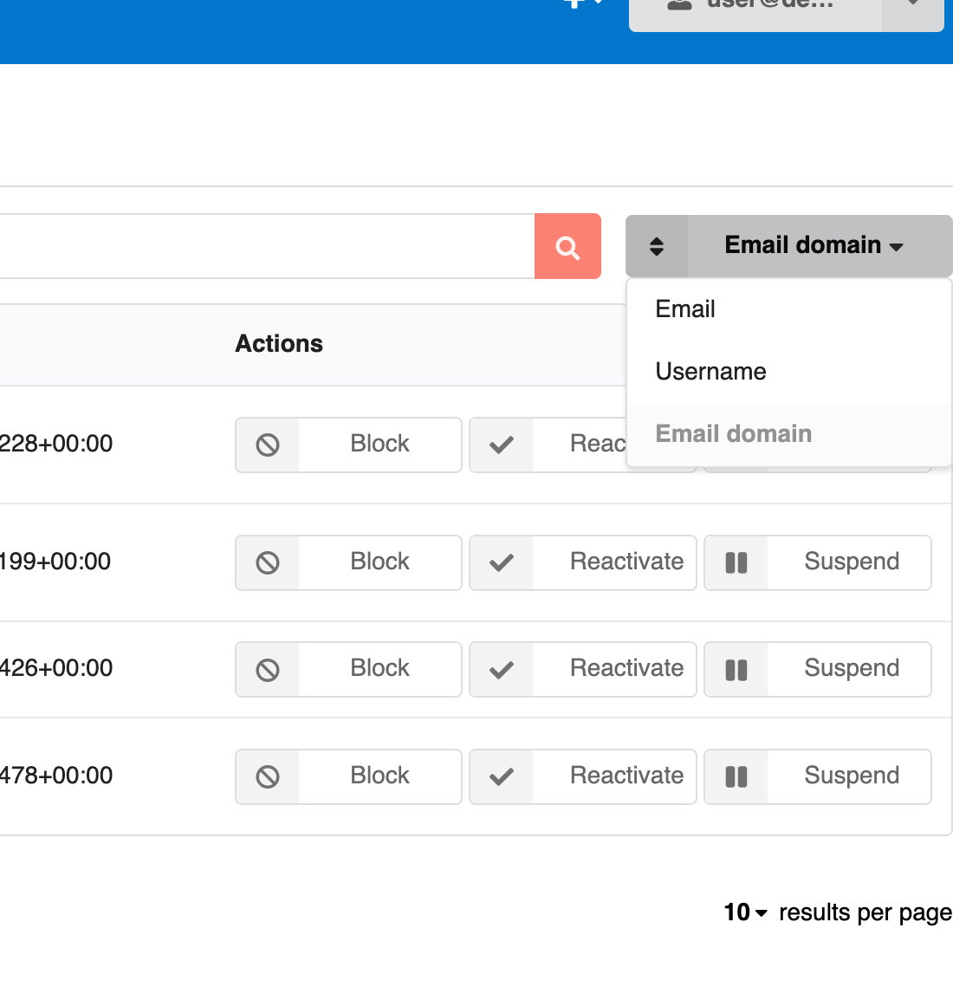

# InvenioRDM v12.0

_2024-07-31_

We're happy to announce the release of InvenioRDM v12.0, the new much anticipated release! Version 12 will be maintained until at least 6 months following the next release. This also means that in February 2025, we will retire v9.1, the previous LTS. Visit our [maintenance policy page](../maintenance-policy.md) to learn more.

## Try it

- [Demo site](https://inveniordm.web.cern.ch)

- [Installation instructions](../../install/index.md)

## What's new?

A lot is new since the previous v11 release. This new version is brimming with new functionality and improvements. We highlight the big changes here and we end with a list of the miscellaneous other improvements.

### Usage statistics compliant with [MakeDataCount](https://makedatacount.org/) and [COUNTER](https://www.projectcounter.org/)

A major new feature in this release is the integration of [`invenio-stats`](https://github.com/inveniosoftware/invenio-stats), a powerful and flexible extension for measuring usage statistics of InvenioRDM records. Usage statistics are compliant with the [MakeDataCount](https://makedatacount.org/) and [COUNTER](https://www.projectcounter.org/) standards. This allows for better tracking and reporting of usage metrics for research data, helping to ensure transparency and accountability in research data management.

A wide variety of usage statistics are tracked over time and versions, including downloads, views, and data volume. You can also define your own custom metrics to track specific usage patterns or behaviors

Usage statistics are displayed in the record landing page and record search:

The landing page shows the _unique views/downloads_ (it deduplicates events coming from the same source) by default.
And only visits to the landing page count towards the record views.

For more details about usage statistics, consult the [explainer page](../../maintenance/internals/statistics.md)

### Record inclusion in multiple communities

A record can now belong to multiple communities.

You can include a record to multiple communities only **after** having published the record. Once a record has been included in a community, it becomes visible and editable by that community's curators. Including a record in multiple communities will let different curators change the files or metadata of the record.

### Powerful and reliable record access

[Giving and requesting access](../../use/records/record.md#request-access-to-restricted-files) to records have seen a complete overhaul in this release. Record owners or curators can share them directly with other users or with groups, as well as control whether, who and how access can be demanded.

This provides flexible, yet reliable access control to the records of an instance and can even be done in bulk.

### Notifications

[A notification system](../../use/notifications.md) has been introduced. Users can now receive email notifications depending on their preferences when they are involved in certain activities. For instance, inviting someone to a community will send an email to the invited party and send an email to the inviter when the invitee makes a decision.

### Moderation of users and records

The administration panel now includes a "User management" section to deactivate, block and delete users, as well as undo all those actions. You can read more about [moderation here](../../use/administration.md#moderation-of-users-and-records).

### DOIs for concept records and no DOIs for restricted records

InvenioRDM now mints a concept DOI for every record by default, similar to what Zenodo has done for many years. This [can be configured](../../operate/customize/dois.md).

Along with this update, restricted records will now stop minting a DOI upon publication thus keeping _private_ records **truly private**.
And if the visibility of a record becomes restricted after being public, a tombstone will be shown:

### Even better previewers

Audio and video previewers come by default. Beware that supporting these typically larger files may require some changes to an instance's [upload limits](../../operate/customize/file-uploads/upload_limits.md) and using delegated file serving.

Also, text (.txt) preview can be truncated after a specified number of bytes via the `PREVIEWER_TXT_MAX_BYTES` configuration variable.
Text previewing has been made much more resilient thanks to that improvement, better encoding detection, and fault-tolerance to encoding misdetection.

### External resources integration (e.g. GitHub)

The landing page for a record can now provide nicer visuals for configured related works. The configuration variable
[`APP_RDM_RECORD_LANDING_PAGE_EXTERNAL_LINKS`](https://github.com/inveniosoftware/invenio-app-rdm/blob/master/invenio_app_rdm/config.py#L849) can be set to highlight some referred platforms:

### Skippable community submission review

With InvenioRDM v12, you can change if a record review is always required for your community, or if curators, managers and owners can submit a record without the review process. In this case, a review will also be created, but it will be automatically accepted. Community managers or owners have the ability to enable or disable this feature for their communities through the "Curation policy" settings.

### Banners

With the addition of [`invenio-banners`](https://github.com/inveniosoftware/invenio-banners), you can now easily add and manage important alerts and messages on your InvenioRDM instance, such as system maintenance notifications or announcements. The extension supports various types of banners, including fixed, floating, and dismissible banners. It also allows banners to be customized with different colors, icons, and animations.

### Static pages - administration panel

Another notable addition is the integration of [`invenio-pages`](https://github.com/inveniosoftware/invenio-pages) with the administration panel. It exposes a convenient UI to create and manage static pages. With invenio-pages, you can easily create custom pages for your application, such as "About Us", "Contact Us", or "Terms of Service" pages.
They are also version-controlled, so page changes can be tracked and rolled back to previous versions if needed - this feature is only available to developers.

Static pages support custom CSS and Javascript. `PAGES_ALLOWED_EXTRA_HTML_ATTRS` and `PAGES_ALLOWED_EXTRA_HTML_TAGS` have been introduced to allow specific HTML attributes and tags in static pages in order to provide a workable security / usability trade-off.

### Miscellaneous additions

Here is a quick summary of the myriad other improvements in this release:

- Enable/disable metadata-only records at the instance-level via the `RDM_ALLOW_METADATA_ONLY_RECORDS` configuration variable
- Enable/disable restricted records at the instance-level via the `RDM_ALLOW_RESTRICTED_RECORDS` configuration variable
- [New export formats](../../use/records/export-formats.md) such as DACT-AP and GeoJSON
- [Signposting](https://zenodo.org/doi/10.5281/zenodo.12554415) has been integrated in a record's API responses and using the `Accept: application/linkset+json` header for a `/api/records/<record_id>` call returns the Linkset.
- [Optional metadata fields](../../use/records/custom-fields.md) that are easy to enable
- Improvements to the `invenio rdm rebuild-all-indices` command
- Mathematical formulas in a deposit can be rendered on the landing page via
  - `THEME_MATHJAX_CDN = "https://cdnjs.cloudflare.com/ajax/libs/mathjax/2.7.1/MathJax.js?config=TeX-AMS-MML_HTMLorMML"` and
  - adding `cdnjs.cloudflare.com` to `APP_DEFAULT_SECURE_HEADERS` (updating content security policy headers)
- Possibility to [add an entry to a controlled vocabulary](../../operate/customize/vocabularies/index.md#addupdate-fixtures-command) via the CLI: `invenio rdm-records add-to-fixture`
- Addition of a proper handler for API permission errors that returns 403 when permission is denied
- Datastreams can sync funders and affiliations. ROR and OpenAIRE are supported.
- Fix for long affiliations' autocomplete crashing search
- Replacement of CKEditor with TinyMCE
- Transition modules from using Flask's deprecated `before_first_request` to using InvenioRDM's `finalize_app` entrypoint
- Backend IIIF tile generation can be set
- Great improvements in bulk serialization performance
- The communities REST endpoint accepts both UUID and slug in the URL
- Many new configuration variables (e.g., `COMMUNITIES_SEARCH_SORT_BY_VERIFIED`) to tune your instance
- ...and many more bug fixes!

## Breaking changes

- See the [Requirements section](#requirements) below for what underlying requirements are now necessary
- The [react-invenio-deposit module](https://github.com/inveniosoftware/react-invenio-deposit) has been moved to [invenio-rdm-records](https://github.com/inveniosoftware/invenio-rdm-records)
  - Any imports should be replaced: `import { ... } from "react-invenio-deposit"` -> `import { ... } from "@js/invenio_rdm_records"`
- Some `Overridable` React component ids may have changed. Verify that your overridden components load
- The `/access/users` API URL has been renamed to `/access/grants` to manage access grants
- Persistent identifiers have a new required `is_enabled` parameter, which enables better customization
- `MarshmallowJSONSerializer`, `XMLSerializer`, `SerializerMixin` have been removed from flask-resources
- Although not immediately breaking, the [`subject_nested` facet](https://github.com/inveniosoftware/invenio-rdm-records/blob/master/invenio_rdm_records/services/facets.py#L87) is deprecated in favor of [`subject_combined`](https://github.com/inveniosoftware/invenio-rdm-records/blob/master/invenio_rdm_records/services/facets.py#L103) to provide proper nested subject aggregation
- The Python module `flask_babelex` has been replaced by `invenio_i18n`
  - Any imports should be replaced: `from flask_babelex import lazy_gettext as _` -> `from invenio_i18n import lazy_gettext as _`
- The cardinality of the Drafts and Records Metadata/REST API field `parent.access.owned_by` changed from `(1-n)` (an array of objects) to `(1)` (a single object).

## Limitations and known issues

- Translations for v12 will be coming in v12.1 targeted for release in two months time from the release of v12.0
- Sharing a secret link to a restricted record in a restricted community does not provide access to the record yet.
  Work on this is [tracked here](https://github.com/inveniosoftware/invenio-app-rdm/issues/2706).
- For each user, only one record can have its storage quota increased via the administration panel, due to an overzealous `unique` constraint.
  The fix (in [Invenio-RDM-Records PR#2037](https://github.com/inveniosoftware/invenio-rdm-records/pull/2037)) will not be backported to v12.

## Requirements

InvenioRDM v12 now supports:

- Python 3.9, 3.11 and 3.12
- Node.js 18+
- PostgreSQL 12+
- OpenSearch v2

Notably, older versions of Elasticsearch/Opensearch, PostgreSQL, and Node.js have been phased out.

## Upgrading to v12.0

We support upgrading from v11 to v12. See the [upgrade guide](./upgrade-v12.0.md) for how.

## Questions?

If you have questions related to these release notes, don't hesitate to jump on [Discord](https://discord.gg/8qatqBC) and ask us!

## Credit

The development work of this impressive release wouldn't have been possible without the help of these great people:

- CERN: Alex, Anna, Antonio, Carlin, Fatimah, Javier, Jenny, Karolina, Lars, Manuel, Nicola, Pablo G., Pablo P., Pablo T., Yash, Zacharias
- Northwestern University: Guillaume
- TU Graz: Christoph, David, Mojib
- TU Wien: Max
- Uni Bamberg: Christina
- Uni Münster: Werner
- Front Matter: Martin
- KTH Royal Institute of Technology: Sam
- Caltech: Tom
