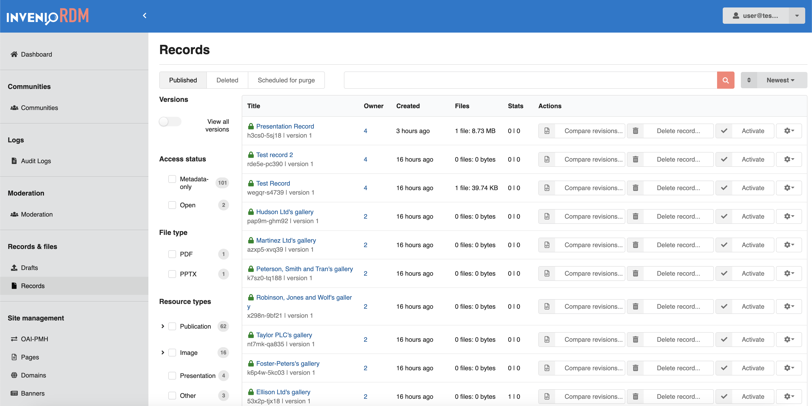
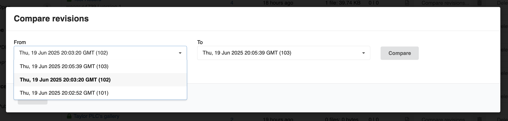
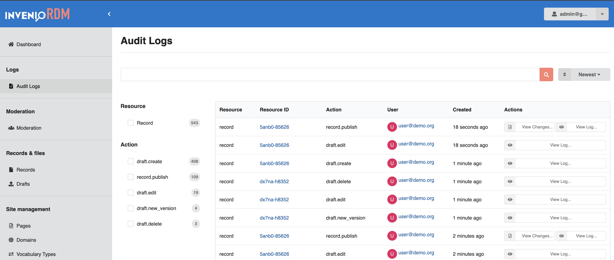
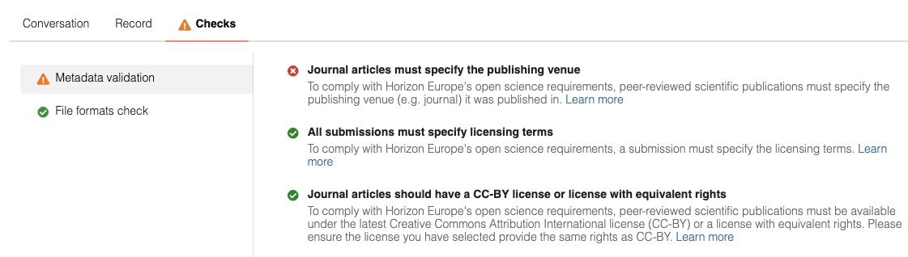
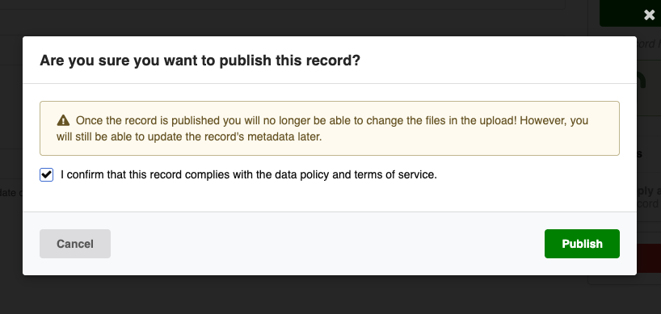
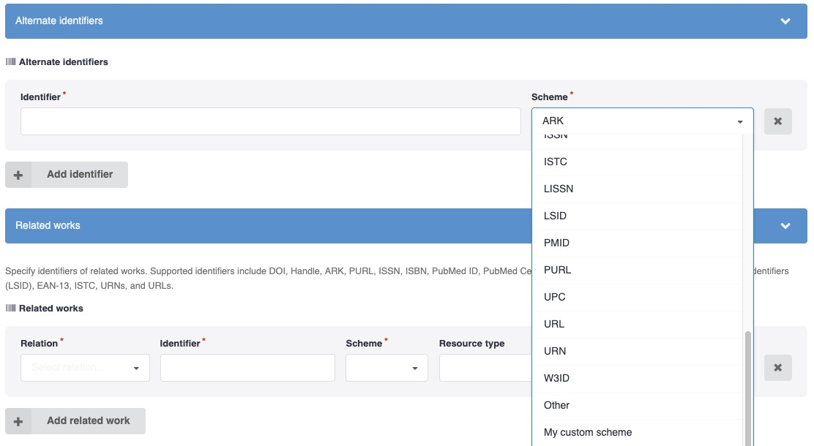
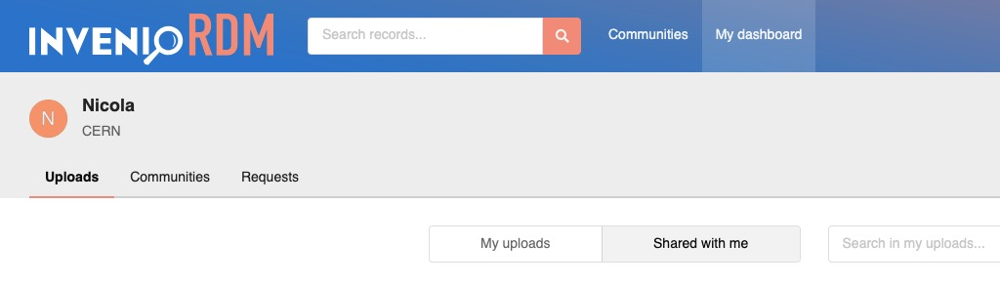
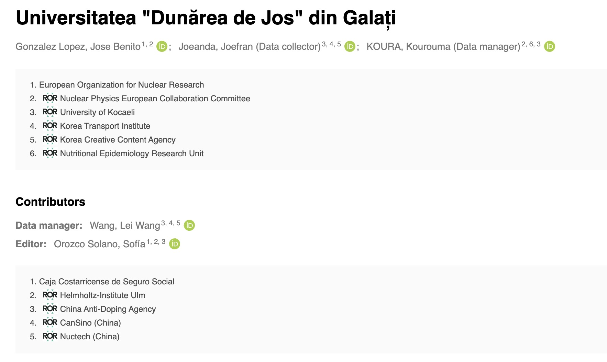
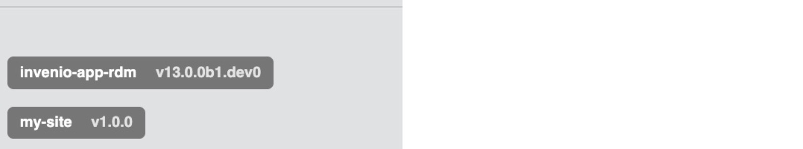

# InvenioRDM v13.0

_2025-07-21_

We're happy to announce the release of InvenioRDM v13.0! Version 13 will be maintained until at least 6 months following the next release. Visit our maintenance policy page to learn more.

## Try it

- [Demo site](https://inveniordm.web.cern.ch)

- [Installation instructions](../../install/index.md)

## What's new?
Our latest release, v13, is here, and it's packed with an incredible array of new features and major improvements. We're diving straight into the highlights, then wrapping up with a comprehensive list of all the other valuable enhancements.

### Administration panel
You'll find several new improvements in the administration panel:

- The default number of results of has been increased from 10 to 20 on all panels
- Records and draft panel:
    - More of the title is shown by default
    - Improved display of files and stats information
    - Fixed narrow viewport display, such as on mobile
    - Owner now links to the ID in the user panel
- User panel:
    - ORCID and GitHub icons now link to the user's profile

#### Compare revisions
The new `Compare Revisions` feature allows administrators to audit record updates and follow changes over time.
From the **Records** list in the Administration panel, click the **Compare revisions...** button in the _Actions_ column to open a side-by-side comparison window:



A modal window appears, allowing you to choose two revisions to compare:



The changes are then displayed in a JSON **side-by-side diff** view:


!!! info "Revisions VS versions"

    This feature allows admins to compare revisions, not versions. A revision is the result of editing a record, where each published edit creates a new revision. A new version is a different record which is semantically linked to the previous record. At this time it is not possible to compare different records, including versions.

### Audit logs
InvenioRDM now comes with a new audit logs feature. See the [related documentation here](../../operate/customize/audit-logs.md).



### Communities
InvenioRDM v13 introduces a range of exciting new features related to communities.

!!! info
    Such features currently lack a user-friendly interface for easy configuration and require manual setup. Please refer to the linked documentation for detailed activation instructions.

#### Themed communities
Communities can now have their own theming with a custom font and colors, which apply to all community pages including records and requests. Below is an example of one "default" and two themed communities on Zenodo.


Themed communities benefit from a custom homepage, defined by changing its HTML template.

Read more about the [themes communities feature](../../operate/customize/look-and-feel/themed_communities.md).

#### Subcommunities
It is now possible to create hierarchical relationships between communities, allowing for departments, subject areas and other structures to be represented via related communities. Records from the "child" community are automatically indexed in the "parent" community, allowing all the records of the children to be browsed in the parents. The communities are also bidirectionally linked so that it is easy to navigate between both.

Having subcommunities also enables the **Browse** page, which lists all the subcommunities and [collections](#collections) of that community.

!!! note
    By design, communities can only have one level of hierarchy (i.e., no grand-child communities) and communities can only have one parent community.

#### Collections
Collections introduce a powerful new way to organize and curate records within your InvenioRDM instance. This major feature enables administrators to create dynamic, query-based groupings of records that automatically stay current as new content is added.


/// caption
Collections provide dedicated pages showing all records matching specific criteria.
///

**Hierarchical organization**
Collections allow you to define hierarchical groupings of records, enabling users to browse content by subject, resource type, funding program, or any other metadata field.


/// caption
The collection browser provides an organized view of all available collections within a community.
///

**Common use cases**
- Group content by research disciplines using a hierarchical vocabulary
- Organize historical records by publication date
- Organize records by funding programs (Horizon 2020, NSF, institutional grants)
- Create resource type collections (datasets, publications, software)
- Highlight featured content or special collections

Collections integrate seamlessly with existing community features and are accessed through intuitive URLs. The feature is currently managed through Python shell commands, with an administrator user interface planned for future releases.

Read more about the [Collections feature](../../operate/customize/collections.md).

### Curation checks
It is now possible to configure automated **checks** in your communities to provide instant feedback on draft review and record inclusion requests. Checks provide feedback to both the user and reviewer that submissions to your community are compliant with your curation policy. For example, you can enforce that submissions to your community must be preprints, funded by a specific grant or any other requirement on the metadata or files.


/// caption
Curation checks in Zenodo's EU Open Research Repository
///

Read the detailed documentation for [Curation checks](../../operate/customize/curation-checks.md).

### Customizable compliance info when publishing
You can now fully customize the compliance information and checkboxes that users must acknowledge when publishing a record. This makes it easy to tailor the publishing workflow to your organization's policies or legal requirements.



See the configuration options in the [related documentation](../../operate/customize/compliance_info.md).

### DOIs on demand
You can now let users to choose if they need a DOI or not when uploading. See how to configure it in the [related documentation](../../operate/customize/dois.md#optional-doi-user-interface-and-advanced-configuration).


### Extra PIDs schemes
InvenioRDM v13 allows you to extend the list of existing schemes for persistent identifiers to detect, validate and add support for your owns.



See the [related documentation](../../operate/customize/metadata/custom_pids_schemes.md) how to add your own custom schemes.

Under the hood, the Invenio [idutils](https://github.com/inveniosoftware/idutils) module handles validation and normalization of persistent identifiers used in scholarly communication, and existing customizations may be affected by changes in v13. The module has been restructured to use a configurable scheme system with a new entrypoint mechanism for registering your own identifier schemes.

### FAIR Signposting
With v13, you can now enable support for FAIR Signposting level 1 and 2. See [the related documentation](../../operate/customize/FAIR-signposting.md) for more information.

### Files uploader & S3-compatible storage
The new file uploader, powered by Uppy (disabled by default), delivers a faster, more intuitive, and modern file upload experience. It also enables advanced features such as **multipart file transfers** with **S3-compatible** storage backends.

Learn more about [file uploaders](../../operate/customize/file-uploads/uploader.md), [S3-compatible storage](../../operate/customize/file-uploads/s3.md), and [file transfers](../../reference/file_transfer.md)

### Jobs
This release introduces a new Jobs feature, providing a comprehensive way to manage asynchronous tasks via the UI or REST API. Jobs are triggered via the admin UI or REST API, run using Celery, and support logging, argument validation, and result tracking. See the related documentation [here](../../operate/ops/jobs/jobs.md).

#### ORCID and ROR integrations
You can now setup jobs to automatically and recurrently fetch ORCID and ROR latest databases.

For ORCID, read more on the [names vocabulary](../../operate/customize/vocabularies/names.md#using-orcid-public-data-sync) documentation page.

With the ROR job, you can automatically load funders or affiliations vocabulary from the InvenioRDM administration panel, and schedule updates with new ROR releases. Instructions can be found on the [affiliations vocabulary](../../operate/customize/vocabularies/affiliations.md) documentation page.
We have also upgraded the integration with ROR to version 2.0 and enhanced the metadata to include organization aliases, status, types, locations, and acronyms, making it easier to find the correct organization or funders.

#### EuroSciVoc subjects
You can now import [EuroSciVoc subjects](https://op.europa.eu/en/web/eu-vocabularies/euroscivoc) using the new Jobs system. If you previously had imported EuroSciVoc subjects, you will need to update the existing records, drafts, and communities that were using these subjects and then deleting the old subjects in the database. This is necessary due to changes in the structure, such as the introduction of the `props` property and updates to the `id` format.

_Note that search mapping updates are needed. Also, you would need to reindex the relevant subjects, records, drafts and communities._

#### CORDIS awards
CORDIS data can now be imported to enhance OpenAIRE awards using the new Jobs system. This update allows for the addition of supplementary information to the awards, including subjects _(Note: The EuroSciVoc subjects are needed for this)_, organizations, and other related metadata. The three funding programs supported are `HE`, `FP7` and `H2020`.

_Note that search mapping updates are needed. Also, you would need to reindex the relevant awards, records, drafts and communities._

### New metadata fields
We have introduced new metadata fields that will allow you to capture more useful information when uploading:

- A dedicated **copyright** field is now available, ensuring clear and comprehensive copyright information.
- We've added new **thesis** add-on set of fields. We've also reorganized the thesis section, grouping thesis fields together. See [here](../../operate/customize/metadata/optional_fields.md) how to enable them.
- The **edition** field has been introduced under the `imprint` add-on set of fields, providing a way to specify the edition of the book.
- A new **identifiers** field, composed of `id` and `scheme`, has been added to the `meeting` add-on set of fields.

### PDF preview upgrade
The v13 release features an upgraded PDF previewer, now powered by [PDF.js v4](https://github.com/mozilla/pdf.js). This update resolves previous issues with failed previews for certain PDF files, providing a more reliable and seamless viewing experience.

### Requests sharing
When a record is shared, the review request is now also accessible. We have introduced a new search filter in `My Dashboard`, to easily find records shared with me.



### Search improvements
Both users and records search have been enhanced to return more accurate results for common names/titles, partial matches (even with typos) and names/titles with accents or diacritics.

Creators, affiliations and funders autocompletion has been improved so that suggestions appear faster and better match what you type.

### Sitemaps
InvenioRDM v13 introduces the automatic generation of sitemaps to help search engines and other crawlers discovering and indexing your repository's content. Sitemaps are even automatically linked in your `robots.txt`.

See the [related documentation](../../operate/customize/sitemaps.md) to learn how to configure it.

### Miscellaneous additions
Here is a quick summary of the myriad other improvements in this release:

- The creators' roles are now displayed in the record's landing page:
  
- You can now optionally display the installed version of InvenioRDM and any other module in the bottom left corner of the administration panel:
  
  By default, the released version will be displayed. You can customize it by changing in your `invenio.cfg`:
  ```python
  ADMINISTRATION_DISPLAY_VERSIONS = [
    ("invenio-app-rdm", f"v{__version__}"),
    ("my-module", "v5.3.1")
  ]
  ```
  You can also disable this feature by setting the config variable to `None`.
- The users API endpoint `/api/users` permission has been changed from anonymous access to **login required**.
- The custom award required fields are now more flexible: either the award `number` or `title` is required, instead of mandating both.
- Previous configuration flags that controlled the visibility of menu items in the administration panel have been removed, as they are not used anymore. You can safely remove these flags from your `invenio.cfg` (if they exist); Removed flags:
    - `COMMUNITIES_ADMINISTRATION_DISABLED`
    - `USERS_RESOURCES_ADMINISTRATION_ENABLED`
    - `JOBS_ADMINISTRATION_ENABLED`
- Following the [latest COUNTER spec](https://www.countermetrics.org/code-of-practice/), the [list of robots and machines](https://github.com/inveniosoftware/counter-robots) have been updated to ensure the stats are counted on human usage.
- Logging: the Flask root logger level has been changed from `undefined` to `DEBUG`. This enables all log messages to pass through by default, instead of being blocked. If you have implemented custom logging handlers, ensure that you have defined the logging level and verify your logging verbosity in deployed environments to avoid excessive logs.
- The issue related to storage quota per record for a given user has been solved. You can now define different storage quotas per record.
- InvenioRDM v13 introduces the `generator` HTML `meta` tag to identify the repository technology. This is used by services like [OpenDOAR](https://opendoar.ac.uk/) to correctly catalog open access repositories.
  The generator string will be `InvenioRDM v13.0`. You can change it in your `invenio.cfg` by overriding the variable `THEME_GENERATOR` or setting it to `None` to disable the meta tag.
- MathJax: when enabled, it will now render mathematical formulas also in the landing page citation box, search results and request's comments pages.
- ...and many more bug fixes!

## Breaking changes
- The upgrade of the PDF previewer requires a small change to the webserver configuration. See the [upgrade guide](upgrade-v13.0.md) for more information.
- The new search improvements and the enhanced subjects and awards features require the recreation of the search mappings for Subjects, Awards, Records _(including percolators)_, Drafts and Communities.  See the [upgrade guide](upgrade-v13.0.md) for more information.
- Direct Python imports of identifier schemes (e.g., `from idutils.isbn import normalize_isbn`) are now deprecated and will be removed in future versions. If you have custom code that directly imports scheme modules, you'll need to update it to use the new API.

## Requirements

InvenioRDM v13 supports:

- Python 3.9 (end of life October 2025), 3.11 and 3.12
- Node.js 18+
- PostgreSQL 12+
- OpenSearch v2

## Upgrading to v13.0

We support upgrading from v12 to v13. See the [upgrade guide](./upgrade-v13.0.md) for how.

## Questions?

If you have questions related to these release notes, don't hesitate to jump on [discord](https://discord.gg/8qatqBC) and ask us!

## Credit

The development work of this impressive release wouldn't have been possible without the help of these great people (name or GitHub handle, alphabetically sorted):

- Adrian Moennich
- alejandromumo
- Alex Ioannidis
- Alzbeta Pokorna
- Anika Churilova
- Austin
- Brian Kelly
- Carlin MacKenzie
- Christoph Ladurner
- Cristian Pogolsha MBP
- Dan Granville
- David Eckhard
- David Glueck
- ducica
- Eduard Nitu
- Emil Dandanell Agerschou
- enitu
- Eric Newman
- Eric Phetteplace
- Esteban J. G. Gabancho
- Fatimah Zulfiqar
- Felipe Carlos
- Florian Gantner
- Furkan Kalkan
- furkankalkan
- Gantner, Florian Klaus
- Guillaume Viger
- Hrafn Malmquist
- Ian W. Scott
- Janne Jensen
- Javier Romero Castro
- Karl Krägelin
- Karolina Przerwa
- libremente
- liptakpanna
- Martin Fenner
- Martin Obersteiner
- Matt Carson
- Max
- Maximilian Moser
- mb-wali
- Michael Groh
- Mirek Simek
- Miroslav Bauer
- mkloeppe
- Nicola Tarocco
- Pablo Panero
- Pablo Saiz
- Pablo Tamarit
- Panna Liptak
- phette23
- psaiz
- rekt-hard
- roll
- Saksham Arora
- Sam Arbid
- Sarah Wiechers
- Tom Morrell
- utnapischtim
- Werner Greßhoff
- Will Riley
- Yash Lamba
- Zacharias Zacharodimos
