# InvenioRDM v14.0

_2026-07-XX_

Here are the release notes for InvenioRDM v14.0, the open-source
repository platform for research data management, institutional repositories,
and digital assets management! Version 14.0 will be maintained until at least
6 months following the next major release. Visit our [maintenance policy page](../maintenance-policy.md) to learn more.
The previous major version, version 13, will be out of support 6 months from today.

## Try it

- [Demo site](https://inveniordm.web.cern.ch)

- [Install from scratch instructions](../../install/index.md)

## What's new?

### Administration panel: users and roles

In v14, the administration panel adds users/roles improvements, including
role-aware views and groups CRUD support.

!!! Danger "v14 breaking change"

    Access checks now resolve roles by **role id** (not role name).
    If you previously relied on role **names** for access control, you must
    migrate all existing logic and related references to role ids after
    upgrading to v14, or access behavior may break.

### Publication date range facet

InvenioRDM v14 introduces an interactive publication date facet on the search
page. Users can filter records by year using a histogram and range slider, or
pick from preset ranges (last 6 months, last year, last 5 years) and enter a
custom date range.

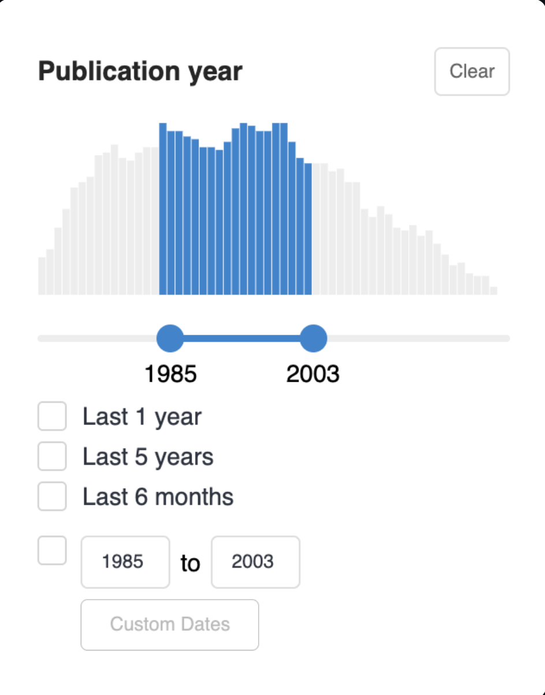{ width="300", : .screenshot}

You can enable additional date facets, tune backend aggregation settings, and
override the frontend UI. See [Configure date range
facets](../../operate/customize/search.md#configure-date-range-facets).

### Record deletion

You can now configure InvenioRDM to allow users to delete, or request deletion of, their own published records in accordance with any policy or criteria you may have. When enabled, the default behavior is that records can be deleted within 30 days of publication. After, the deletion can be requested to repository's administrators. Deletion requests are visible within the administration panel and the user's request dashboard.

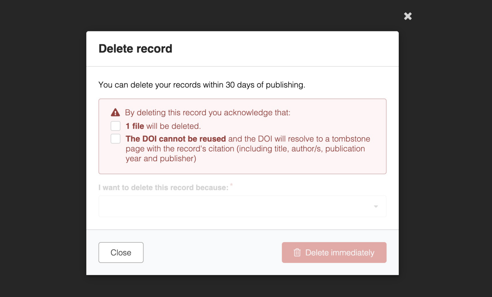{: .screenshot}
/// caption
Modal to immediately delete a record
///

This feature is highly customizable. You can introduce deletion policies based on resource type, community role, file type, or any other criteria you require. Additionally, you can prevent unnecessary record deletion by adding a deletion checklist that suggests how users can resolve the issue correctly instead of deleting the record. See the [relevant documentation](../../operate/customize/record_deletion.md) to enable and customize this feature.

### Files modification

You can now allow users to modify the files of their published records, in accordance with your policies. When enabled, the record's owner can unlock file editing within the first 30 days of publication and modify them within 45 days (by default), thus giving them at least 15 days to upload and publish again. See the [relevant documentation](../../operate/customize/file_modification.md) to see how to enable and customize this feature.

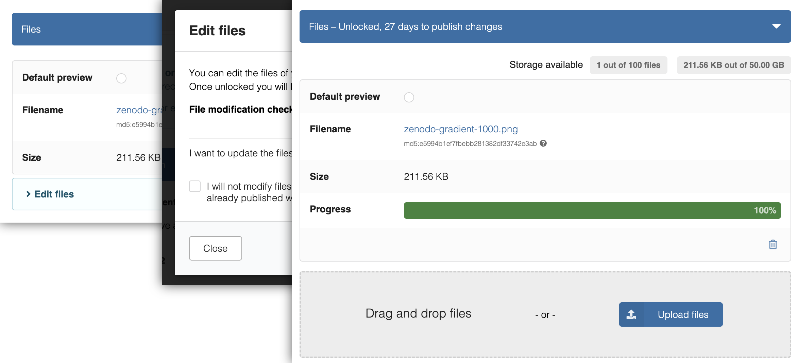{: .screenshot}

### Files quota

You can now specify a default amount of extra storage quota for files which users can spread across their records, allowing them to selectively use a budget of quota for extra large records.

There is a new section added to the deposit form which provides an intuitive interface to manage the extra quota:

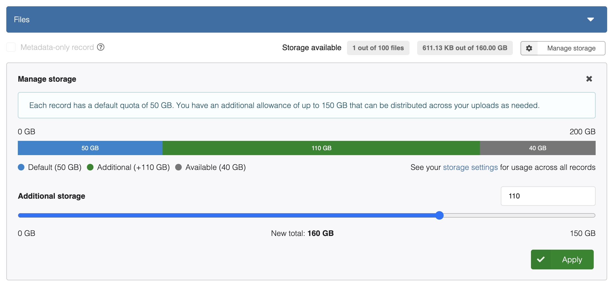{: .screenshot}

Additionally users can view the extra quota which they have used across their records in the new storage page in their settings.

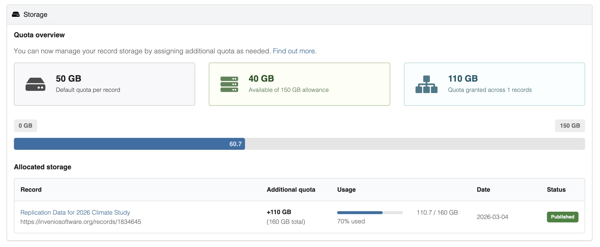{: .screenshot}

See the [related documentation](../../operate/customize/file-uploads/user-quota.md) to discover how to enable and customize this feature.

### Request commenting enhancements

We've introduced a number of exciting new features to improve the commenting experience on requests, which are currently used across InvenioRDM for a range of purposes such as community record submission.

#### Sharing a link to a comment

You can now copy a link to a comment directly, allowing for easy and precise sharing.
When opened, the link will take the user to the comment and highlight it, regardless of which page it's on.

To share a link to a comment, simply click the "Copy link" button on a comment:

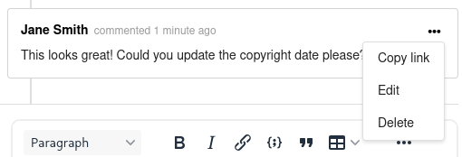

#### LaTeX equations

Comments now support LaTeX, so mathematical equations can be written inline (using `$`) or as full-width blocks (using `$$`). A "Preview math equations" button lets you check the rendered result before publishing the comment.

#### Quoting comments

You can now quote a comment, or part of a comment, when writing a reply. When quoting a whole comment, there is a "Quote reply" option in its action menu. To quote just part of it, highlight the text you want to quote and a "Quote reply" option will appear in line.

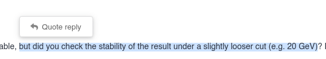

#### Replying to comments

A dedicated "Write a reply" box lets you reply directly to a specific comment, keeping related discussion grouped together and the conversation easier to follow.

#### Locking conversations

Community curators, managers, and owners can now lock a request's conversation to prevent further comments at any time, with locking and unlocking events recorded in the conversation timeline for transparency. Once a conversation is locked, existing comments can still be deleted but not edited.

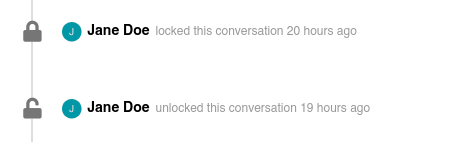

#### Attaching files to comments

You can now attach files directly to a comment, with attachments displayed beneath the comment text once submitted.

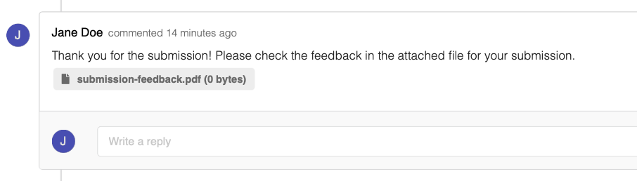

### Community reviews for each record version

Previously, when [submitting a record to a community](../../use/requests.md), only the first version of the record required a review by the community's curators.
It was not possible to require a review for new versions of the record.

**It is now possible to require a review for all record versions**, subject to custom code on the instance level.
The default behaviour (where reviews are only required for the initial version) remains unchanged.

See the [requests documentation](../../operate/customize/requests.md#require-reviews-for-each-record-version) for more information.

### OAuth improvements

We've added a few small but crucial improvements to the [invenio-oauthclient](https://github.com/inveniosoftware/invenio-oauthclient) module, improving security and bringing Invenio's third-party authentication in line with modern standards.

- **Refresh tokens** are now supported, meaning we now have full compatibility with all OAuth 2.0 authorization servers. This means we can securely store long-lived tokens and exchange them for short-lived access tokens as and when needed, allowing us to integrate with modern third-party apps ([invenio-oauthclient#328](https://github.com/inveniosoftware/invenio-oauthclient/pull/328)).

- The `extra_data` column of the `oauthclient_remoteaccount` table is now stored in the more efficient `JSONB` type when using PostgreSQL, improving the performance and flexibility of queries ([invenio-oauthclient#360](https://github.com/inveniosoftware/invenio-oauthclient/pull/360)).

### Job notifications

Jobs can now send email notifications to configured recipients when runs complete with specific statuses. This enables administrators and librarians to be automatically informed about the outcome of scheduled or manually triggered jobs.

See [Job Notifications](../../use/administration.md#job-notifications) for usage details and [Email Notification Templates](../../operate/customize/jobs.md#email-notification-templates) for customization options.

### Membership requests

Users can now request to become members of communities. This feature is opt-in per community and feature-gated at the instance level.

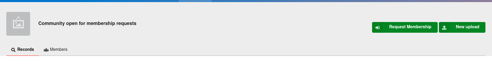

It should lessen the administrative burden of inviting new users and further let them self-organize around their interests.

Enabling the feature is just a matter of turning on a [configuration variable](../../reference/settings.md#membership-requests). See these links for [how to enable it on a per community basis](../../use/communities.md#membership-policy) and what the [usage flow](../../use/communities.md#members) is like.

### User role management

Administrators can now manage user roles directly from the administration panel. See [User Role Management](../../use/administration.md#user-role-management-ui) for details.

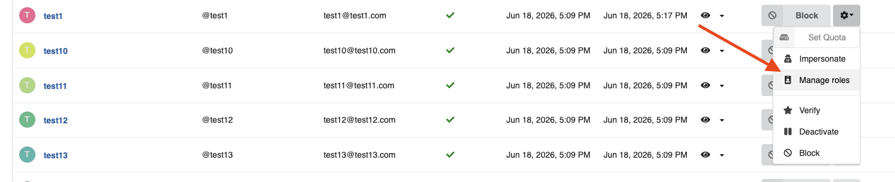

### Support for ZIP and container formats

We've added support for ZIP files and introduced a flexible framework for handling container formats (e.g., NetCDF, TAR). Users can now explore and access files inside archives without downloading them entirely, making large datasets easier to work with.

These new features allow:

- Browsing archive contents directly in the UI with a hierarchical tree view

- Previewing files inside ZIPs (images, PDFs, text, notebooks, audio/video, etc.)

- Downloading individual files or directories without extracting the entire archive

See the [ZIP and other container files configuration guide](../../operate/customize/file-uploads/zip-and-container-files.md) for how to enable the feature and tune its behavior, and the [REST API reference](../../reference/rest_api_drafts_records.md#container-files) for the new API endpoints.

### Software archival (from GitHub, GitLab, etc.)

Software releases can now be archived not only from GitHub, but also from other code forges such as GitLab and GitHub Enterprise.
The new [`invenio-vcs`](https://github.com/inveniosoftware/invenio-vcs/) module replaces the existing `invenio-github` module with a nearly identical end-user experience while adding support for a generic code forge interface.

This new module addresses existing limitations, such as allowing users to select which community should receive their code releases.

The module is **optional** and must be installed and configured.
See [the documentation](../../operate/customize/software_archival.md) for more details.

### DOI registration with Crossref

[DOI registration](../../operate/customize/dois.md) with Crossref is a new feature in InvenioRDM v14. Crossref has a different metadata schema than DataCite and supports textual content types such as journal articles, books, conference proceedings, preprints, posters or dissertations.
For more advanced use cases, InvenioRDM v14 also supports DOI registration with DataCite **and** Crossref in the same instance and/or using multiple DOI prefixes. Migration of existing DataCite DOIs to Crossref (or vice versa) is another possible advanced use case.

### Modern toolchain

The modern build toolchain introduced as experimental in v13 is now considered stable and ready for adoption:

- **[uv](https://github.com/astral-sh/uv)** in place of `pipenv` for Python dependency management.
- **[pnpm](https://pnpm.io/)** in place of `npm` for JavaScript dependency management, with faster installs and a disk-efficient content-addressable store.
- **[Rspack](https://www.rspack.dev/)** in place of `webpack` for asset bundling, with Rust-based builds that are much faster and drop-in compatible with the existing Invenio asset pipeline.

Each tool is opt-in independently. See the [upgrade guide](./upgrade-v14.0.md) for how to enable each of them.

### Miscellaneous additions

Here is a quick summary of the other improvements in this release:

- Admin panel Jobs: Addition of a [Delete action](../../use/administration.md#deleting-a-job) to the Jobs list so admins can remove jobs directly from the UI.
- Temporarily pinned `bcrypt<5.0.0` due to compatibility issues ([flask-security-fork#82](https://github.com/inveniosoftware/flask-security-fork/pull/82)). Will be lifted in a future release.
- A new configuration variable, `RDM_RECORDS_RELATED_IDENTIFIERS_SCHEMES`, enables configuring identifier schemes specifically for related identifiers, defaulting to `RDM_RECORDS_IDENTIFIERS_SCHEMES` when not defined.
- Deposit form: "Creators" label was changed to "Authors" to clarify that they appear in citations.
- Resource types: the default vocabulary now labels `publication-dissertation` as "Thesis" and drops the separate `publication-thesis` entry, so DataCite DOIs use the standard `Dissertation` value instead of a custom `Text` one. Migrating your existing records to this change is entirely optional; see [aligning the "Thesis" and "Dissertation" resource types](./upgrade-v14.0.md#align-thesis-and-dissertation-resource-types) in the upgrade guide.
- A new configuration variable, `RDM_RECORDS_REQUIRE_SECRET_LINKS_EXPIRATION`, controls whether an expiration date must be set for access links and secret links. Defaults to `FALSE` when not defined.
- Addition of support for Wikidata identifiers (QIDs) for creators and contributors of records and their affiliations.
- Addition of an HTTP User-Agent helper (`invenio_user_agent`) for outbound HTTP requests in `invenio-vocabularies` datastreams.
- Addition of a previewer to display web archive files (WACZ, WARC, HAR, CDX, CDXJ file types) via an embedded [ReplayWeb.page](https://replayweb.page/) viewer. See "Enabling Web Archives" in [invenio-previewer](https://github.com/inveniosoftware/invenio-previewer/blob/master/invenio_previewer/__init__.py)
- Communities: Fix permissions to enable community owners to [remove it from a record](../../use/communities.md#curate-records). This does not change the expected behavior for when a [community is required](../../operate/customize/require_community.md#require-community-for-record-publication) for record publication.
- Over 15 deprecations (mostly from third-parties) were addressed in this release, helping the codebase be up-to-date and logs more free of distractions (until inevitable new deprecations arise!)
- and plenty of bug fixes as usual!

## Deprecations

- Many [custom field widgets](../../operate/customize/metadata/custom_fields/widgets.md) used the `icon` and `description` props, which have now been deprecated and replaced with `labelIcon` and `helpText` respectively. This is to improve consistency with the naming of the built-in fields used in the deposit form and thereby avoid confusion. The old names will continue to function for now.
- In preparation for Marshmallow 4+ removing `context` in its serialization/deserialization, a couple of changes were made: a `ContextVar` was introduced in `marshmallow_utils.context`, some context values were passed to the `Schema` constructors, and some class properties were parameterized with former context values. Some former values were kept in `self.context` because not used in serialization/deserialization anyway.
- Since `pkg-resources` has been deprecated and removed from pypi, and the dependency `fs` is not updated anymore, we decided to re-implement the interface in `invenio-files-rest` directly.
- invenio-github

## Breaking changes

- Overridables in the deposit form have been modified to improve consistency in structure and naming conventions. This has involved renaming the IDs of several `<Overridable>`s, but none have been removed. If you are using these IDs to override components, please see [the full list of updates](https://github.com/inveniosoftware/invenio-rdm-records/pull/2101/files#diff-ff3c479edefad986d2fe6fe7ead575a46b086e3bbcf0ccc86d85efc4a4c63c79) and change your IDs accordingly.
- The default value for `WSGI_PROXIES` has been removed from Invenio-App-RDM in [PR 3284](https://github.com/inveniosoftware/invenio-app-rdm/pull/3284); instead `PROXYFIX_CONFIG` should be configured (cf. the [cookiecutter](https://github.com/inveniosoftware/cookiecutter-invenio-rdm/blob/83bb37436980ab8998a80fa0429e7d09f01f45f2/%7B%7Bcookiecutter.project_shortname%7D%7D/docker-services.yml#L24))
- The configuration variable to display the Browse menu tab in communities has been renamed from `COMMUNITIES_SHOW_BROWSE_MENU_ENTRY` to `COMMUNITIES_COLLECTIONS_ENABLED`. Check if the former was declared in your `invenio.cfg`.
- Per [v13 deprecation notice](../v13/version-v13.0.0.md#deprecations), usage of `invenio_records_resources.services.Link` has been replaced by `invenio_records_resources.services.EndpointLink` for InvenioRDM links and `invenio_records_resources.services.ExternalLink` for external third-party links. Continued import of `Link` is incorrect (may still work, but is being removed completely).
- TO DOCUMENT:
    - https://github.com/inveniosoftware/invenio-accounts/pull/557
    - https://github.com/inveniosoftware/invenio-rdm-records/commit/eaa4ba426a1a5f9ae192461105fb109183444b2a

## Requirements

For InvenioRDM v14:

- Python 3.14 is recommended (3.11, 3.12, 3.13 may work).
- Node.js 24+ is required. This release has been tested with version 26+ too.
- PostgreSQL 12+ is required.
- OpenSearch v2.12+ is required.

## Upgrading to v14

Detailed instructions on how to upgrade from v13 to v14 are in the [v14 upgrade guide](./upgrade-v14.0.md).

## Questions?

If you have questions related to these release notes, don't hesitate to jump on [discord](https://discord.gg/8qatqBC) and ask us!

## Credit

The development of this release wouldn't have been possible without the help of these smart people (name or GitHub handle, alphabetically sorted):

- Alex Ioannidis
- Alžběta Pokorná
- Anika Churilova
- Brian Kelly
- Carlin MacKenzie
- Chokri Ben Romdhane
- Chris Wagner
- Christoph Ladurner
- Dan Granville
- ducica
- Dusan Stojanovic
- enitu
- Eric Newman
- Esteban J. G. Gabancho
- Fatimah Zulfiqar
- gressho
- Guillaume Viger
- Hrafn Malmquist
- Ian Scott
- Jacob Collins
- Jakob
- jakob miesner
- Javier Romero Castro
- Jorge Marco
- Julie Hinge
- Karl Krägelin
- Karolina Przerwa
- Lars Holm Nielsen
- Laura
- Maira Salazar
- Markus Klöpper
- Martin Fenner
- Maximilian Moser
- Miroslav Bauer
- Miroslav Simek
- mkloeppe
- Mohammed Taha Khan
- Nicola
- Oliver Geneser
- Ondřej Ruml
- Orkun BALCI
- Pablo Saiz
- Pablo Tamarit
- Pal Kerecsenyi
- Pascal Repond
- Peter Desmet
- Peter Weber
- Rafael Martínez-Estévez
- Rishabh Oberoi
- ron
- Saksham
- Sam Arbid
- Sarah Wiechers
- senyaaa
- Simone Tripodi
- sushmithainjeti
- Taha Khan
- Till Korten
- Tom Morrell
- Uma Ganapathy
- Werner Greßhoff
- yashlamba
- Zacharias Zacharodimos
- Zübeyde Civelek
