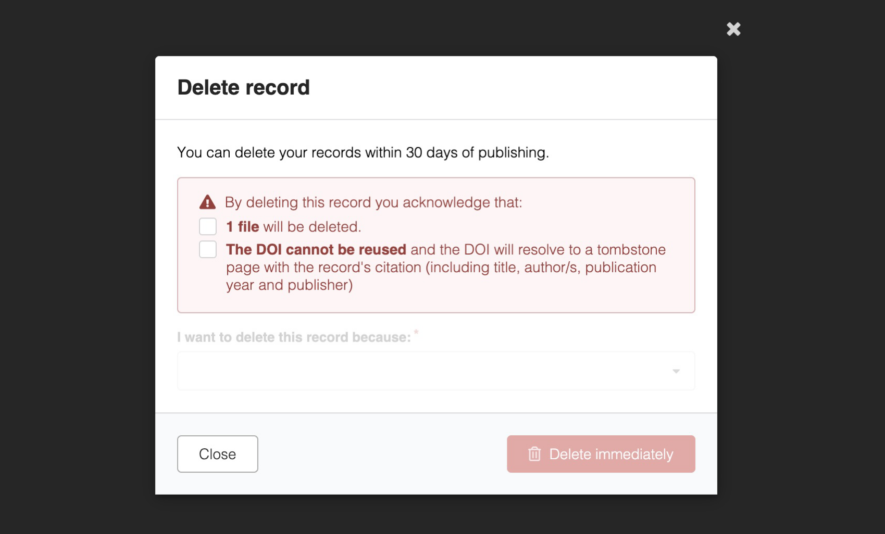

# InvenioRDM vNext

_2020-0-0_

This is a work-in-progress document to enable InvenioRDM developers to track
new features that will be included in the next release.

We're happy to announce the release of InvenioRDM vNext, the open-source
repository platform for research data management, institutional repositories,
and digital assets management! Version Next will be maintained until at least 6 months following the next release. Visit our [maintenance policy page](../maintenance-policy.md) to learn more.

## Try it

- [Demo site](https://inveniordm.web.cern.ch)

- [Installation instructions](../../install/index.md)

## What's new?

### Record deletion

You can now allow users to delete, or request deletion of, their own records in accordance with any required criteria you may have. When enabled the default behaviour is that records can be deleted by their owners within 30 days of publication and record owners can request deletion outside this period. Deletion requests are visible within the admin panel and the user's request dashboard.

This feature is also [highly customisable](../../operate/customize/record_deletion.md)! You can introduce deletion policies based on the resource type, community role, file type or any other criteria you require. Additionally, you can prevent extraneous record deletion by adding a deletion checklist. This allows you to suggest how the user can fix the problem in the correct way instead of deleting the record.

#### New Web Archive previewer

https://github.com/inveniosoftware/invenio-previewer/pull/224

### OAuth improvements

We've added a few small but crucial improvements to the [invenio-oauthclient](https://github.com/inveniosoftware/invenio-oauthclient) module, improving security and bringing Invenio's third-party authentication in line with modern standards.

- **Refresh tokens** are now supported, meaning we now have full compatibility with all OAuth 2.0 authorization servers. This means we can securely store long-lived tokens and exchange them for short-lived access tokens as and when needed, allowing us to integrate with modern third-party apps ([invenio-oauthclient#328](https://github.com/inveniosoftware/invenio-oauthclient/pull/328)).

- The `extra_data` column of the `oauthclient_remoteaccount` table is now stored in the more efficient `JSONB` type when using PostgreSQL, improving the performance and flexibility of queries ([invenio-oauthclient#360](https://github.com/inveniosoftware/invenio-oauthclient/pull/360)).

### Miscellaneous additions

Here is a quick summary of the myriad of other improvements in this release:

- Admin panel Jobs: Added a "Delete" action to the Jobs list so admins can remove jobs directly from the UI.
- Temporarily pinned `bcrypt<5.0.0` due to compatibility issues ([flask-security-fork#82](https://github.com/inveniosoftware/flask-security-fork/pull/82)). Will be lifted in a future release.
- A new configuration variable, `RDM_RECORDS_RELATED_IDENTIFIERS_SCHEMES`, enables configuring identifier schemes specifically for related identifiers, defaulting to `RDM_RECORDS_IDENTIFIERS_SCHEMES` when not defined.
- Deposit form: label/help text changes for Authors and Contributors: https://github.com/inveniosoftware/invenio-app-rdm/issues/3197
- A new configuration variable, `RDM_RECORDS_REQUIRE_SECRET_LINKS_EXPIRATION`, controls whether an expiration date must be set for access links and secret links. Defaults to `FALSE` when not defined.
- Add support of wikidata identifiers. 

## Deprecations

- Many [custom field widgets](../../operate/customize/metadata/custom_fields/widgets.md) used the `icon` and `description` props, which have now been deprecated and replaced with `labelIcon` and `helpText` respectively. This is to improve consistency with the naming of the built-in fields used in the deposit form and thereby avoid confusion. The old names will continue to function for now.

## Breaking changes

- Overridables in the deposit form have been modified to improve consistency in structure and naming conventions. This has involved renaming the IDs of several `<Overridable>`s, but none have been removed. If you are using these IDs to override components, please see [the full list of updates](https://github.com/inveniosoftware/invenio-rdm-records/pull/2101/files#diff-ff3c479edefad986d2fe6fe7ead575a46b086e3bbcf0ccc86d85efc4a4c63c79) and change your IDs accordingly.

- The changes to [invenio-oauthclient](https://github.com/inveniosoftware/invenio-oauthclient) include automated database migrations that will run smoothly for most instances. However, if your `oauthclient_remoteaccount` table has more than ~50k rows and you are unable to take your system offline for the upgrade, please instead [follow the manual steps](./upgrade-vNext.md#oauth-client-changes).

## Requirements

InvenioRDM vNext supports:

- Python 3.9 (end of life October 2025), 3.11 and 3.12
- Node.js 18+
- PostgreSQL 12+
- OpenSearch v2.12+

## Upgrading to vNext

We support upgrading from v13 to vNext. See the [upgrade guide](./upgrade-vNext.md) for how.

## Questions?

If you have questions related to these release notes, don't hesitate to jump on [discord](https://discord.gg/8qatqBC) and ask us!

## Credit

The development work of this impressive release wouldn't have been possible without the help of these great people (name or GitHub handle, alphabetically sorted):
