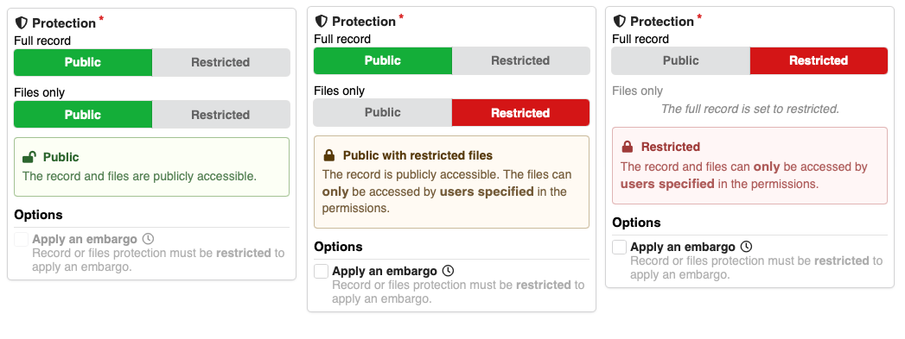
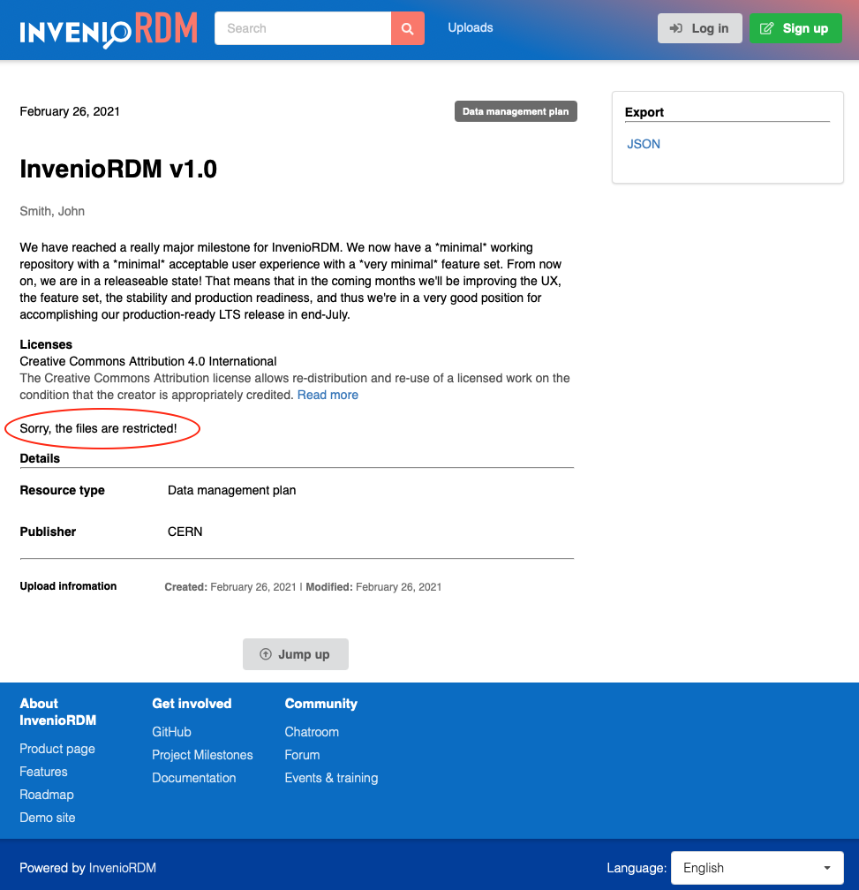
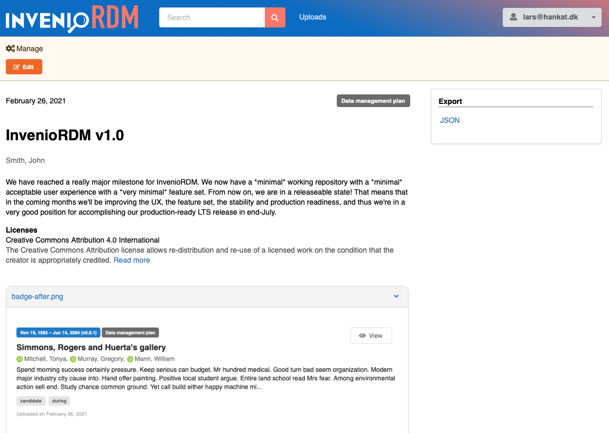
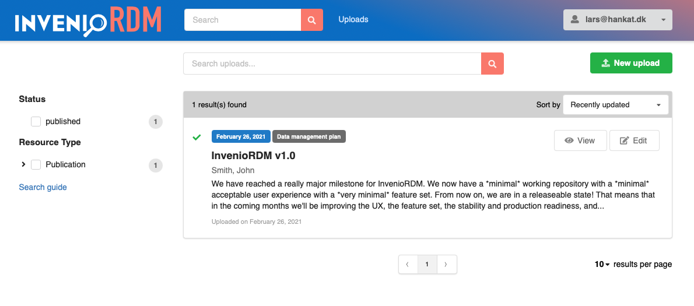

# InvenioRDM v1.0 Release Notes

We're happy to announce InvenioRDM v1.0!

VERY IMPORTANT, read the full release notes before you install and run the system! The v1.0 label **does not** mean the system is suitable for **production** use!

# FAQ (do not skip!)

### Can I use v1.0 in production?

No. Do not even try, or think it might work out!

### When can I use InvenioRDM in production?

The first release of InvenioRDM that you can use in a production system will be the LTS (Long-Term Support) release due in end-July.

### Why the v1.0 label?

We follow semantic versioning, and in the coming months we'll be releasing v2.0, v3.0, etc. We use the v1.0 label because we're now in a state where the project partners can start running demo systems to demonstrate the progress of the project to their stakeholders. Furthermore, the project partners will be able to start user testing more widely.

### Can I upgrade from v1.0 to v2.0?

Read the upgrade contract below.

# Upgrade contract (do not skip!)

The following "contract" is meant to align expectations on how and what you'll be able to upgrade from v1.0 to v2.0.

You **MUST** expect **breaking changes** to anything on subsequent releases until the LTS release! REST APIs, programmatic APIs, features, Jinja/React templates, data model, vocabularies, etc.

We will **ONLY** guarantee that you will be able to upgrade a database created with v1.0 to v2.0. With that, we mean that **through a manual, labour intensive and offline process** you'll be able to upgrade your database. Basically this boils down to, that we will document the steps you need to apply in order to move your data from v1.0 to v2.0 code. In no way do we promise it will be easy! You **MAY** need to apply manual changes to records. We of course plan to make this an easy and smooth process for the LTS release, but for now it's not.

# What's new?

Now that you've hopefully read all the above and are very scared of installing InvenioRDM in production (you should be!), then let's share a bit of the excitement we have for the release this month.

We have reached a really major milestone for InvenioRDM. We now have a *minimal* working repository with a *minimal* acceptable user experience with a *very minimal* feature set. From now on, we are in a releaseable state! That means that in the coming months we'll be improving the UX, the feature set, the stability and production readiness, and thus we're in a very good position for accomplishing our production-ready LTS release in end-July.

Below you'll find the specific areas we've been working on this month.

### Access control

The major new feature this month is the support for minimal access control.

The deposit form now has a new protection widget that allows you to deposit records in the following categories:

- Public records with public files
- Public records with restricted files (with or without embargo)
- Restricted records with restricted files (with or without embargo)
- Public metadata-only records
- Restricted metadata-only records (with or without embargo).

Below are some examples of how this now looks in the deposit form:

**Restricted records and files**

Restricted records and files are only visible for the owner (the user who deposited the material). This means that e.g. a restricted record will not show up in the search results of other users.

User without access (no files and no edit button visible):

User with access (files and edit button visible):

Note, that the message "Sorry, the files are restricted!" is a temporary message, until we have a solution for the access badge (see next section).

**Limitation: Access status**

We have temporarily removed the access status badge (see before/after screenshot below) until we have found a suitable solution for the badge. The current badge was not easily transferable to the new access control, and is mixing indications about if you can access a record, and/or if files are available.

Before:

After:

**Limitation: Embargo feature**

You can apply an embargo period to restricted files or records. Once an embargo period is over the record/files are supposed to be made automatically publicly accessible. In v1.0 however, we were not able to include the background job responsible for doing this automatically.

We'll ship this task in the March v2.0 release.

**Limitation: Manage permissions**

Currently, only the owner is able to see a restricted record/files. In future releases, we'll of course add the support for managing permissions, so that restricted records and files can be shared with colleagues, groups and entire institutions.

**Access backend**

Underneath the hood, we have prepared the entire access control system to be able to share access with other users, communities, IP networks, etc. Thus, the backend part for allowing management of permissions is almost done, while we are primarily missing the frontend that allows an end-user to interact with the permission system.

### Minimal UX

**Disabled unfinished features**

We have disabled all unfinished features from the user interface. We have for instance disabled the communities module, the version flip-switch in search results, a button to the advanced search and so on.

The features will be added back, once they have reached sufficient quality to be running in a demo system.

**Deposit form fields**

We have also removed all deposit form fields from the user interface that were not ready. Each of these fields will be added back progressively as they are finished. Most notably we e.g. had to remove the subjects field for this release.

**Field help text**

We have added help text to as many fields as possible. Please provide feedback, if they are understandable.

**Styling issues**

We have fixed a large number of small styling and consistentcy issues. Still some remain, and you're feedback is very much appreciated on anything you find in this respect.

**List uploads**

The list uploads page now has a nice greeting for first time users:

Also, the overall styling of the page was improved:

**Search guide**

We have added a guide (taken from Zenodo) on how to perform advanced queries. See it on https://inveniordm.web.cern.ch/help/search.

### Release v1.0

We have gone through a lot of quality checking to ensure that we'll be able to upgrade data created with the v1.0 release to the coming v2.0 release. This work has focused on ensuring, for example, proper validation and integrity of the data that makes it into the database.

We have also ensured that all database tables have proper upgrade recipes for our automatic schema upgrade system (Alembic).

# Known issues

**Landing page**

- Preview: The image previewer is not using IIIF and only previews images up to 500kb.

- Preview: If you e.g. upload a .JPG extension file, you can set the default preview for the file, but the list of files will not have a preview button.

- Preview: The caption of the preview box does not change when selecting another file for preview.

**Deposit form**

- Validation error messages: The form validation error messages are not displaying correctly. Labels are system names, and sometimes [Object (Object)] is displayed for errors.

- Missing files: If files are missing to be uploaded, the publish button is disabled, but there no feedback to the end-user that files are missing.

- Performance: We have seen some slight performance issues when entering information into the form. We're looking into this, to make sure it is not noticeable.

- Affiliations vocabulary: We have not initialized the affiliation vocabulary, and thus there is no auto-completion for affiliations (creators and contributors).

- Publish button: It is not enabled when reloading a page with a valid record - you first have to save the record for the publish button to be enabled.

- Protection: The files restriction in the protection widget only become visible after uploading a file. It should be hidden only for metadata-only records.

- Languages: The language vocabulary search results are not ranked properly for the query. For instance searching for "english" will show less relevant results first.

- Creators: The list of creators in the deposit form does not display the role nor identifier if entered.

**Search results**

- HTML entities (e.g. ``&nbsp;``) in the description fields are not removed from the descriptions displayed in search results, causing them to be printed verbatim.

**List uploads**

- Facet: The search facet distinguishing between published and drafts on the list uploads page is using system labels instead of human readable labels.

- The title of a search result item is not clickable even though it looks clickable.

**Backend**

- Embargo records are not automatically published due to the missing background job.

- The REST API JSON serialization has timestamps that are not in UTC, nor do they have timezone information.

# Credits

The development work in this release was done by:

- CERN (Lars & Zach)
- Northwestern University (Guillaume)
- TU Graz (Mojib)
- TU Wien (Max)

A special thanks goes to Max and Mojib as well as their institutions TU Graz and TU Wien for joining full-time during the February iteration. This made it possible to reach this month's milestone for the regular team from CERN & Northwestern University!
