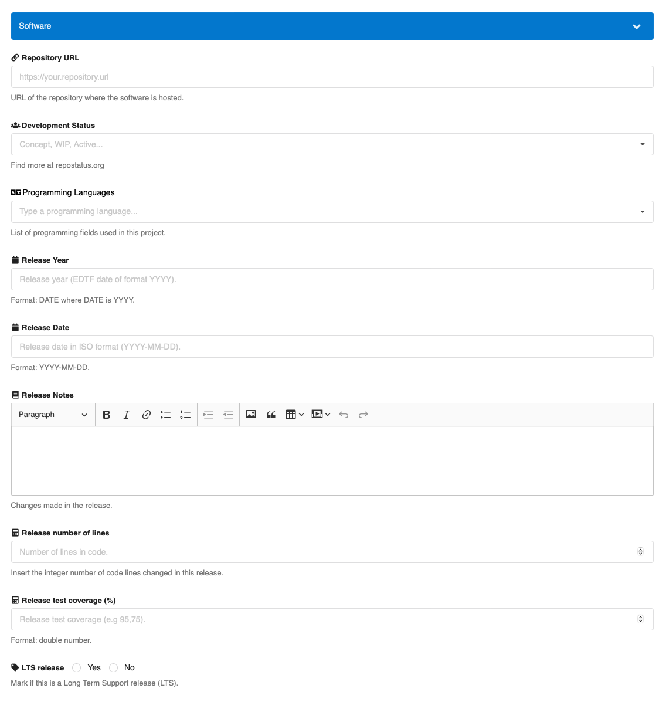
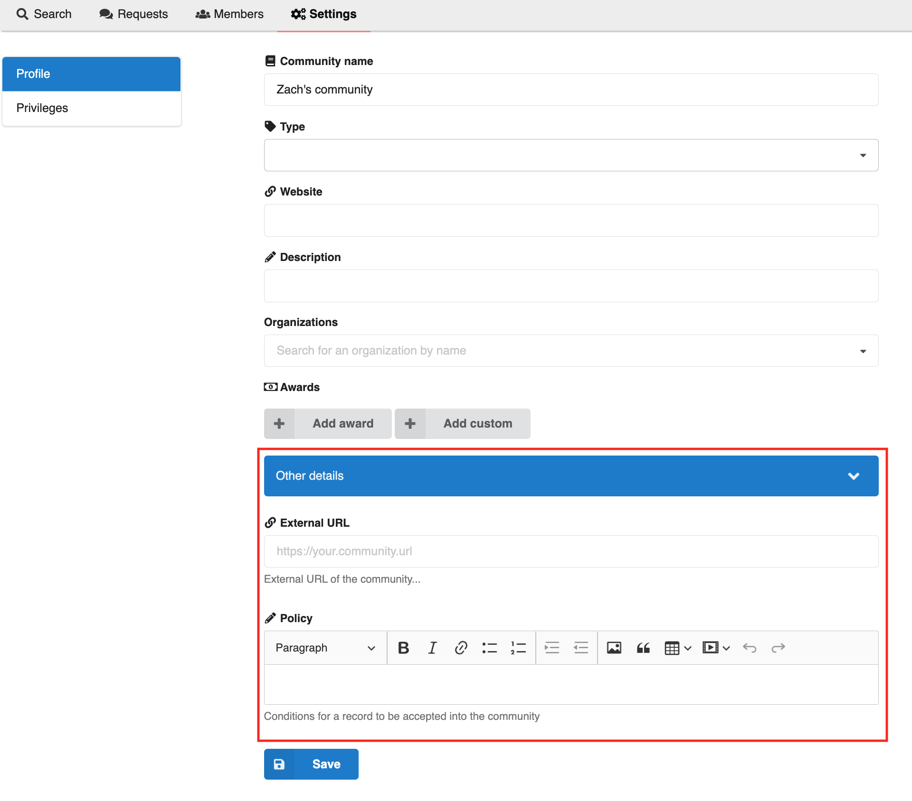
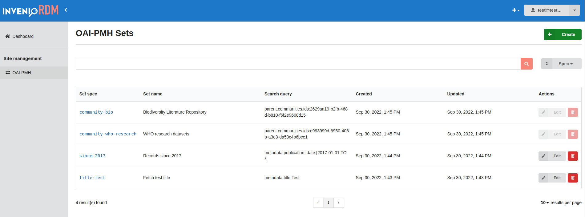
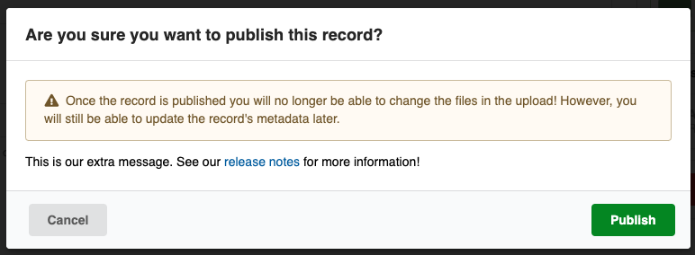

# InvenioRDM v10.0

_2022-10-10_

_Short-term support (STS) release_

We're happy to announce the release of InvenioRDM v10.0. The release is a short-term support release which is maintained until v11.0.

## Try it

- [Demo site](https://inveniordm.web.cern.ch)

- [Installation instructions](https://inveniordm.docs.cern.ch/install/)

## What's new?

In addition to the many bugs fixed, this release introduces custom fields both for records and communities, back-office administration panel with support for OAI sets management and the support of OpenSearch.

### Custom Fields

You can now add custom fields to [bibliographic records](https://inveniordm.docs.cern.ch/customize/metadata/custom_fields/records/) and [communities](https://inveniordm.docs.cern.ch/customize/metadata/custom_fields/communities/) data models. InvenioRDM supports a wide variety of field types and UI widgets: you can find the full list in the [custom fields](https://inveniordm.docs.cern.ch/customize/custom_fields/records/#reference) and the [UI widgets](https://inveniordm.docs.cern.ch/reference/widgets/) documentation pages.

You can also extend the default components or implement your owns. To get more information, refer to the [custom fields development section](../../develop/howtos/custom_fields.md) in the documentation.

#### Fields in the upload form

Below, an example of the upload form with custom fields related to software. You can test them out in the [demo site upload form](https://inveniordm.web.cern.ch/uploads/new).

#### Community settings page

Custom fields will be displayed at the bottom of the community's settings page.

When a community field is required, it will be also displayed in the form to [create a new community](https://inveniordm.web.cern.ch/communities/new).

### Administration panel

The new administration panel provides a modern, clean and easy to use interface. It allows to manage the repository's settings from the web interface without requiring technical knowledge. It also allows customising existing views or adding new ones.

This release comes with the first new OAI-PMH administration view, which allows to manage or create OAI-PMH sets.

Some OAI-PMH sets are automatically created when a new community is added. These system created sets are blocked from edition in the administration view to preserve the data sets integrity.

#### Resource based views

The newly added [Invenio-Administration](https://github.com/inveniosoftware/invenio-administration) module allows to add new administration views with a minimal implementation. A developer can easily create a new view for any of the [resources REST APIs](../../develop/topics/resource.md) available in InvenioRDM.

#### Customisable views

The administration views are fully customisable, using Jinja templates and React components. You can read the [full documentation](../../develop/topics/administration_panel.md) to discover how to create and customise the administration views.

### OpenSearch

With the [change of license](https://www.elastic.co/pricing/faq/licensing) of Elasticsearch, announced by Elastic, its usage in InvenioRDM is deprecated. That's why, starting with this release, InvenioRDM now supports [OpenSearch](https://www.opensearch.org/) v1 and v2 and it is also the default for new instances of InvenioRDM.

While Elasticsearch v7 is still supported, Elasticsearch v6 support has been removed. However, Elasticsearch support will be removed in a future version of InvenioRDM.

We recommend migrating directly to OpenSearch v2, OpenSearch v1 [end of life](https://endoflife.date/opensearch) is rapidly approaching. See the [upgrade guide](../upgrading/upgrade-v10.0.md) for more information.

You can read more on how to setup an OpenSearch cluster in the [official documentation](https://opensearch.org/docs/latest/opensearch/install/index/). [Invenio Helm Charts](https://github.com/inveniosoftware/helm-invenio/) have been updated adding support for OpenSearch, but the configuration will setup a demo cluster and it should **not be used in production**. OpenSearch provides [official Helm charts](https://opensearch.org/docs/latest/opensearch/install/helm/) suitable for production environments.

## Changes

### Breaking changes

- Elasticsearch 6 support has been removed. If you are using InvenioRDM with Elasticsearch 6, you can migrate to Elasticsearch 7 or directly to OpenSearch. See the [upgrade guide](../upgrading/upgrade-v10.0.md) for more information.
- The configuration variable `INVENIO_SEARCH_ELASTIC_HOSTS` has been deprecated (but non-breaking) and it will be removed in the following releases. Please change its name to `INVENIO_SEARCH_HOSTS`. This variable is most probably also used in your deployment environments.
- The following changes should not affect the majority of the users. We recommend to verify if any usage can be found in customisations or modules:
    - In [Invenio-Indexer](https://github.com/inveniosoftware/invenio-indexer), the param `es_bulk_kwargs` in the class `RecordIndexer` has been renamed to `search_bulk_kwargs`. The method `record_to_index` and `schema_to_index` now return only the index and not a tuple with index and doc type. The configuration variable `INDEXER_DEFAULT_DOC_TYPE` is now removed.
    - In [Invenio-Records-Rest](https://github.com/inveniosoftware/invenio-records-rest), the method `check_elasticsearch` have been renamed to `check_search`.
    - In [Invenio-Records](https://github.com/inveniosoftware/invenio-records), the class `ElasticsearchDumper` has been renamed to `SearchDumper`.
    - in [Invenio-Records-Resources](https://github.com/inveniosoftware/invenio-records-resources), the func and params `es_preference` have been renamed to `search_preference`.
    - In [Invenio-Records-Permissions](https://github.com/inveniosoftware/invenio-records-permissions), the classes `SuperUser` and `AdminUser` have been removed. Make sure that you are not importing them in any of your Python modules or customisations. The permissions to delete records and to manage OAI-PMH sets were wrongly granted to the action `admin-access` (`AdminUser`). The deletion of records has been replaced by the `superuser-access` action and the management of OAI-PMH is now allowed to users who can access the new administration panel.

### Minor changes

**Strict search mappings**

Search mappings have been made strict, which means that no unknown fields will be accepted. Before, no errors were being thrown. If you had custom record dumpers you might need to add custom fields and rebuild the indices. See the [upgrade guide](../upgrading/upgrade-v10.0.md) for more information.

**Deposit form publish modal warning text customization**

The warning text shown in the modal during the publish/submit-for-review action can now be extended via the `APP_RDM_DEPOSIT_FORM_PUBLISH_MODAL_EXTRA` config variable. You can pass text or html there and the result will look like the following:

## Deprecations

With InvenioRDM v10.0, support to Elasticsearch v7 is now deprecated and it will be removed in a future release.

## Limitations

With this release, communities custom fields are not displayed in the community profile page, but they are searchable. This feature will be implemented in one of the following releases.

## Upgrading to v10.0

We support upgrading from v9.1 to v10 Please see the [upgrade notice](../upgrading/upgrade-v10.0.md).

## Maintenance policy

InvenioRDM v10.0 is a **short-term support** (STS) release which is supported until InvenioRDM v11.0. See our [Maintenance Policy](../maintenance-policy.md).

If you plan to deploy InvenioRDM as a production service, please use InvenioRDM v9.1 Long-Term Support (LTS) Release.

## Requirements

InvenioRDM v10.0 supports:

- Python 3.7, 3.8 and 3.9
- PostgreSQL 10+
- Elasticsearch v7 / OpenSearch v1 and v2

## Questions?

If you have questions related to these release notes, don't hesitate to jump on our chat and ask questions: [Getting help](../../develop/getting-started/help.md)

## Credit

The development work in this release was done by:

- CERN: Alex, Javier, Jenny, Karolina, Lars, Manuel, Nicola, Nicolas, Pablo G., Pablo P., Zacharias
- Northwestern University: Guillaume
- TU Graz: Christoph, David, Mojib
- TU Wien: Max
- Uni Bamberg: Christina
- Uni Münster: Werner
