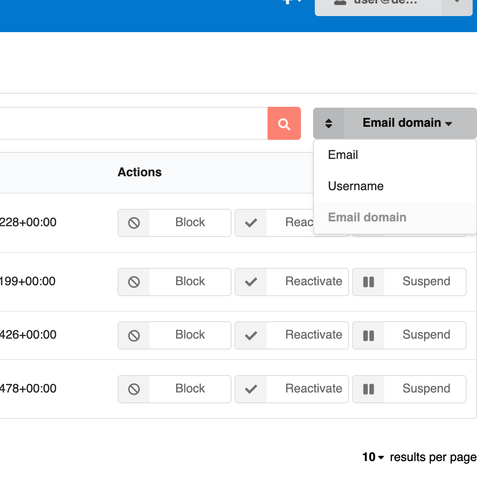

# InvenioRDM v12.0

_2024-07-31_

_Long-term support (LTS) release_

We're happy to announce the release of InvenioRDM v12.0, the new much anticipated long-term support release! Version 12 will be maintained until at least 6 months following the next long-term support release. This also means that in February 2025, we will retire v9.1, the previous LTS. Visit our [maintenance policy page](../maintenance-policy.md) to learn more.

## Try it

- [Demo site](https://inveniordm.web.cern.ch)

- [Installation instructions](https://inveniordm.docs.cern.ch/install/)

## What's new?

A lot is new since the last v11 release. This new version is brimming with new functionality and improvements. We highlight the big changes here and at the end of this page we collate a list of the miscellaneous other improvements.

### Powerful and reliable record access

[Giving and requesting access](../../features/features-walk-through/access_requests.md) to records have seen a complete overhaul in this release. Record owners or curators can share them directly with other users or with groups, as well as control whether, who and how access can be demanded.

This provides flexible, yet reliable access control to the records of your instance and can even be done in bulk.

### Notifications

[A notification system](../../features/features-walk-through/notifications.md) has been introduced. Users can now receive email notifications when they are involved in certain activities. For instance, invitations to a community will send an email to the invited party and notify the inviter of the invitee's decision.

### Moderations of users and records

The administration panel now includes a "User management" section to suspend, block and delete users, as well as undo all those actions.
Suspending a user temporarily prevents them from creating records, but lets them appeal their suspension. Blocked users cannot sign in anymore and deleted users are removed from the system.

Records can also be deleted (with a grace period for appeal or undoing) which empowers administrators to enforce institutional policies and fight spam.

Bulk versions of these are in the works.

### Even better previewers
TODO

### GitHub integration
TODO

### Changes from v12.0.0b1 are officialized

[An interim beta release of v12](../temporary-versions/version-v12.0.0b1.md) was made some months ago and tentatively brought a number of changes. We are happy to report all those changes are present and solidified in v12.0. Of note, those include:

- Usage statistics compliant with the [MakeDataCount](https://makedatacount.org/) and [COUNTER](https://www.projectcounter.org/) standards
- Option to skip the review process for curators and higher roles of a community
- Record submission and inclusion in multiple communities
- Display and dynamic administration of site banners
- Creation of static pages via the administration panel
- Instance-level configuration to enable metadata-only records and restricted files.
- [New export formats](../../reference/export_formats.md) such as DACT-AP and GeoJSON
- Contributed custom fields that are easy [to enable]((../../reference/metadata/optional_metadata.md))

### Miscellaneous additions

- Introduction of `PAGES_ALLOWED_EXTRA_HTML_ATTRS` and `PAGES_ALLOWED_EXTRA_HTML_TAGS` to allow specific HTML attributes and tags in Pages from [invenio-pages](PAGES_ALLOWED_EXTRA_HTML_TAGS)
- Improvements to the `invenio rdm rebuild-all-indices` command
- Mathematical formulas in a deposit can be rendered on the landing page via `THEME_MATHJAX_CDN = "https://cdnjs.cloudflare.com/ajax/libs/mathjax/2.7.1/MathJax.js?config=TeX-AMS-MML_HTMLorMML"` and updated content-secuirty policy headers: add `cdnjs.cloudflare.com` to  `APP_DEFAULT_SECURE_HEADERS`.
- Possibility to [add entry to a controlled vocabulary](../../customize/vocabularies/index.md#addupdate-fixtures-command) via the CLI: `invenio rdm-records add-to-fixture`

## Breaking changes

- See the [Requirements section](#requirements) below for what underlying requirements are now necessary
- The [react-invenio-deposit module](https://github.com/inveniosoftware/react-invenio-deposit) has been moved to [invenio-rdm-records](https://github.com/inveniosoftware/invenio-rdm-records)
    - Any imports should be replaced: `import { ... } from "react-invenio-deposit"` -> `import { ... } from "@js/invenio-rdm-records"`
- Some `Overridable` React component ids may have changed. Verify that your overridden components load
- `RoleNeed` uses the role's `id` instead of the role's `name`
- The `/access/users` API URL has been renamed to `/access/grants` to manage access grants

## Limitations and known issues
TODO

## Requirements

InvenioRDM v12 now supports:

- Python 3.9, 3.11 and 3.12
- Node.js 18+
- PostgreSQL 10+
- OpenSearch v2

Notably older versions of Elasticsearch/Opensearch and Node have been phased out.

## Upgrading to v12.0

We support upgrading from v11 to v12. See the [upgrade notice](../upgrading/upgrade-v12.0.md) for how.

## Questions?

If you have questions related to these release notes, don't hesitate to jump on [:simple-discord: discord](https://discord.gg/8qatqBC) and ask questions!

## Credit

The development work of this impressive release wouldn't have been possible without the help of these great people:

- CERN: Alex, Anna, Antonio, Javier, Jenny, Karolina, Lars, Manuel, Nicola, Pablo G., Pablo P., Zacharias
- Northwestern University: Guillaume
- TU Graz: Christoph, David, Mojib
- TU Wien: Max
- Uni Bamberg: Christina
- Uni Münster: Werner
- Front Matter: Martin
- KTH Royal Institute of Technology: Sam
