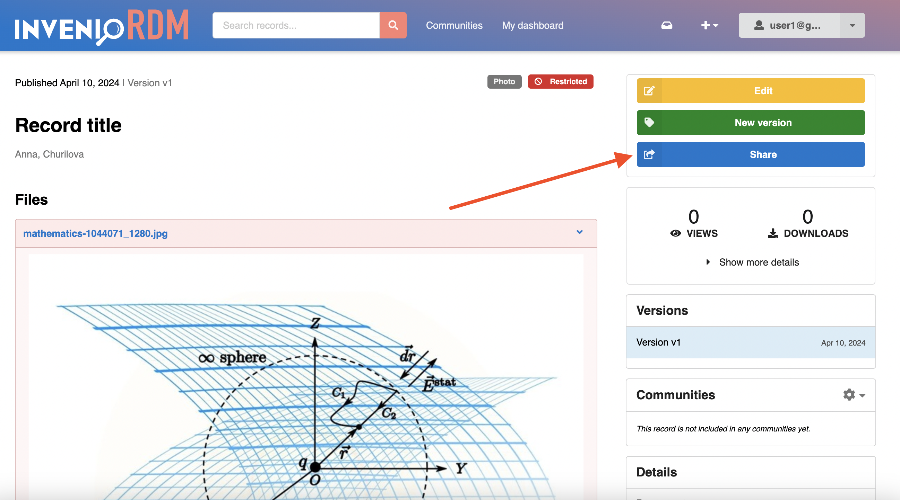
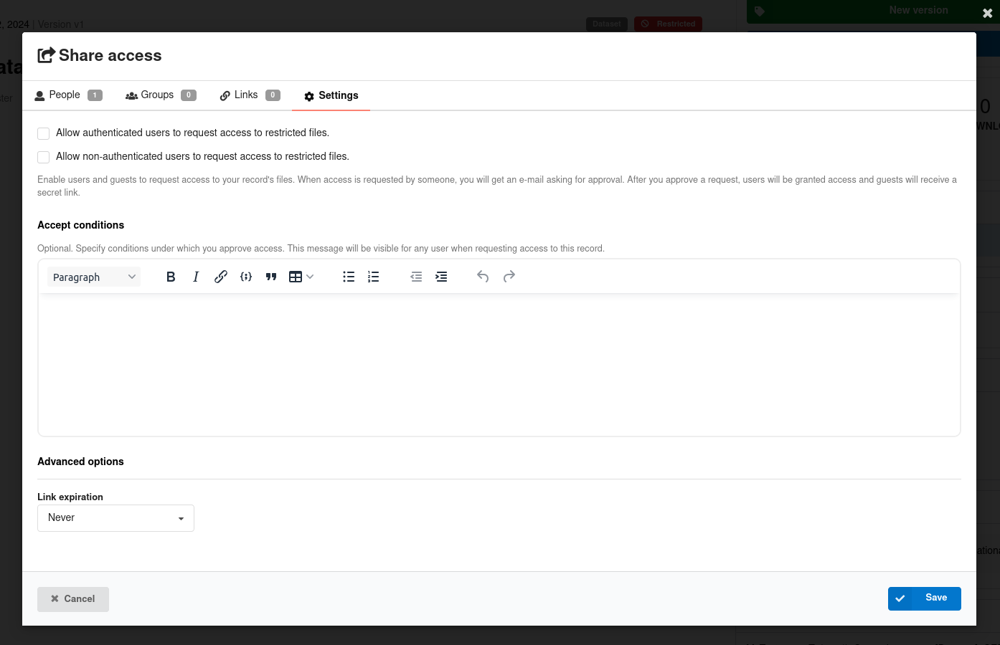

# InvenioRDM v12.0

_2024-07-31_

_Long-term support (LTS) release_

We're happy to announce the release of InvenioRDM v12.0, the new much anticipated long-term support release! Version 12 will be maintained until at least 6 months following the next long-term support release. This also means that in February 2025, we will retire v9.1, the previous LTS. Visit our [maintenance policy page](../maintenance-policy.md) to learn more.

## Try it

- [Demo site](https://inveniordm.web.cern.ch)

- [Installation instructions](https://inveniordm.docs.cern.ch/install/)

## What's new?

A lot is new since the last v11 release. This new version is brimming with new functionality and improvements. We highlight the big changes here and at the end of this page we collate a list of the miscellaneous other improvements.

### Powerful and reliable record access

[Giving and requesting access](../../features/features-walk-through/access_requests.md) to records have seen a complete overhaul in this release. Record owners or curators can share them directly with other users or with groups, as well as control whether, who and how access can be demanded.

This provides flexible, yet reliable access control to the records of an instance and can even be done in bulk.

### Notifications

[A notification system](../../features/features-walk-through/notifications.md) has been introduced. Users can now receive email notifications when they are involved in certain activities. For instance, invitations to a community will send an email to the invited party and notify the inviter of the invitee's decision.

### Moderations of users and records

The administration panel now includes a "User management" section to suspend, block and delete users, as well as undo all those actions.
Suspending a user temporarily prevents them from creating records, but lets them appeal their suspension. Blocked users cannot sign in anymore and deleted users are removed from the system.

Records can also be deleted (with a grace period for appeal or undoing) which empowers administrators to enforce institutional policies and fight spam. This leaves a [tombstone](../../reference/metadata.md#tombstone) page in place of the record landing page. See the Concept DOIs section below for a screenshot.

Associated JSON APIs (e.g. domains API) have been added. Bulk versions of these are in the works.

### DOIs for concept records and not for restricted records

InvenioRDM will now mint a concept DOI for every record by default, similar to what Zenodo has done for many years. This [can be configured](../../customize/dois.md#parent-or-concept-dois).

Along with this update, restricted records will now stop minting a DOI upon publication thus keeping *private* records **truly private**.
And if the visibility of a record becomes restricted after being public, a tombstone will be shown:

### Even better previewers

Audio and video previewers come by default. Beware that supporting these typically larger files may require some changes to an instance's [upload limits](../../customize/upload_limits.md) and using delegated file serving.

Also, text (.txt) preview can be truncated after a specified number of bytes via the `PREVIEWER_TXT_MAX_BYTES` configuration variable.
Text previewing has been made much more resilient thanks to that improvement, better encoding detection, and fault-tolerance to encoding misdetection resulting in an overall smoother experience.

### External resources integration (e.g. GitHub)

The landing page for a record can now provide nicer visuals for configured related works. The [configuration variable](https://github.com/inveniosoftware/invenio-app-rdm/blob/master/invenio_app_rdm/config.py#L849)
`APP_RDM_RECORD_LANDING_PAGE_EXTERNAL_LINKS` can be set to highlight some referred platforms:

### Changes from v12.0.0b1 are officialized

[An interim beta release of v12](../temporary-versions/version-v12.0.0b1.md) was made some months ago and tentatively brought a number of changes. We are happy to report all those changes are present and solidified in v12.0. Of note, those include:

- Usage statistics compliant with the [MakeDataCount](https://makedatacount.org/) and [COUNTER](https://www.projectcounter.org/) standards
- Option to skip the review process for curators and higher roles of a community
- Record submission and inclusion in multiple communities
- Display and dynamic administration of site banners
- Creation of static pages via the administration panel
- Instance-level configuration to enable metadata-only records and restricted files.
- [New export formats](../../reference/export_formats.md) such as DACT-AP and GeoJSON
- [Optional metadata fields](../../reference/metadata/optional_metadata.md) that are easy to enable

### Miscellaneous additions

- Introduction of `PAGES_ALLOWED_EXTRA_HTML_ATTRS` and `PAGES_ALLOWED_EXTRA_HTML_TAGS` to allow specific HTML attributes and tags in Pages from [invenio-pages](PAGES_ALLOWED_EXTRA_HTML_TAGS)
- Improvements to the `invenio rdm rebuild-all-indices` command
- Mathematical formulas in a deposit can be rendered on the landing page via `THEME_MATHJAX_CDN = "https://cdnjs.cloudflare.com/ajax/libs/mathjax/2.7.1/MathJax.js?config=TeX-AMS-MML_HTMLorMML"` and updated content-secuirty policy headers: add `cdnjs.cloudflare.com` to  `APP_DEFAULT_SECURE_HEADERS`
- Possibility to [add entry to a controlled vocabulary](../../customize/vocabularies/index.md#addupdate-fixtures-command) via the CLI: `invenio rdm-records add-to-fixture`
- Add a proper handler for API permission errors to return 403 when permission is denied
- Datastreams can sync funders and affiliations. ROR and OpenAIRE are supported.
- Fix for long affiliations' autocomplete crashing search
- Replace ckeditor with tinymce
- Transition modules from using Flask's deprecated `before_first_request` to using InvenioRDM's `finalize_app` entrypoint
- Backend IIIF tile generation can be set
- Great improvements in bulk serialization performance
- ...and many more bug fixes

## Breaking changes

- See the [Requirements section](#requirements) below for what underlying requirements are now necessary
- The [react-invenio-deposit module](https://github.com/inveniosoftware/react-invenio-deposit) has been moved to [invenio-rdm-records](https://github.com/inveniosoftware/invenio-rdm-records)
    - Any imports should be replaced: `import { ... } from "react-invenio-deposit"` -> `import { ... } from "@js/invenio-rdm-records"`
- Some `Overridable` React component ids may have changed. Verify that your overridden components load
- `RoleNeed` uses the role's `id` instead of the role's `name`
- The `/access/users` API URL has been renamed to `/access/grants` to manage access grants
- Persistent identifiers have a new required `is_enabled` parameter, which enables better customization
- `MarshmallowJSONSerializer`, `XMLSerializer`, `SerializerMixin` have been removed from flask-resources
- Although not immediately breaking, the [`subject_nested` facet](https://github.com/inveniosoftware/invenio-rdm-records/blob/master/invenio_rdm_records/services/facets.py#L87) is deprecated in favor of [`subject_combined`](https://github.com/inveniosoftware/invenio-rdm-records/blob/master/invenio_rdm_records/services/facets.py#L103) to provide proper nested subject aggregation
- The Python module `flask_babelex` has been replaced by `invenio_i18n`
    - Any imports should be replaced: `from flask_babelex import lazy_gettext as _` -> `from invenio_i18n import lazy_gettext as _`

## Limitations and known issues

- Translations for v12 will be coming in v12.1 targeted for release in two months time from the release of v12.0

## Requirements

InvenioRDM v12 now supports:

- Python 3.9, 3.11 and 3.12
- Node.js 18+
- PostgreSQL 12+
- OpenSearch v2

Notably, older versions of Elasticsearch/Opensearch, PostgreSQL, and Node.js have been phased out.

## Upgrading to v12.0

We support upgrading from v11 to v12. See the [upgrade notice](../upgrading/upgrade-v12.0.md) for how.

## Questions?

If you have questions related to these release notes, don't hesitate to jump on [discord](https://discord.gg/8qatqBC) and ask questions!

## Credit

The development work of this impressive release wouldn't have been possible without the help of these great people:

- CERN: Alex, Anna, Antonio, Javier, Jenny, Karolina, Lars, Manuel, Nicola, Pablo G., Pablo P., Zacharias
- Northwestern University: Guillaume
- TU Graz: Christoph, David, Mojib
- TU Wien: Max
- Uni Bamberg: Christina
- Uni Münster: Werner
- Front Matter: Martin
- KTH Royal Institute of Technology: Sam
- Caltech: Tom
