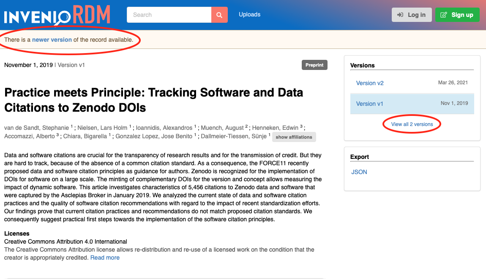
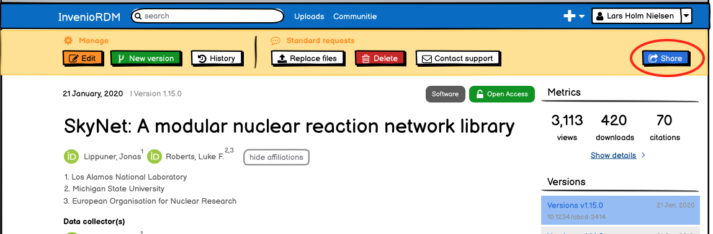

# InvenioRDM v2.0

We're happy to announce InvenioRDM v2.0!

!!! warning
    InvenioRDM v2.0 is NOT yet suitable for production services.

## Try it

Want to try the new features in v2.0 - just head over to our demo site: https://inveniordm.web.cern.ch/

If you want to install it, follow the installation instructions on https://inveniordm.docs.cern.ch/install/

## What's new?

### Versioning support

InvenioRDM now supports versioning for records. By default, InvenioRDM does not allow you to change the files after you have published a record. With the new versioning support, you can the files can now be changed however in *new versions* of the record.

#### Creating new versions

Now, a user can create a new version of the record, add or remove files and publish it by clicking the "New version" button.

One way to make new versions is from the record's landing page directly by clicking on the "New Version" button. Only allowed users can do so:


Another way is while editing a previously published record:


#### Search

Search results will by default only display the latest published version of a record. However, toggling the flip switch in the versions facet, allows you to view and search all versions.


#### Landing page

The landing page for previous versions of a record clearly displays that a newer version exists, with a link to it.

Also, in the right-hand column you have a link to view all published versions:



#### Permissions

We manage permissions at two levels when it comes to versioning.

Each specific version can have its own record/files visibility (e.g. one version can be restricted another not). Embargo dates also apply to specific versions.

Ownership of records, secret links (see below) and sharing of records is applied to all versions. So for instance, if you create a secret link to edit a record, that link will allow the holder to edit all versions of that record.


### Get an access link (REST API only)

During this month, we have also added the capability in the REST API to create a shareable link (similar to the Share or Get a link feature on platforms like Google Docs, Dropbox, ownCloud and the like). This link is interchangeably referred as an "access link", a "secret link" or a "shareable link".

You are able to create links with different permission, for instance to allow

- Anyone with the link to view the metadata of a restricted record.
- Anyone to access the restricted files of a record with public metadata.
- Anyone with an account to edit a record.

**Note**: One of the current limitations (that will be resolved further down the road) is that each secret link can only grant one permission, and they're not hierarchical (e.g. the permission to read files does not entail the permission to read the metadata).

In the future, we plan to also allow sharing only a preview of an unsubmitted record. This is particular useful for instance for peer-review scenarios, where a user can prepare a dataset and provide a journal with a link to the unpublished dataset. The peer-reviewer can then anonymously access the dataset, and the researcher can later update the dataset based on feedback from the peer-reviewer.

We plan to have a first minimal user interface for allowing users to use this new feature in the April release (v3.0). Below you see some of the mockups:




#### Usage

A secret link can be created by sending a POST request to the record's access/links endpoint, e.g.:

```bash
curl -H "authorization: bearer <PERSONAL_TOKEN>" -H "content-type: application/json" -d '{"permission": "read"}' https://<HOSTNAME>/api/records/<RECID>/access/links
```

If everything went well, the (JSON) response should contain a token. To use the token, it has to be specified in the query string of a URL, e.g.:

```
https://<HOSTNAME>/records/<RECID>?token=<TOKEN>
```

This will grant the user the permission with which the secret link was created (even if they don't have an account).

**Note**: Optionally, an expiration date (UTC timestamp) can be specified when creating a new secret link:

```
{
  "permission": "read",
  "expires_at": "2021-12-31 23:55:00"
}
```


### Upgrading

The last major new feature is that you are now able to upgrade an InvenioRDM v1.0 instance to v2.0.

Do remember to make a backup of the database and files before performing the upgrade!

Please checkout the full [upgrade instructions](https://inveniordm.docs.cern.ch/releases/upgrading/upgrade-v2.0/).

#### REST API changes

The JSON serializations for records in the REST API  have only changed slightly this month, mainly for the new versioning support:

- Added new top-level key ``versions``.
- Added new top-level key ``parent``.
- Moved the top-level key ``conceptid`` to ``parent.id ``
- Moved the ``access.owned_by`` to ``parent.access.owned_by``

### Minor changes

- Database connection pooling: We have improved the disconnect handling of the database connection pool, so that connections are automatically opened/closed every hour.
- Documentation: We have slightly reorganised the install/customize part of the documentation.
- Documentation: We have slightly reorganised the REST API part of the documentation.

## Known issues

**Versioning**

- Deposit form: When you create a new version, the files of the previous version are not transferred to the new version so you have to reupload everything.

The following are all carry-overs from the previous release:

**Landing page**

These are all carry-overs from the previous release:

- Preview: The image previewer is not using IIIF and only previews images up to 500kb.

- Preview: If you e.g. upload a .JPG extension file, you can set the default preview for the file, but the list of files will not have a preview button.

- Preview: The caption of the preview box does not change when selecting another file for preview.

**Deposit form**

- Validation error messages: The form validation error messages are not displaying correctly. Labels are system names, and sometimes [Object (Object)] is displayed for errors.

- Missing files: If files are missing to be uploaded, the publish button is disabled, but there is no feedback to the end-user that files are missing.

- Performance: We have seen some slight performance issues when entering information into the form. We're looking into this, to make sure it is not noticeable.

- Affiliations vocabulary: We have not initialized the affiliation vocabulary, and thus there is no auto-completion for affiliations (creators and contributors).

- Publish button: It is not enabled when reloading a page with a valid record - you first have to save the record for the publish button to be enabled.

- Protection: The files restriction in the protection widget only become visible after uploading a file. It should be hidden only for metadata-only records.

- Languages: The language vocabulary search results are not ranked properly for the query. For instance searching for "english" will show less relevant results first.

- Creators: The list of creators in the deposit form does not display the role nor identifier if entered.

**List uploads**

- The title of a search result item is not clickable even though it looks clickable.

**Backend**

- Embargo records are not automatically published due to the missing background job.

- The REST API JSON serialization has timestamps that are not in UTC, nor do they have timezone information.

**Installation**

- Some versions of NPM 7 are *known* to cause issues -- NPM 6.14.5 is recommended.

## Feedback

For this particular release we're especially interested in hearing about your challenges and success about upgrading from v1.0 to v2.0.

Please post a message on the #rdm-general Discord channel.

For other issues, please first check if you've hit a known issue:

- Bugs: First check for known issues above, then report them on the [Invenio-App-RDM](https://github.com/inveniosoftware/invenio-app-rdm/issues/new/choose) repository on GitHub.
- Feedback: Suggestions for improvements, results of user testing, etc. - please reach out to Lars directly (Discord chat or mail).


## What's up next?

During the April iteration (deadline April 30th) we're moving most of the CERN teams on top of InvenioRDM. This means, we'll be around 12 senior and junior developers working on InvenioRDM.

This in itself, poses its own challenges in onboarding new team members and reaching high productivity fast.

We'll be running three teams, each with its own focus:

- Team Communites: The goal for this team is to integrate the creation of communities in InvenioRDM v3.0 (you will not yet be able to associate records with communities)
- Team PIDs: The goal of this team is to ensure that InvenioRDM v3.0 can register DOIs for uploads.
- Team QA: The goal for this team is to catch-up on left-overs from previous iterations, perform quality assurance and release management.

## Credits

The development work in this release was done by:

- CERN (Lars & Zach)
- Northwestern University (Guillaume)
- TU Wien (Max)

