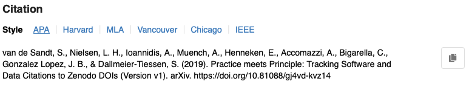
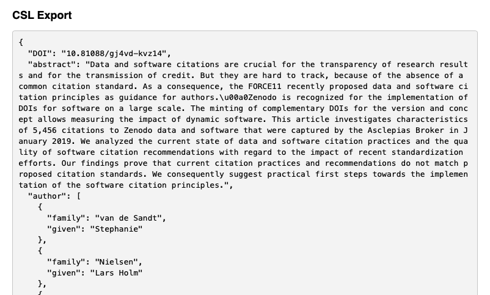
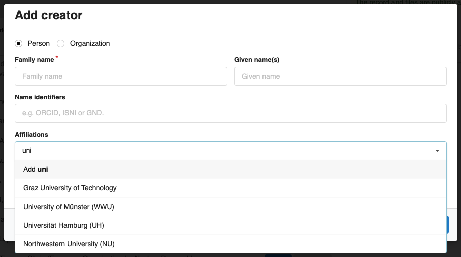
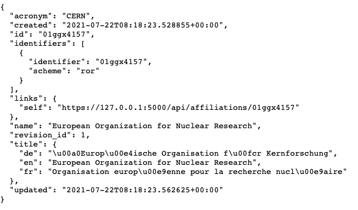
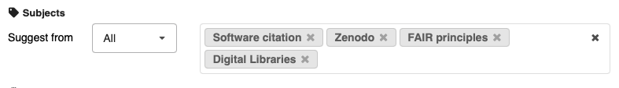
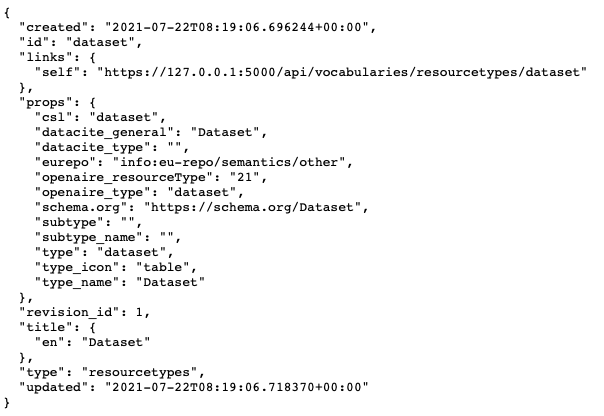
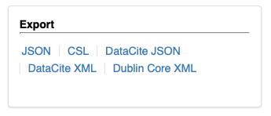
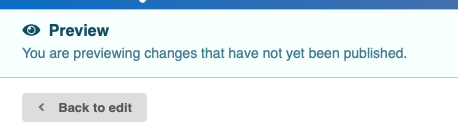

# InvenioRDM v5.0

*2021-07-23*

!!! Warning

    InvenioRDM v5.0 is **NOT** yet suitable for production services.

We are closing in on the release of InvenioRDM 6.0 LTS! This release candidate contains all the features that are shipping in the LTS. The LTS release is coming at the end of the month. We are excited to give you a sneak peak here.

## Try it

If you want to install it, follow the installation instructions on [https://inveniordm.docs.cern.ch/install/](https://inveniordm.docs.cern.ch/install/)

## What's new?

### Citations

InvenioRDM v5.0 adds support for generating citation strings from the metadata.

**Record landing page**

The record landing page will now prominently display a citation for the record, and you can easily copy the citation string via the copy button as well as choose between different citation styles:



**REST API**

The citation strings can also be generated directly from the REST API (e.g. build a list of references from a search query). Simply use the ``text/x-bibliography`` HTTP Accept header with the two query string parameters ``style`` and ``locale``:

```console
$ curl -k \
    -H "Accept: text/x-bibliography" \
    "https://127.0.0.1:5000/api/records?style=apa&locale=en"
van de Sandt, S., Nielsen, L. H., Ioannidis, A., Muench, A., Henneken, E., Accomazzi, A., Bigarella, C., Gonzalez Lopez, J. B., & Dallmeier-Tiessen, S. (2019). Practice meets Principle: Tracking Software and Data Citations to Zenodo DOIs (Version v1). arXiv. https://doi.org/10.81088/gj4vd-kvz14
...
```

**Citation style language**

The new feature is based on the [Citation Style Language (CSL)](https://citationstyles.org). From InvenioRDM, we are able to generate a CSL JSON representation, which can then be transformed to a citation string using one of more than [800+ styles](https://github.com/citation-style-language/styles) that are available.



**Default styles**

Currently, InvenioRDM by default displays the APA, Havard, MLA, Vancouver, Chicago and IEEE citation styles. If you need to enlarge the selection, you can easily change it by adding the following to your ``invenio.cfg``:

```python
RDM_CITATION_STYLES = [
     ('apa', _('APA')),
     ('harvard-cite-them-right', _('Harvard')),
     ('modern-language-association', _('MLA')),
     ('vancouver', _('Vancouver')),
     ('chicago-fullnote-bibliography', _('Chicago')),
     ('ieee', _('IEEE')),
]
```

With more than 800+ different citation styles, chances are that one of them fits you.

### Affiliations and ROR support

The affiliations field in the deposit form now supports auto-completion from an affiliations vocabulary which can be seeded, for instance, with the [ROR data](https://ror.org):



The development instance, by default, only loads a few affiliation records (namely the InvenioRDM partners). You can however load the full ROR dataset which is about 100,000 entries.

Behind the scenes, the ROR identifier for the affiliation will automatically be registered in the DOI metadata to ensure the affiliation is unambiguous.

**REST API**

All the affiliations are naturally available via a REST API:



The API is available on ``/api/affiliations``.

**Limitations**

Importing the entirety of the ROR dataset is time consuming. We will provide an easy method to quickly import the ROR dataset and keep it up to date in your instance in the future. This goes for other vocabularies as well.

### Subjects field

InvenioRDM also ships with a new subjects field in the deposit form as well as a vocabulary that allows importing subjects from many different vocabularies such as Medical Subject Headings (MeSH), Library of Congress Subject Headings, Dewey Decimal Classifcation and many others.



By default, the subjects field will auto-complete terms from all available subject vocabularies as the user types. If a user only wants suggestions from a specific vocabulary (e.g. MeSH), they can easily change it using the drop-down.

**Medical Subject Headings (MeSH)**

Northwestern University maintains an [extension that imports all topical MeSH subjects](https://github.com/galterlibrary/invenio-subjects-mesh) in your instance. We hope to see further modules for other standard vocabularies in the future. If you're interested in helping out, don't hesitate to get in touch.

**REST API**

There is of course an API for subjects too at `/api/subjects`.

### Custom types (roles, dates, titles, descriptions, relations)

We have now completed the transition so that all vocabularies can be customized by each instance. Thus you can provide your own resource types, roles, date types, title/description types and the like.

**REST API**

The new vocabularies are all available via the REST API:

- ``/api/vocabularies/contributorsroles``
- ``/api/vocabularies/creatorsroles``
- ``/api/vocabularies/datetypes``
- ``/api/vocabularies/descriptiontypes``
- ``/api/vocabularies/languages``
- ``/api/vocabularies/licenses``
- ``/api/vocabularies/relationtypes``
- ``/api/vocabularies/resourcetypes``
- ``/api/vocabularies/titlestypes``

**Mappings**

Each of the vocabularies also provides a mapping to other vocabularies. For instance, resource types needs to map to both DataCite resource types as well as Dublin Core:



**Localization**

Furthermore, each of the vocabularies  supports localization of the strings, so that we can later display e.g. resource types in the deposit form in the user's desired language.

**Loading**

Loading of vocabularies is done automatically and in order of priority. Vocabularies defined in your instance's `app_data/` are loaded first and instead of any other. Then vocabularies from extensions you've installed are loaded, and finally default vocabularies from InvenioRDM's modules are loaded if they haven't already.

### New export formats

In addition to the existing export formats of v4.0 (InvenioRDM JSON and DataCite JSON ), v5.0 now has added support for:

* Citation Styles Language JSON
* DataCite XML
* Dublin Core XML

The new export formats can easily be accessed from the landing page's Export box:



InvenioRDM now supports the following MIME types in the REST API:

- DataCite JSON - ``application/vnd.datacite.datacite+json``
- DataCite XML - ``application/vnd.datacite.datacite+xml``
- Dublin Core - ``application/x-dc+xml``
- CSL JSON - ``application/vnd.citationstyles.csl+json``
- Citation string - ``text/x-bibliography``

### I18N

A lot of work has been put into the internationalization (I18N) of InvenioRDM in this release. We've been marking and extracting translation strings in more than 12 Invenio modules, and one of the primary I18N blockers has been solved, namely the translation of React frontend modules.

The I18N work is not yet complete but we have achieved significant progress that's worth reporting on.


### Minor new features

**Lifting of embargos**

We have added support for the automatic lifting of an embargo period. Once an embargo period expires for a record, it will now automatically be made public (both metadata and files).

**DOI string**

We have changed the DOI string to no longer include any textual information (previously it contained the term ``datacite``):


You can now also easily customize the generated DOI string via a configuration variable in ``invenio.cfg``:

```python
RDM_RECORDS_DOI_DATACITE_FORMAT = "{prefix}/zenodo.{id}"
```

**Preview: Back to edit**

The preview feature now has a "Back to edit" button to make it easier to go back to the deposit form:



**Resource types**

We have made it possible to only allow certain resource types to be deposited, while allowing all resource types to be linked in the related identifiers field. A typical use case for this feature is for a data-only repository that wants to allow only depositing datasets, but want to be able to link to papers, software and other research outputs.

**Deposit form error reporting**

We have done a round of improvements on the error messages displayed in the deposit form. This is to make it easier for the depositor to identify which fields have issues.

## Upgrading

IMPORTANT: This release does not have upgrade support. We will ship the LTS release with upgrade support from v4.0 to v6.0 (the LTS).

## What's next?

The next release will be the Long-Term Support release. We aim to release it by July 30th.

The coming week will be primarily focused on documentation as well as fixing issues in advance of the LTS release. We do not plan to ship new features in the next release.

## Credit

The development work in this release was done by:

- Caltech (Tom)
- CERN (Alex, Dimitris, Ezgi, George, Ines, Javier, Lars, Nico, Pablo G., Pablo P., Zach, Jenny)
- Northwestern University (Guillaume)
- TU Graz (Mojib, David)
- TU Wien (Max)
- University of Bamberg (Christina)
