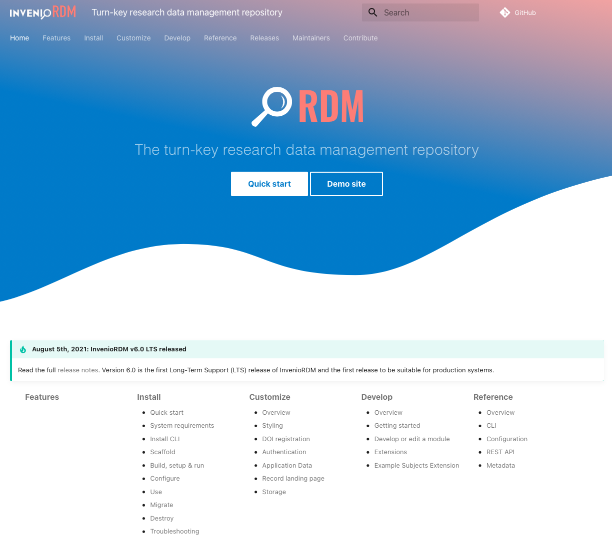

# InvenioRDM v6.0 LTS

*2021-08-05*

!!! tip "BREAKING"

    InvenioRDM v6.0 has reached a major milestone being the first release labelled **Long-Term Support (LTS)** thereby making it suitable for production systems.


## Try it

Want to try InvenioRDM? Just head over to our demo site: [https://inveniordm.web.cern.ch](https://inveniordm.web.cern.ch)

If you want to install it, follow the installation instructions on [https://inveniordm.docs.cern.ch/install/](https://inveniordm.docs.cern.ch/install/)

## What's new?

InvenioRDM v6.0 is mainly a bug fix release with only few new features.

### Long-Term Support release

InvenioRDM v6.0 is the first release suitable for production services. Please do read our "Production service notice" below to understand the maturity of InvenioRDM v6.0.

InvenioRDM v6.0 is maintained minimum until August 5, 2022 and possibly longer.  See our [Maintenance Policy](../maintenance-policy.md).

### New documentation frontpage

We have redesigned the documentation frontpage to provide a better overview of the available documentation as well as provide a nicer welcome experience. We hope you like it!



### Facets and sort options

We have made it possible to easily customize the facets and sort options displayed on search and uploads pages. You just have to include the ``RDM_SEARCH`` and/or ``RDM_SEARCH_DRAFTS`` configuration variables in your ``invenio.cfg``.

```python
# For /search
RDM_SEARCH = {
    # Supported values: access_status, is_published, language, resource_type,
    # subject, subject_nested
    "facets": ["access_status", "resource_type", "subject"]

    # Supported values: bestmatch, newest, oldest, version, updated-desc,
    # updated-asc
    "sort": ["bestmatch", "newest", "oldest", "version"]
}
# For /uploads
# RDM_SEARCH_DRAFTS = ...
```


Do please let us know which facets and sort options you'd like to see in the next release.

### Subjects: OECD Fields of Science

By default, a new instance now includes the [OECD Fields of Science](https://www.oecd.org/science/inno/38235147.pdf) subjects vocabulary. The vocabulary is  sufficiently broad with only 48 terms and is currently also used by DataCite. We do not expect this vocabulary to be suitable for all instances, and it's therefore also easy to disable by simply editing ``app_data/vocabularies.yaml``.

### Resource types

It is now possible to allow only certain resource types to be deposited while other resource types can be linked under "Related works" (e.g. allow only dataset to be deposited, but allow linking to papers and other resource types).

### Minor changes

**ROR icon for affiliations**

Affiliations that is linked to a ROR affiliation record now have a small ROR icon displayed next to them.


**Preview for .txt files and .ipynb**

The previewer will now also work for ``.txt`` and ``.ipynb`` files.

**Citation style**

We have changed the selected list of citation styles from a text list to a dropdown to improve the user experience and allow for more styles to be included.


**DOI landing page**

The registered DOI landing page was set to ``/api/records/<id>`` instead of ``/records/<id>``. This has now been fixed, but any previously registered DOI must be manually updated.

**Content Security Policy (CSP)**

We have removed all external domains from the CSP as well as the ``unsafe-eval`` to ensure we are as strict a policy as possible. If you use external JavaScript (e.g. loading fonts from Google) this will affect you and you will need to edit the ``APP_DEFAULT_SECURE_HEADERS`` configuration variables in ``invenio.cfg``. You may also need to add back ``unsafe-eval`` when running the demo containers.

**CSRF protection for REST API**

The REST API now requires the HTTP header ``X-CSRFToken: <value>`` to be sent with all PUT, POST, PATCH and DELETE requests. A JavaScript client can obtain the ``<value>`` to use in the request from the Cookie ``csrftoken``.

**Development server and Celery**

The Celery background worker that is started during ``invenio-cli run`` will now log a lot more information to the console as we have changed the log-level from ERROR to INFO. This means developers can more easily follow which tasks are being executed.

In addition an issue has been fixed so that cron tasks are executed, because the Celery beat scheduler is now started correctly.

**Removed SITE_HOSTNAME**

The config variable ``SITE_HOSTNAME`` has now been completely removed, and replaced with ``SITE_API_URL`` and ``SITE_UI_URL`` instead.

**MinIO S3 development server**

Fixes were applied to the docker-compose file for the MinIO S3 development server (if S3 was chosen as storage during the ``invenio-cli init rdm`` step), so that now data is stored inside your instance directory under ``/data``.

**Deposit form error messages**

We have continued work on improving the error messages. In particular, we have improved the error messages for lists of items like e.g. related works.

**Admin interface disabled**

The Invenio Framework comes with an admin interface under ``/admin``. This admin interface however mainly resembles a database inspection tool, and at best is not useful, but at worst allows destrucive operations to be conducted on your database. We have therefore completely disabled the admin interface.

**Licenses classification**

The licenses in the license vocabulary have now been classified as data or software licenses to ensure that our license selection form works properly.

**Partner logos removed**

We have removed all partner logos from the main InvenioRDM distribution to avoid distributing the partner logos to all InvenioRDM instances. Instead, we have moved them so they are visible on the demo site as well as inveniosoftware.org.

### Known issues

**DOI registration**

The largest known issue relates to DOI registration and means that, at this point, we have to label it as a feature preview, and thus **the DOI registration feature is not yet suitable for production services**.

## Upgrading to v6.0

We support upgrading from v4.0 to v6.0. Please see the [upgrade notice](../upgrading/upgrade-v6.0.md)

## Production services notice

If you plan to deploy InvenioRDM as a production service, please read this notice carefully to understand the maturity of InvenioRDM.

InvenioRDM v6.0 is the first release reaching maturity for production services. We expect issues to be discovered as more systems get deployed. Please report any problems you discover on [GitHub](https://github.com/inveniosoftware/invenio-app-rdm/issues/new/choose), so that we can quickly provide bug fixes.

InvenioRDM has been running in several test systems over the past 6-months and has been subjected to both a security audit and penetration test. InvenioRDM is based on the Invenio Framework which has been used in large-scale production services since 2016.

InvenioRDM v6.0 has not yet been put under heavy production workloads, nor been exposed to a large number of users. We are working towards having the Zenodo.org service running on InvenioRDM. Until this milestone has been reached, we cannot guarantee how suitable InvenioRDM will be for very heavy production loads.

## What's next?

The InvenioRDM partners have been working hard for the past many months to ship the first Long-Term Support release, and many developers will be taking a well-deserved vacation during August (we will have developers on watch for bug/security fixes 😉).

The InvenioRDM project partners will hold a virtual project meeting at the end of September where the road map for the coming 6-12 months will be discussed and agreed upon.

We are currently planning the scope of the next release, and expect the release date to be around early/mid October. A lot of work has already been completed on an OAI-PMH server, I18N support and DOI registration improvements so these are likely candidates to be shipped in the next release.

## Credit

The development work in this release was done by:

- CERN (Javier, Lars, Pablo, Zach, Jenny)
- Northwestern University (Guillaume)
- TU Graz (Mojib, David)
