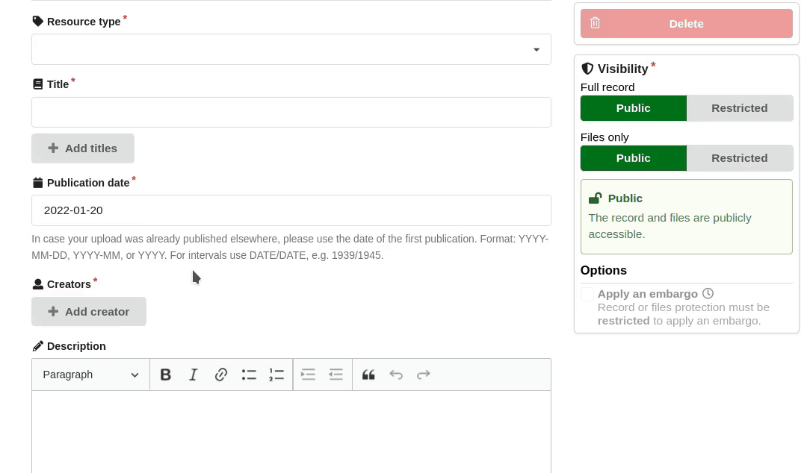
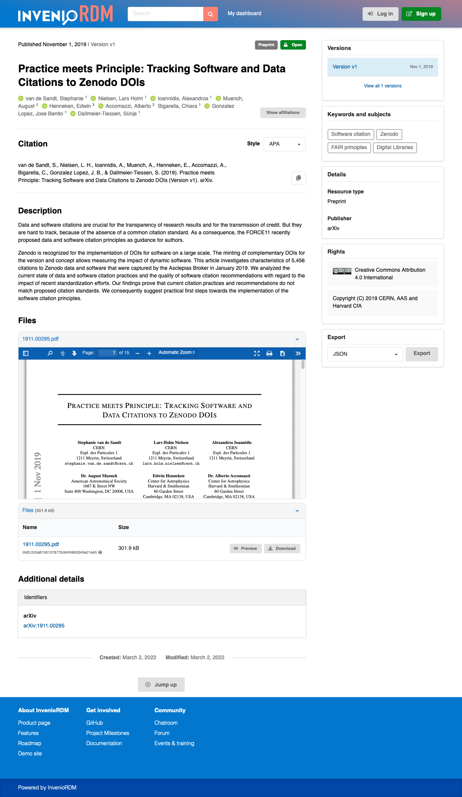
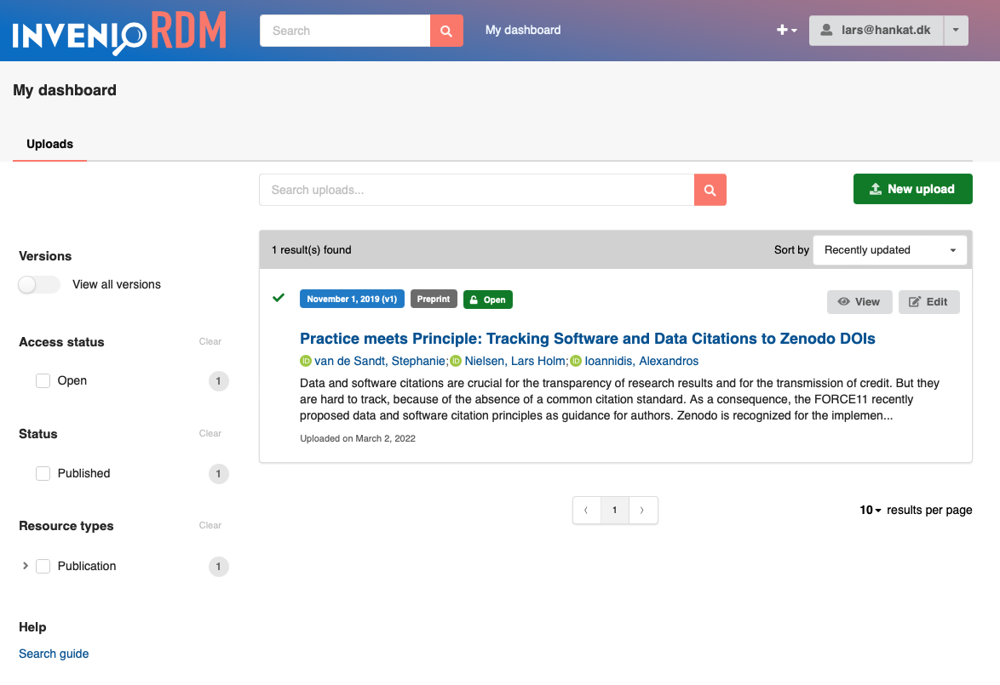
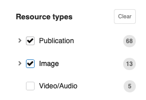
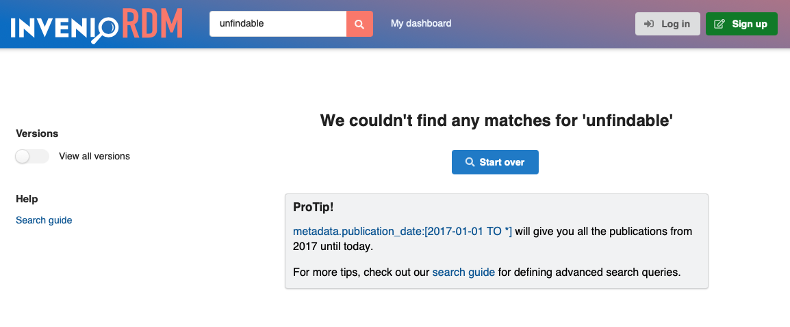
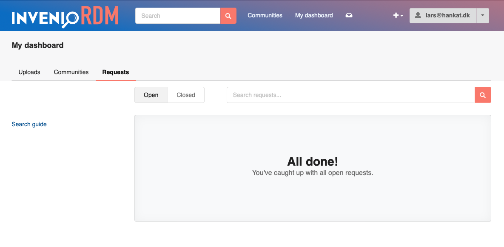

# InvenioRDM v8.0

*2022-03-03*

*Short-term support (STS) release*

We're happy to announce the release of InvenioRDM v8.0. The release is a short-term support release which is maintained until v9.0 (due mid-April 2022).

## Try it

- [Demo site](https://inveniordm.web.cern.ch)

- [Installation instructions](https://inveniordm.docs.cern.ch/install/)

## What's new?

In addition to the many bugs fixed, many features were added.

### Creators/contributors auto-completion

InvenioRDM now supports auto-completion of creators and contributors in the upload form.



The search box is powered by a new names vocabulary, exposed under the ``/api/names`` endpoint.

It is up to each instance of InvenioRDM to populate the names vocabulary with the persons they'd like to auto-complete. An InvenioRDM instance could, for example, choose to import names from an institutional directory service. Out-of-the-box, InvenioRDM supports importing the public data dump from ORCID so you can auto-complete from public ORCID profiles.

More about the names vocabulary [here](../../customize/vocabularies/names.md).

### Record landing page

The record landing page was redesigned to improve the overall readability and web accessibility of records.



The changes to the landing page include:

- Responsive layout - the landing page now renders nicely on desktop, tablets and mobiles.
- Creators/contributors improvements - contributors are now rendered horizontally to reduce whitespace usage.
- Keywords & subjects - moved from the main section to the sidebar to make this information easily accessible to the user.
- Rights - the previous "License" section has been renamed to "Rights".
- License icons - now displayed for Creative Common licenses.
- Additional descriptions - extracted from the details section and moved to the right, below the main description.
- Export links - now displayed in a select menu with direct download, to avoid having to select and copy/paste from the previous page.
- Administration buttons - moved to the right column in preparation for the communities feature, launching in v9.
- Additional details - converted from a horizontal table to a tabular menu with vertical listing of the details.

### My dashboard

We have changed the header menu from "Uploads" to "My dashboard" in preparation for the communities feature launching in v9.0. The goal of the change is to provide users with an overview of all their records, communities and requests in InvenioRDM.

This also means we have changed the URL endpoint of the uploads page from ``/uploads`` to ``/me/uploads`` so that we can later add both ``/me/communities`` and ``/me/requests``.



### OAI-PMH server improvements

The OAI-PMH server, added in v7.0, has been improved so it's now a fully compliant OAI-PMH 2.0 server. The improvements include:

**Sets support**

The OAI-PMH server now has sets support, which includes improvements to the underlying Invenio Framework. Records are immediately available in the sets as soon as they have been indexed (within seconds). This means other sets a record is part of can efficiently be queried.

The sets are defined as search queries over the set of records, and currently have to be programmatically added. However, InvenioRDM v9.0 will add a REST API for allowing administrators to manage sets.

**DataCite metadata formats**

We have added support to DataCite metadata formats in the OAI-PMH server via the ``oai_datacite`` and  ``datacite`` metadata format prefixes.

**OpenAIRE compliance**

In addition to the above features, we have now also validated the OAI-PMH server against the [OpenAIRE Guidelines](https://guidelines.openaire.eu/en/latest/) to ensure it is compliant with the guidelines.

See the [OAI-PMH server documentation](../../reference/oai_pmh.md).

### Translations (I18N)

InvenioRDM v8.0 has seen a lot of improvements on the translation front as well. We are now almost at a stage where the system is fully translated with German being the first translated language.

We aim at finishing the full translation of InvenioRDM by v9 LTS. If you'd like to participate in the translation, please checkout our new guide for [getting involved as a translator](../../contribute/translators-guide.md).

### Web accessibility (A11y)

We are continuing our work towards Web Content Accessibility Guidelines (WCAG) level AA conformance, and have made progress on multiple pages. The landing page was improved for screen readers by adding aria-attributes and organising the layout into sections. Where the elements have a different purpose than styling, semantic HTML or aria-roles were added. Each section was given a heading with the appropriate level (`h1`, `h2`...). The interactive elements were given aria-attributes, and made accessible by keyboard.

Accessibility was tested with Apple VoiceOver and Screen Reader Chrome Plugin on MacOS.

### User experience improvements

**Search facets**

We have improved how the search facets work. It is now possible to easily clear selected facets. In addition, the facets will be automatically cleared if you change the search query.



**No results search tips**

We have also improved the page shown when no search results could be found. It now includes a "ProTip" section and allows the user to easily clear the search.



**Deposit form arrays**

Array components on the deposit form, now behave correctly when one of their items is deleted. Related, removing a license nows works correctly too.

### Developer documentation

We have made a larger update to our developer documentation to make it accessible to developers of different skill levels from long-time contributors or to first-time beginners.

See our new [developer documentation](../../develop/index.md).

### Code changes

**Marshmallow deprecation warnings**

A number of marshmallow deprecation warnings have been fixed.

**Service argument order**

Services (e.g. `RecordService`) now always take the acting identity as their methods' first argument.

**Entry points improvements and declarative packages**

Invenio Framework relies heavily on Python entry points as a mechanism for
supporting plugins and an extendable architecture. Previously, these entry
points were read by the ``pkg_resources`` package. We have started switching
packages over to using Python's ``importlib`` instead for performance reasons.

We have also begun moving packages to a purely declarative definition
by moving most of what was previously in ``setup.py`` into ``setup.cfg``.
This is in keeping with the long-term direction of the Python packaging environment,
and thus allows to gradually transition to the new method.

## Feature preview

!!! warning "Do not enable feature previews in production systems"

    **IMPORTANT**: Feature previews are not supported with upgrades or migrations, and should not be enabled in production systems.

InvenioRDM v8.0 ships with a feature preview of the new communities feature. The full communities feature is planned to launch with InvenioRDM v9.0 LTS in mid-April.

You can enable the feature preview by including the following line in your ``invenio.cfg``:

```python
COMMUNITIES_ENABLED = True
```

This will enable the communities and requests modules. You'll e.g. see the dashboard has been extended with two new tabs "Communities" and "Requests".



You'll also see in the header there's a new "Communities" item, as well as a "request inbox" icon.

!!! note
    If the feature preview is disabled, all the associated REST API and views are disabled, and thus v8.0 can safely be used on production systems.

## Upgrading to v8.0

We support upgrading from v7.0 to v8.0. Please see the [upgrade notice](../upgrading/upgrade-v8.0.md).

## Maintenance policy

InvenioRDM v8.0 is a **short-term support** (STS) release which is supported until InvenioRDM v9.0 (release currently planned for mid-April 2022). See our [Maintenance Policy](../maintenance-policy.md).

If you plan to deploy InvenioRDM as a production service, please use InvenioRDM v6.0 Long-Term Support (LTS) Release.

## Requirements

InvenioRDM v8.0 supports:

- Python 3.7, 3.8 and 3.9
- PostgreSQL 10+
- Elasticsearch 7

Note that Python 3.6, Elasticsearch 6 and PostgreSQL 9 have all reached end of
life and are no longer supported by their respective organisations.

### Future breaking changes

Following is an advance notification of larger upcoming changes.

InvenioRDM v9.0 will ship with larger changes to the underlying user management modules. These changes include:

- Moving the ``UserIdentity`` database table from Invenio-OAuthClient to Invenio-Accounts.
- Depending on the Flask-Security-Invenio module over Flask-Security.
- Moving user profile information from Invenio-UserProfiles to Invenio-Accounts.
- Separating login timestamps and IP addresses from the user database table.

We are still assessing if it is possible and feasible to change the current user identifier from a sequential integer to a random string (UUID). If this change is applied,
InvenioRDM will be shipped with an upgrade guide and data migrations. However, if you have custom code, these changes may impact you.

## Questions?

If you have questions related to these release notes, don't hesitate to jump on our chat and ask questions: [Getting help](../../develop/getting-started/help.md)

## Credit

The development and translation work in this release was done by:

- CERN: Alex, Dimitris, Javier, Jenny, Karolina, Lars, Nicola, Pablo G., Pablo P., Sergio, Zacharias
- EU Joint Research Centre: Camelia
- New York University: Laura
- Northwestern University: Guillaume
- RERO: Peter
- TU Graz: Alex, Christoph, David, Hermann, Mojib
- TU Wien: Max
- Uni Bamberg: Christina

