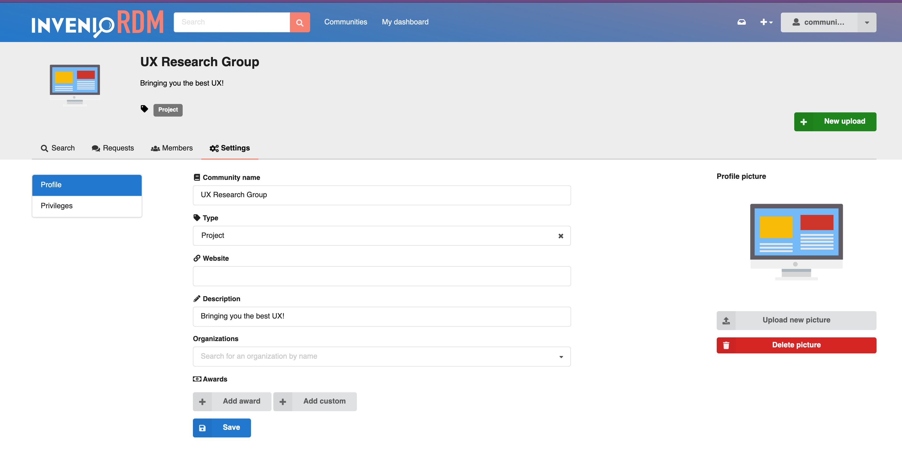
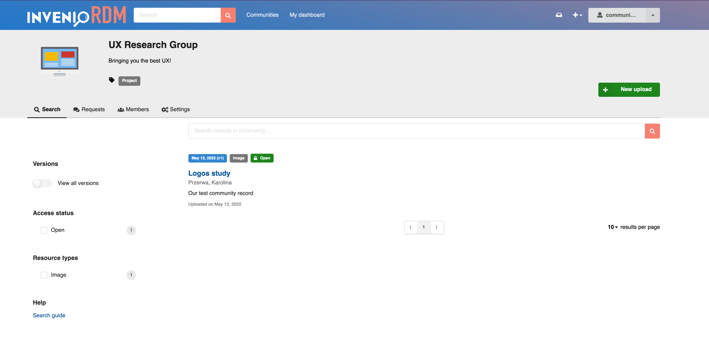
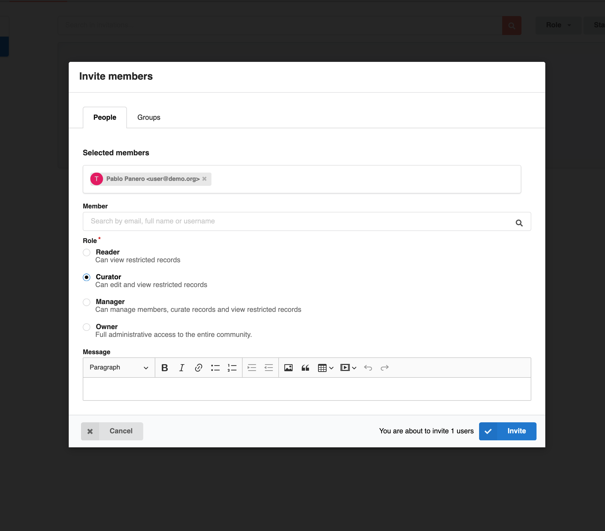
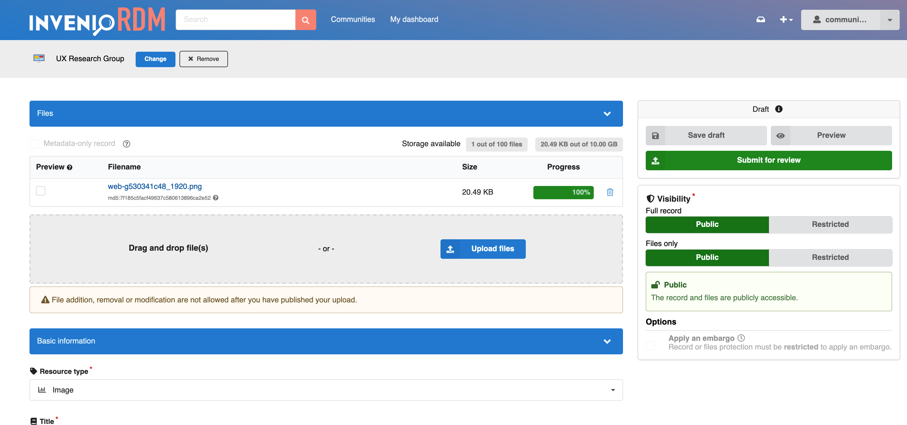
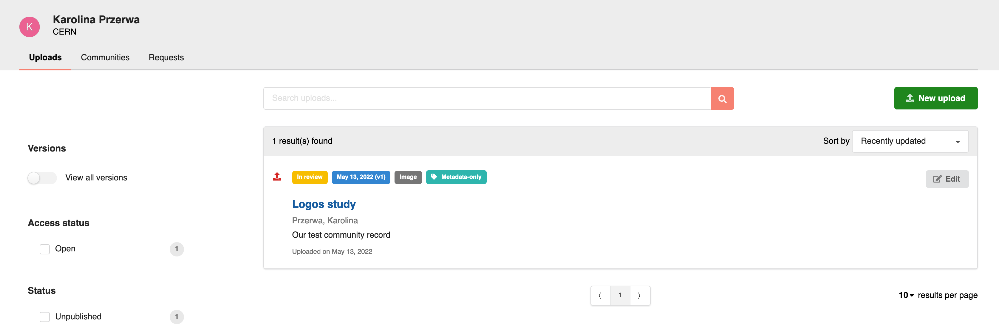
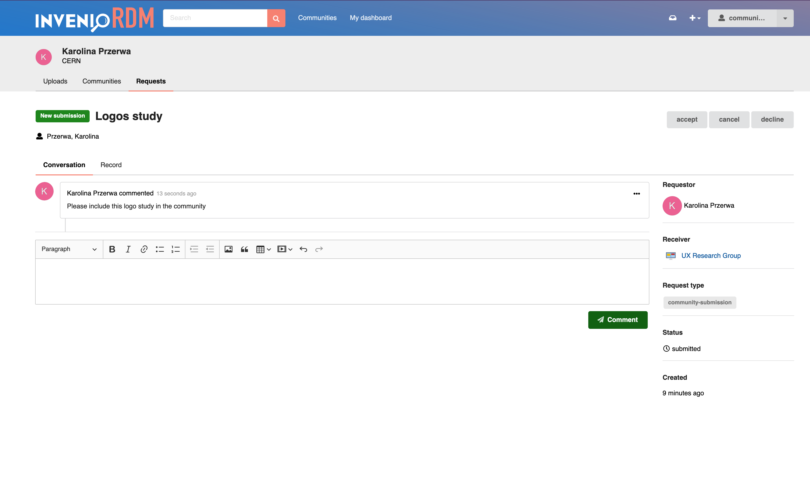
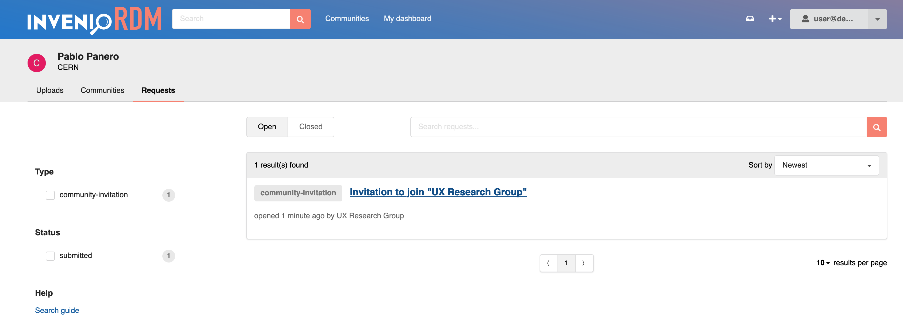
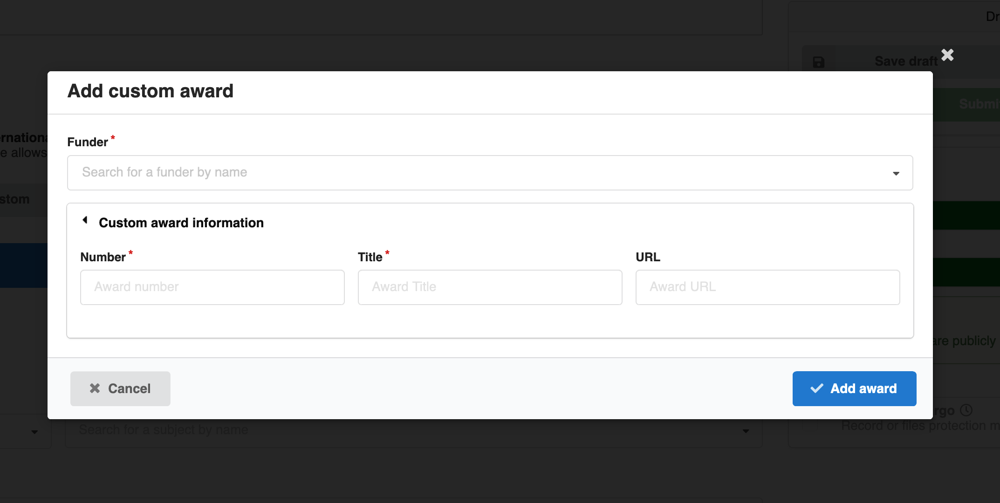

# Release candidate

2022-05-17

*Release candidate 1*

We are happy to share with you our **release candidate 1** (RC1) for version 9.0.0 LTS. Test it with us!

## Try it (development)

[Demo site](https://inveniordm.web.cern.ch/)
1. Create a local account (SSO not available at the moment)
2. Make sure your user profile is visible by switching it on in your profile settings.

#### Install

To install the release candidate 1, follow [the installation guide](../../../install). In step 3 specify the release candidate 1 version, as follows
`invenio-cli init rdm -c v9.0`

## Final release

We expect to ship the final release of v9.0.0 LTS on Tuesday, May 24th.

## What's new ?

Many awaited features were added in the upcoming version 9, and are now ready to be tested with the release candidate:

### Communities

InvenioRDM now provides communities by default, as a tool for organising users and records into collaborative entities.

Users can submit their records for inclusion in specific communities. The inclusion request will be reviewed by the community manager as part of the community workflow.

#### Community records

Members of a community are able to access all the approved records belonging to that community.

#### Members

Community managers can invite members or groups and assign them a role as part of the invitation process. A small message can even be included.

#### Review of uploads

A user submits their deposit for review on the deposit form:

..and can see the status of their submissions in their dashboard:

#### Requests

Users can communicate with community managers using the request timeline.

### User extended dashboard

As a user, you are now able to control all your uploads, communities, and requests from just one dashboard.

### Funders and awards

The deposit form now features funders and awards fields. Those are then displayed on the uploaded record.

### UI Theme polishing

The InvenioRDM theme was refactored and cleaned up, providing better overridability for subthemes and instances. We added detailed [documentation](../../customize/styling-theme.md) on how to customize the theme.

## Requirements

InvenioRDM v9.0rc1 supports:

- Python 3.7, 3.8 and 3.9
- PostgreSQL 10+
- Elasticsearch 7

Note that Python 3.6, Elasticsearch 6 and PostgreSQL 9 have all reached end of life and are no longer supported by their respective organisations.

## Feedback

Something is not working? Table not displayed properly? Important information missing in the UI? Let us know!

Please help us testing the release candidate, and report any issues before v9.0.0 release!

Report the issues using [this form](https://github.com/inveniosoftware/invenio-app-rdm/issues/new?assignees=&labels=bug&template=bug_report.md) or reach us on [Discord channel](https://discord.com/channels/692989811736182844/704629170470125578).

### Known issues

1. Community curators/readers cannot see restricted community records in the community uploads search.
2. Request actions are not translated.
3. Accepted/declined invitations are still visible on the community dashboard.
4. SSO is not available yet (you need to create a local account to login)
