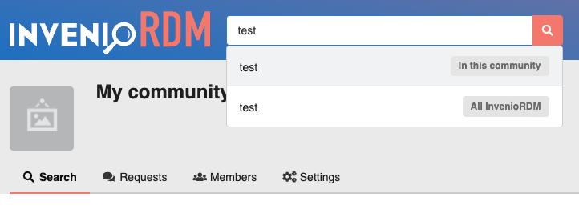
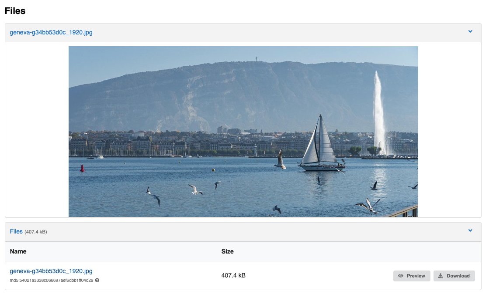
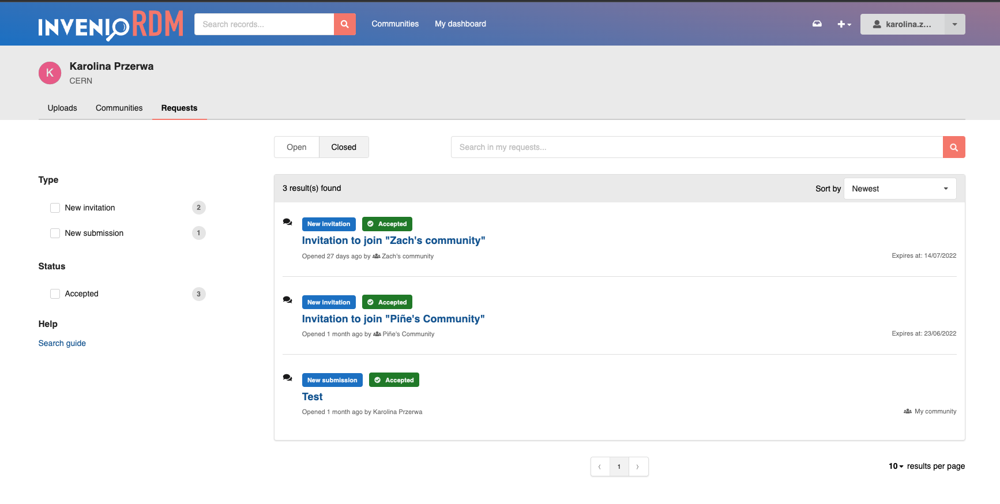
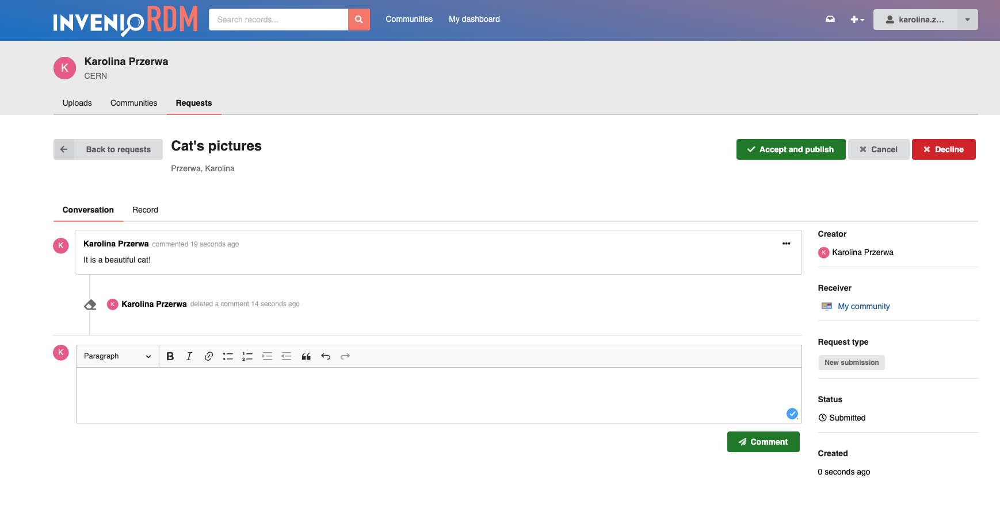
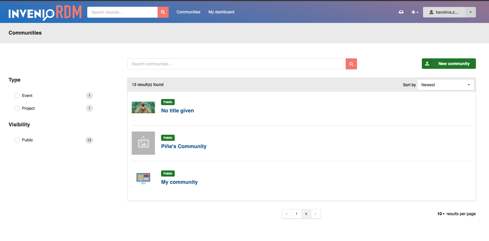
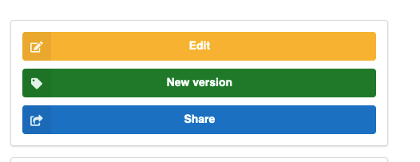

# InvenioRDM v9.1

*2022-07-11*

We are happy to announce the release of InvenioRDM v9.1. The is a minor release, which will be maintained as a part of v9.0 LTS.

## Try it

- [Demo site](https://inveniordm.web.cern.ch)

- [Installation instructions](https://inveniordm.docs.cern.ch/install/)

## What's new?

InvenioRDM v9.1 adds many user experience improvements as well as bug fixes.

### Multi-option search bar

A new drop-down in the search bar allows users to control the scope of their search - for example the entire repository or the current community.
The options are configurable via your instance's Jinja templates.



### IIIF

Preview of images attached to a record is now powered by [IIIF](https://iiif.io/). Preview with IIIF has 2 main advantages:

  * Improves user experience by delivering images optimised for the preview window, meaning less bandwidth and faster page loads.
  * Preview of TIFF and JPEG2000 attachments is now possible. These widely used archive formats have limited browser support, which is overcome by conversion to JPEG when previewing.
  
For example, a 20MB TIFF file attached to a record is previewed as a JPEG under 250kB:



The IIIF previewer configuration options are shown below:


```python
PREVIEWER_PREFERENCE = [
    "csv_dthreejs",
    "iiif_simple", # Enables IIIF preview.
    "simple_image",
    "json_prismjs",
    "xml_prismjs",
    "mistune",
    "pdfjs",
    "ipynb",
    "zip",
    "txt",
]
"""Preferred previewers."""

IIIF_SIMPLE_PREVIEWER_NATIVE_EXTENSIONS = ["gif", "png"]
"""Images are converted to JPEG for preview, unless listed here."""

IIIF_SIMPLE_PREVIEWER_SIZE = "!800,800"
"""Size of image in IIIF preview window. Must be a valid IIIF Image API size parameter."""

```

### Requests

* Request searching has been redesigned providing more information on the requests in a cleaner style, mirroring the style of the records search page.




When a comment is deleted, the user will see a specific timeline event replacing the comment message.




### Communities

The community search view has been redesigned to improve the user experience with more detail shown when searching, helping users find the right community.



### Theme improvements

Version 9.1 introduces "context" coded theme elements (labels, buttons and icons), simplifying theme customisation.
It also is easier to replace the default InvenioRDM colors (`.negative`, `.positive`, `.warning`, `.neutral`, `.danger`) with custom color variants.
Below is an example from the upload form with custom colours for each action button:




#### Limitations

While this release includes many improvements related to communities, it does not resolve all known limitations:

- **E-mail notifications**: There is no notification mechanism for requests. No
  e-mail or other notification is sent for new requests. Users will need to check for new 
  requests and messages via their dashboard / community requests pages.

- **Add to community after publishing**: If you publish a record without adding it to a
  community, it cannot currently be added to a community at a later time.

- **Removal from a community**: Once a record is accepted into a community, there
  is no user interface for removing the record from the community. This can however be
  achieved programatically by an administrator.

- **Featured communities**: A REST API exists for managing featured communities
  however there is no user interface on top of it yet.

- **Community logos and avatars**: The current implementation of community logos
  requires additional work to improve the presentation of a the community.

## Upgrading to v9.1


To upgrade from version 9.0 to 9.1 you need to update your instance's dependencies and assets:

- In your Pipfile, change:

``` diff
- allow_prereleases = true
+ allow_prereleases = false
```

- delete Pipfile.lock


run:

```shell
invenio-cli install
```


## Maintenance policy

InvenioRDM v9.x is a **long-term support** (LTS) release which is supported until the next LTS release + 6 months and for minimum 1 year. See our [Maintenance Policy](../maintenance-policy.md).

## Requirements

InvenioRDM v9.x supports:

- Python 3.7, 3.8 and 3.9
- PostgreSQL 10+
- Elasticsearch 7

Note that Python 3.6, Elasticsearch 6 and PostgreSQL 9 have all reached end of life and are no longer supported by their respective organisations.
