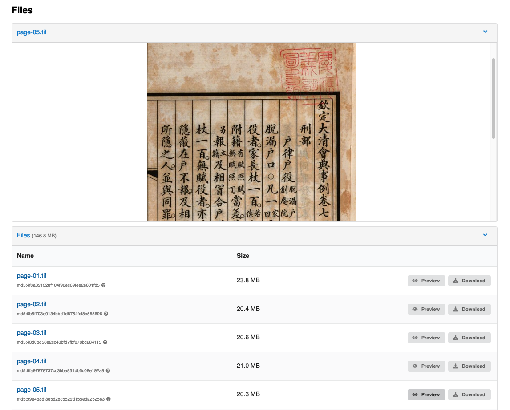

# InvenioRDM v9.1

*2022-07-11*

We're happy to announce the release of InvenioRDM v9.1. The release is a minor release which is maintained as a part of v9.0 LTS.

## Try it

- [Demo site](https://inveniordm.web.cern.ch)

- [Installation instructions](https://inveniordm.docs.cern.ch/install/)

## What's new?

InvenioRDM v9.1 adds many user experience improvements and includes many bug fixes.

### Multi-option search bar

Version 9.1 of InvenioRDM adds a new feature: multi-option search bar in the navigation bar.
The new search options in the searchbar's dropdown allows users to choose where to search, for example only in the current community's records or in the entire repository.
The options are configurable per instance by overriding the Jinja templates.


### IIIF

InvenioRDM v9.1 includes the preview of image files in the record landing page using IIIF.
The file preview now displays the thumbnail version of the image instead of the full size, decreasing data usage and speeding up the image's loading for better user experience.



The IIIF files preview can be configured as in the example below:

```python
PREVIEWER_PREFERENCE = [
    "csv_dthreejs",
    "iiif_simple",
    "simple_image",
    "json_prismjs",
    "xml_prismjs",
    "mistune",
    "pdfjs",
    "ipynb",
    "zip",
    "txt",
]
"""Preferred previewers."""

IIIF_SIMPLE_PREVIEWER_NATIVE_EXTENSIONS = ["gif", "png"]
"""Images are converted to JPEG for preview, unless listed here."""

IIIF_SIMPLE_PREVIEWER_SIZE = "!800,800"
"""Size of image in IIIF preview window. Must be a valid IIIF Image API size parameter."""

```

### Requests

* Requests search views are redesigned in version 9.1 and display more information for each row, following the clean style of the records search page.


When a comment is deleted, the user can now see a specific timeline event replacing the comment message.


### Communities

The community search view has been redesigned to improve the user experience: each result now displays more community's details.


### Theme improvements

Version 9.1 introduces "context" coded theme elements (Labels, Buttons and icons), improving the overridability of the InvenioRDM theme.
It is now easier to replace default InvenioRDM colors (`.negative`, `.positive`, `.warning`, `.neutral`, `.danger`) with your custom color variants.
Below, an example of buttons in the upload forms with specific colors per action button:


#### Limitations

While this release includes many improvements related to communities, it does not solve all known limitations:

- **Email notifications**: There is no notification mechanism, and thus no
  emails or similar are sent for new requests. Users must go to
  their dashboard, or community requests, to see if there's any new requests or
  new messages.

- **Add to community after publish**: If you publish directly, and later want
  to add a record to a community there's currently no way for the submitter or
  community curators to submit or claim records.

- **Removal from community**: Once a record is accepted into a community, there
  is no user interface for removing the record from the community again. It's
  possible to programmatically remove records from a community.

- **Featured communities**: A REST API exists for managing featured communities
  however there is no user interface on top of it yet.

- **Community logos and avatars**: The current implementation of community logos
  requires extra work and design in order to better present a community.

## Upgrading to v9.1

To upgrade from version 9.0 to 9.1 you need to update your instance's dependencies and assets by running
```shell
invenio-cli packages upgrade
invenio-cli assets build
```

## Maintenance policy

InvenioRDM v9.x is a **long-term support** (LTS) release which is supported until the next LTS release + 6 months and for minimum 1 year. See our [Maintenance Policy](../maintenance-policy.md).

## Requirements

InvenioRDM v9.x supports:

- Python 3.7, 3.8 and 3.9
- PostgreSQL 10+
- Elasticsearch 7

Note that Python 3.6, Elasticsearch 6 and PostgreSQL 9 have all reached end of life and are no longer supported by their respective organisations.
