# Administration

This page provides a usage overview of the InvenioRDM administration panel.

**Audience**: Instance staff / Content Managers / Administrators

The administration panel is a feature in InvenioRDM introduced in v10 that provides a graphical user interface for managing your instance. It is designed to be used by administrators and superusers of the repository.
For more technical details you can read the [developer guide to the InvenioRDM administration panel](../maintenance/internals/administration_panel.md), detailing its programmatic interface and usage.

**As an administrator** you can access the administration panel at `/administration`. This is also available through the user menu in the top right corner of your instance:

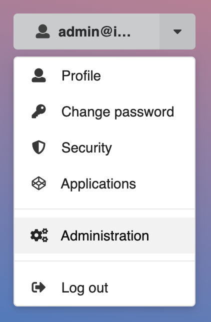

## Communities

The **Communities** section in the administration panel lets you see and manage communities.

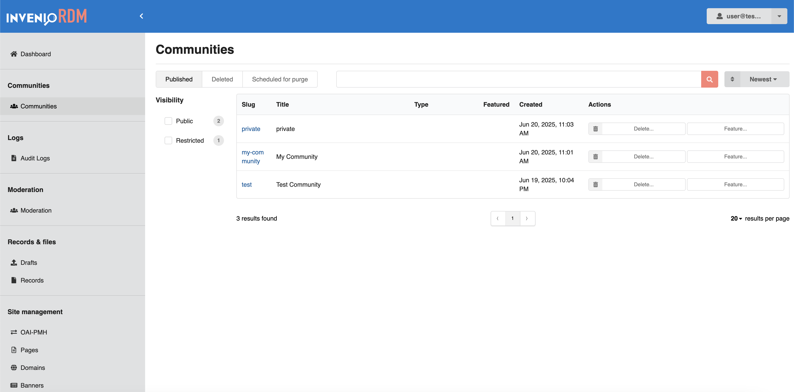

You can:

- **View communities** that are active or deleted.
- **Filter** by visibility: public or restricted.
- **Search** by name or slug.
- **Sort** by newest or oldest.
- **Take actions** like deleting or featuring a community.

!!! info

    For more details on communities, see [Communities](../maintenance/architecture/communities.md).
    For API usage, see the [REST API for Communities](../reference/rest_api_communities.md).

## Logs

### Audit Logs

_Introduced in v13_

The **Audit Logs** page provides actions taken in the system. As an administrator, you can keep track of recent changes across the repository.

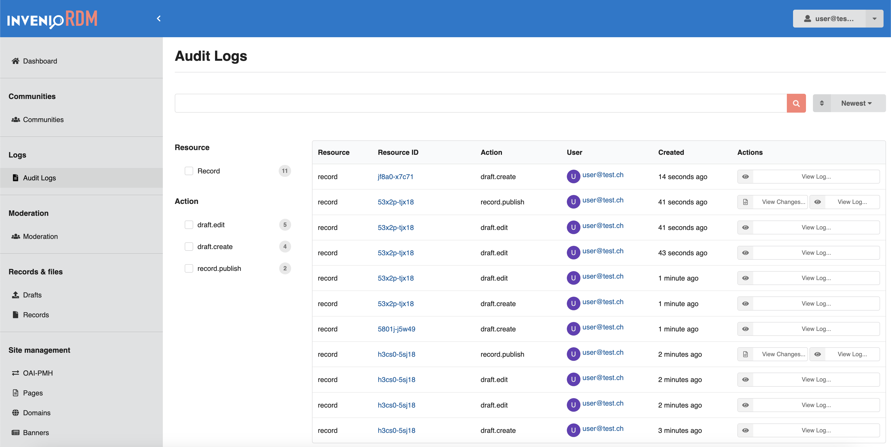

You can:

- See a list of actions like creating, editing, or publishing records
- Check who performed each action and when
- Open detailed logs or compare changes

You can filter by:

- Resource type (e.g. records)
- Action type (e.g. draft.edit, record.publish)

!!! info
    If you want to enable, configure or extend audit logging, see [configuration guide](../operate/customize/audit-logs.md).

## Records & files

### Drafts

The **Drafts** page allows you to view and manage records that have not yet been published.

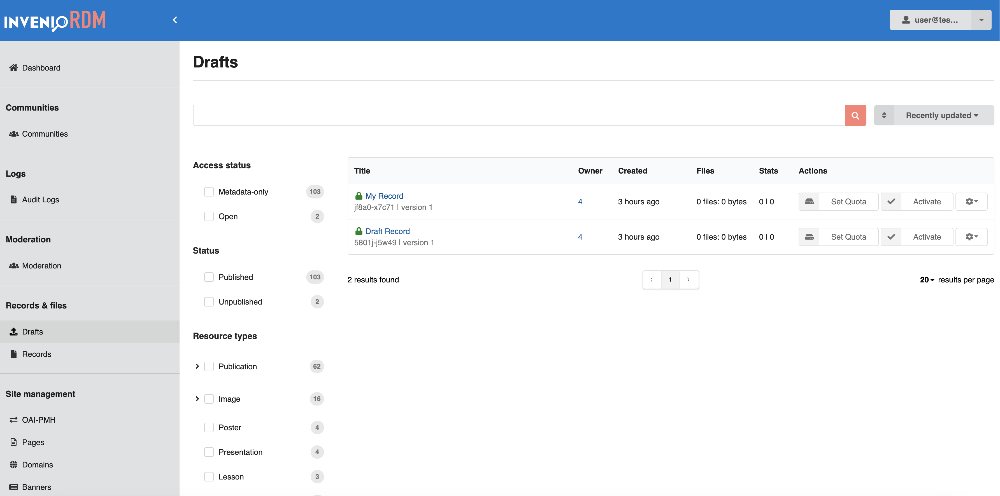

You can:

- Review draft records and their details
- Filter by access status, publication status, resource type, or file type
- Set quotas for each draft
- Activate, Deactivate or Block the user owning the record

!!! info

    For API usage, see [Drafts](../reference/rest_api_drafts_records.md#drafts).

### Records

The **Records** page provides access to all published records you can manage.

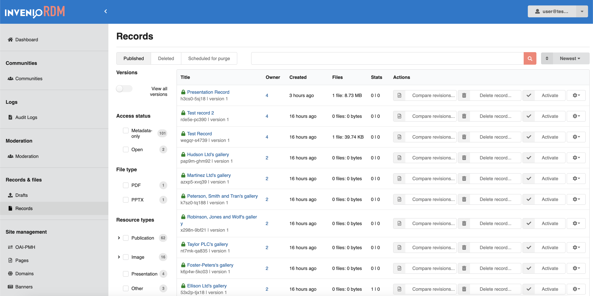

You can:

- View records that are published, deleted, or scheduled for purge
- Filter records by access status, file type, or resource type
- Delete records and compare different versions
- Activate, Deactivate or Block the user owning the record

!!! info
    For API usage, see [Records](../reference/rest_api_drafts_records.md#records).

_Introduced in v13_

#### Compare revisions
The `Compare Revisions` feature allows administrators to audit record updates and follow changes over time.
From the **Records** list in the Administration panel, click the **Compare revisions...** button in the _Actions_ column to open a side-by-side comparison window:

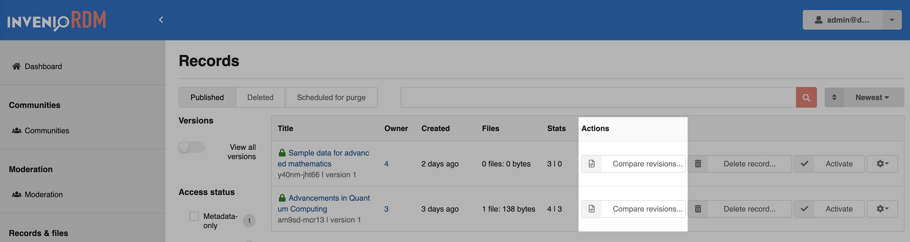

A modal window appears, allowing you to choose two revisions to compare:

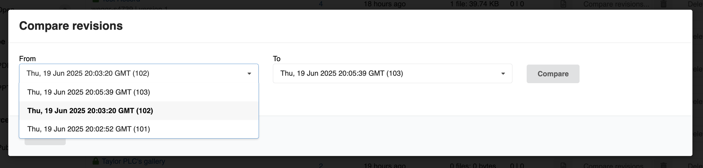

The changes are then displayed in a JSON **side-by-side diff** view:

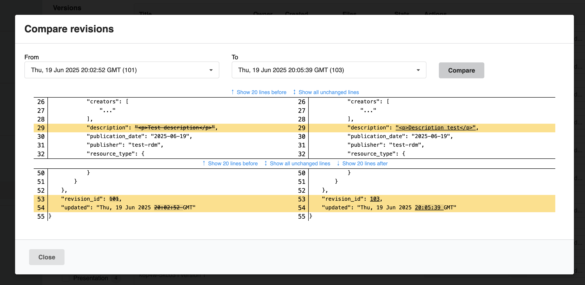

!!! info "Revisions VS versions"

    This feature allows admins to compare revisions, not versions. A revision is the result of editing a record, where each published edit creates a new revision. A new version is a different record which is semantically linked to the previous record. At this time it is not possible to compare different records, including versions.

## Site Management

### OAI-PMH

The **OAI-PMH** page allows you to manage sets used for metadata harvesting via the OAI-PMH protocol. Sets are defined by search queries and help external systems harvest records.

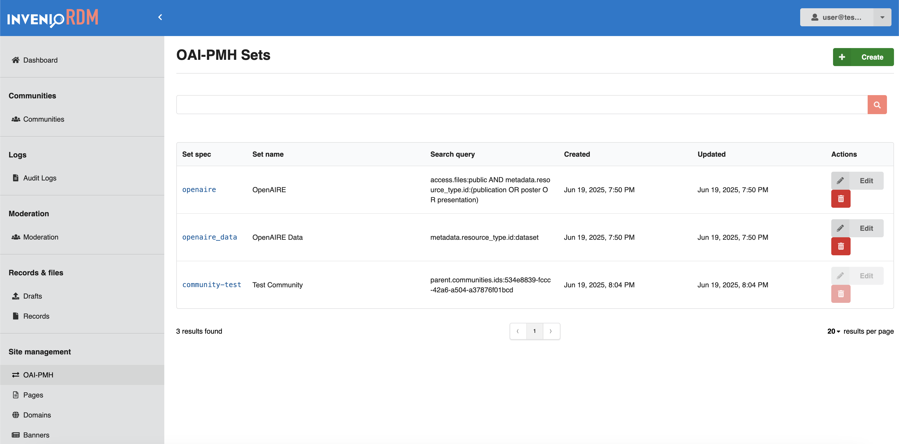

You can:

- View existing OAI-PMH sets and their search queries
- Edit or delete existing sets
- Create new sets

  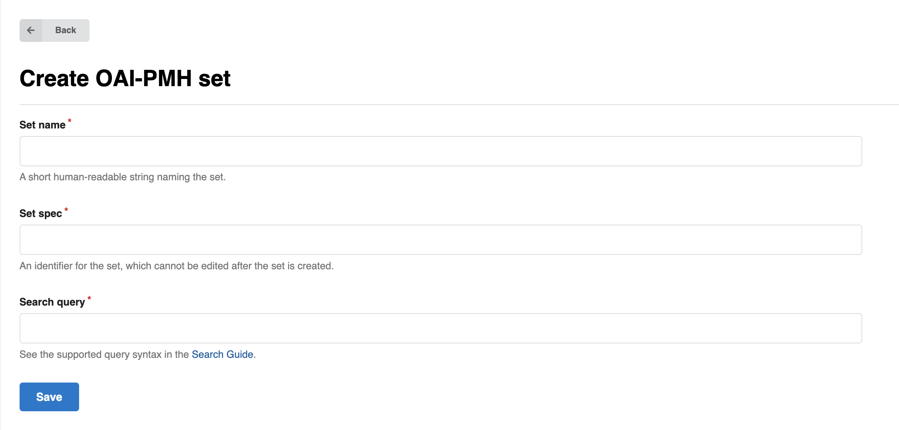

!!! info

    For details, see [OAI-PMH](../reference/oai_pmh.md).
    For API usage, see the [REST API for OAI-PMH Sets](../reference/rest_api_oaipmh_sets.md).

### Pages

The **Pages** section allows you to manage static informational pages on your site.

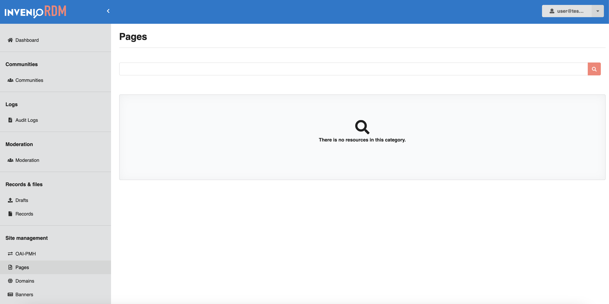

You can:

- View the list of existing pages
- Edit existing page content, titles, language and description.

!!! info

    To learn how to customize static pages, see [Static Pages](../operate/customize/static_pages.md).

### Domains

The **Domains** section allows you to **manage and configure approved email domains** for your InvenioRDM instance.
These domains are particularly useful for **content moderation**, when moderation features are enabled. For example, you can configure your system to automatically verify and approve content uploaded by users whose email addresses originate from an approved domain.

You can:

- View domain status and user activity (e.g. active, inactive, confirmed)
- Filter by status, flagged state, or top-level domain
- Create, edit, or delete domain entries

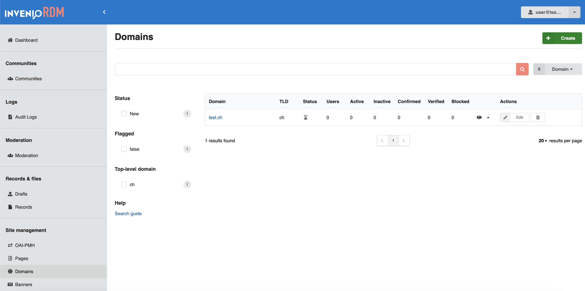

!!! info

    You can read more about [below](#moderation-of-users-and-records).

### Banners

The **Banners** section allows you to add announcement banners to your InvenioRDM instance. Banners can be displayed site-wide or targeted to specific pages.

#### Adding a new banner

**As an administrator**, you can use the **Banners** section in the administration panel to add new banners.

Banners can be added globally or restricted to a specific path. When you open the section, you'll see an overview of all banners currently added to your instance. In the example below, the list is empty because no banners have been created yet.

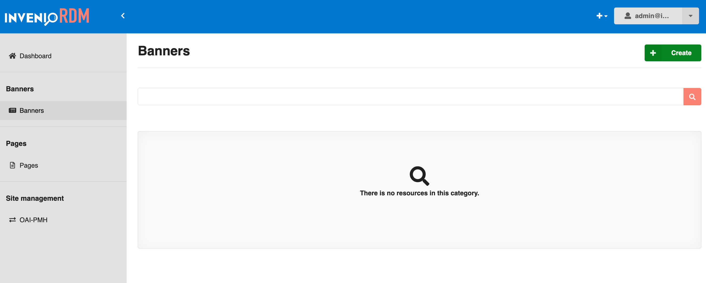

To add a new banner, you can click the green "Create" button in the top right corner. This will take you to the form where you can add all the details for your new banner:


Here you can see that the first field "Start time" is already pre-filled, however, you are free to update this to whatever start date and time you want. Note that both the start and end time need to be specified in UTC format.

- "Start time" (UTC format) is when your banner will become visible on your site.
- "End time" (UTC format) is when your banner will deactivate automatically.
- "Message" is the content that will show in your banner.
- "URL path" lets you specify where your banner should be visible. If left empty, the banner will show on every page of your site. If you specify a subpath, e.g. `/records`, the banner will show only on `/records` **and all its subpages** e.g. `/records/1234`.
- "Category" is where you can define the theme of your banner. Info - blue, Warning - orange, Other - gray.
- "Active" needs to be checked to activate the banner. This ensures that the banner will show on the given start time and deactivate on the given end time. If left unchecked, the start and end times will be ignored, and the banner will not be visible. This can be used to deactivate the banner temporarily, or permanently.

In the following example, the banner will show up on all subpages of `/records` as an info banner between April 3, 2023, at 12:00 and May 3, 2023, at 12:00.


When ready, click save and you will be taken back to the "Banners" page where the new banner will appear in the list:

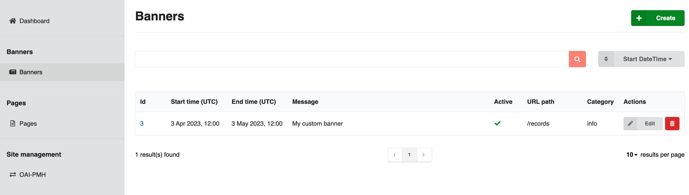

The list is searchable and can be filtered by selecting an option from the dropdown next to the search bar, above the list of banners.

From the list you can see the key details of your banners, and whether they are active or not. You can also edit a banner by clicking the "Edit" button in the "Actions" column, or delete it by clicking the trash can.

Clicking the link in the "ID" column will take you to a details page where you can see more details of the selected banner:


Now that the banner is enabled, visiting any page under `/records` within the specified date range, will show the banner above the header:

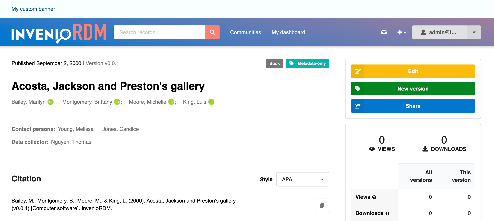

If you have multiple active banners at the same time, they will simply stack on top of each other:

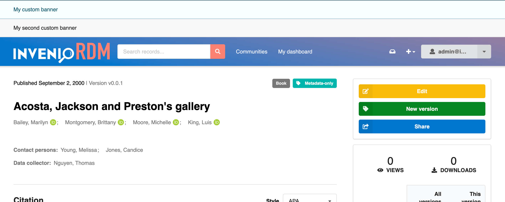

### Vocabulary Types

The **Vocabulary Types** section allows administrators to view and manage controlled vocabularies used across the repository. These vocabularies ensure consistent metadata, such as contributor roles, languages, or licenses.

You can:

- Browse available vocabulary types
- View how many entries exist in each type

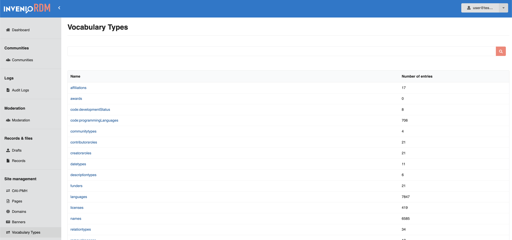

!!! info

    To customize vocabularies, see [Customize Vocabularies](../operate/customize/vocabularies/index.md).
    For API usage, see the [REST API for Vocabularies](../reference/rest_api_vocabularies.md).

## System

### Jobs

_Introduced in v13_

A powerful asynchronous tasks management interface called `Jobs`, giving administrators control over background tasks directly from the administration interface.

See the [related documentation](../operate/customize/jobs.md) on how to enable and configure jobs.

#### Creating a Job

!!! note "Info"
    Creating a job will **not execute it**. It will only be executed when scheduled or run manually. If you already have an existing Job and want to run it, see [running a job](#running-a-job).

1. Head to the administration interface and navigate to the "Jobs" section.

    

2. Click the create button on the top right.

    

3. Here, you can define a new job by specifying the following:
    - **Name**: A descriptive name for the job.
    - **Description**: A brief description/notes of what the job does.
    - **Queue**: The Celery queue to which the job will be submitted. This is useful for categorizing jobs based on their priority or type.
    - **Task**: Select the task from the available Jobs.
    - **Active**: Whether the job is currently active or not. Inactive jobs will not be executed automatically even if scheduled but they can can be [executed manually](#configure-and-run-manual-run).
    <figure markdown="span">
        
        <figcaption>Create Job form</figcaption>
    </figure>
    <figure markdown="span">
        
        <figcaption>Create Job form filled</figcaption>
    </figure>

4. Once you have filled in the details, click `Save` to save the job. Now you should see the job in the Jobs list page.

    

#### Running a Job

Once a job is created, you can configure it for its first run.

There are two ways to run a job:

1. **Configure and Run (Manual):** Trigger the job immediately using the added configuration.
2. **Schedule and Run (Automatic):** Set up a recurring schedule and let the job run automatically based on that.

<figure>
  
</figure>

After each run, check the logs and output to confirm that the job executed successfully.

##### Configure and Run (Manual run)

When creating a new run, you'll need to configure several key parameters in the **Configure and run** dialog:


#### Basic Configuration

- **Title:** Give your run a descriptive name

- **Queue:** Select the appropriate queue for your run execution

- **Args:** Specify any command-line arguments your Job requires

- **Since:** Optional timestamp in `YYYY-MM-DD HH:mm` format to continue processing from that particular timestamp. _Uses the last successful run if left empty._

##### Advanced Configuration

This section explains how to define your job's workflow directly using JSON, bypassing the UI form. You should use this method for advanced configurations when you need more powerful and granular control over your job's input parameters and have a clear understanding of its setup.

###### Custom Arguments

Use the Custom args field to provide additional arguments that will override any arguments specified in the configuration above.

!!! warning "Configuration Override"

    When custom args are provided, they take precedence over the arguments specified in the advanced configuration section.

#### Schedule a Job

Once your job is created and active, click on **Schedule** to configure the timing. You can schedule jobs using either of the following methods:

- **Interval**
  

- **Crontab**
  

!!! tip "When to use which?"

    | Use Case                              | Recommended | Example                         |
    |---------------------------------------|-------------|---------------------------------|
    | Run a task every fixed amount of time | Interval    | Every 10 minutes, every 2 hours |
    | Run on a specific day/time schedule   | Crontab     | Every day at 3 AM, every Monday at 5 PM |

!!! note

    - Check the job **Active** status – The job must be marked as active, or it won't run.

After clicking **Save**, the job will be scheduled. The first run will occur within the first 5 minutes, and subsequent runs will follow the schedule you specified.

## User Management

### Moderation of users and records

_Introduced in v12_

{ loading=lazy }

#### Setting up the moderation role (CLI)

To grant specific moderation permissions via the command-line interface, create and allow the role `administration-moderation`:

```shell
invenio roles create administration-moderation
invenio access allow administration-moderation role administration-moderation
```

You can assign this role to users to permit access to moderation tools.

!!! info

    See [Create and assign roles](../operate/customize/users.md#create-and-assign-roles) for more information on managing user roles.

#### User states and moderation actions

The administration panel now includes a "User management" section to deactivate, block, and delete users, as well as undo all those actions. Below is a table summarizing the hierarchy of user moderation states and their effects:

| User state       | Can create records | Can sign in | Records can be seen |
| ---------------- | ------------------ | ----------- | ------------------- |
| In good standing | ✅                 | ✅          | ✅                  |
| Deactivated      | ❌                 | ✅          | ✅                  |
| Blocked          | ❌                 | ❌          | ✅                  |
| Deleted          | ❌                 | ❌          | ❌ (Tombstones)     |

- **Deactivated users**: Temporarily prevented from creating records but can still sign in and appeal their deactivation.
- **Blocked users**: Cannot sign in anymore, but their records remain visible.
- **Deleted users**: Their records are removed from public view and replaced with a tombstone page indicating the user has been deleted.

Records can also be deleted (with a grace period for appeal or undoing) which empowers administrators to enforce institutional policies and fight spam. This leaves a [tombstone page](../reference/metadata.md#tombstone) in place of the record landing page.

Associated JSON APIs (e.g. `/api/domains`) have been added. Bulk versions of these are in the works.
