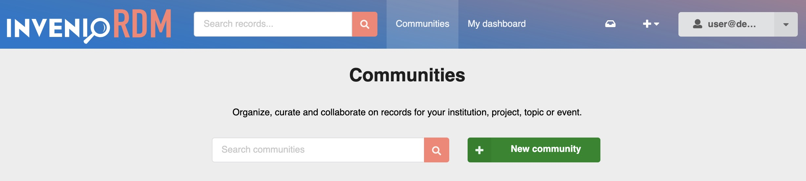
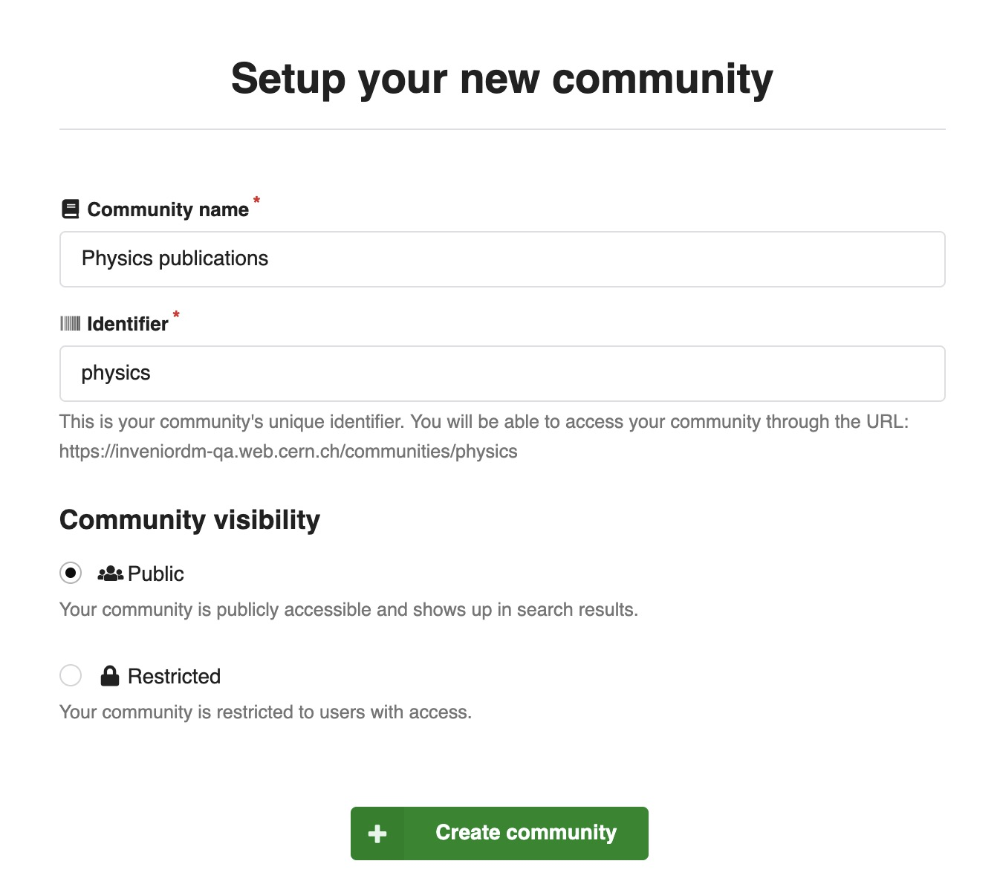
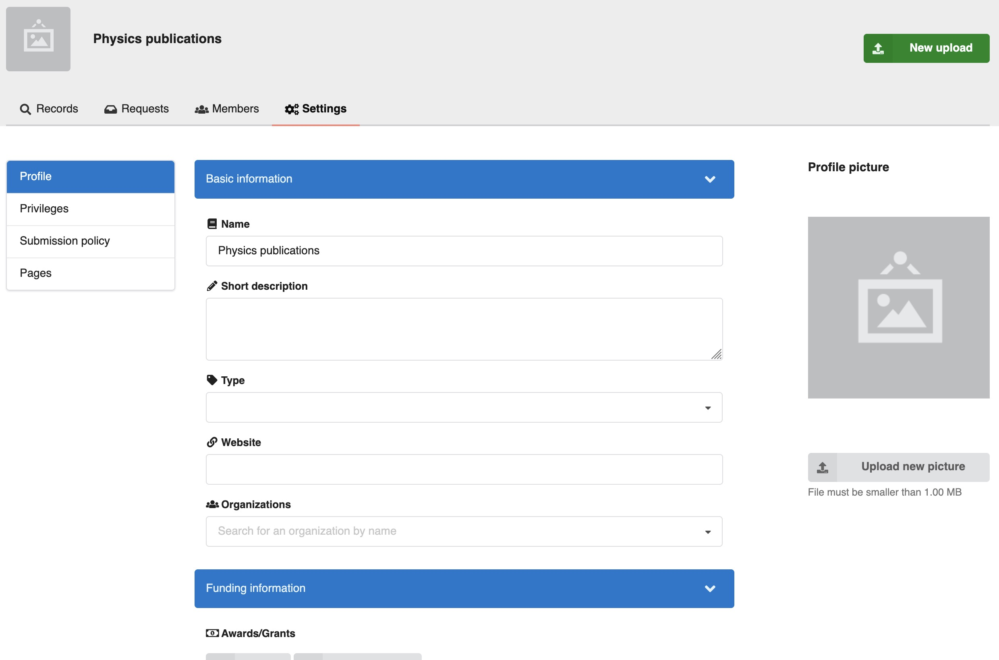
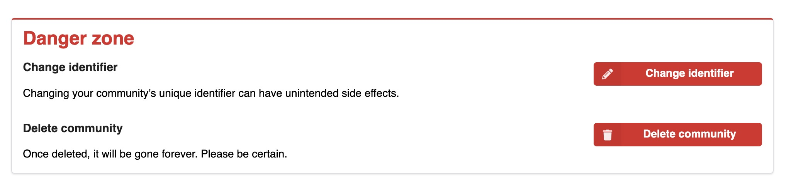
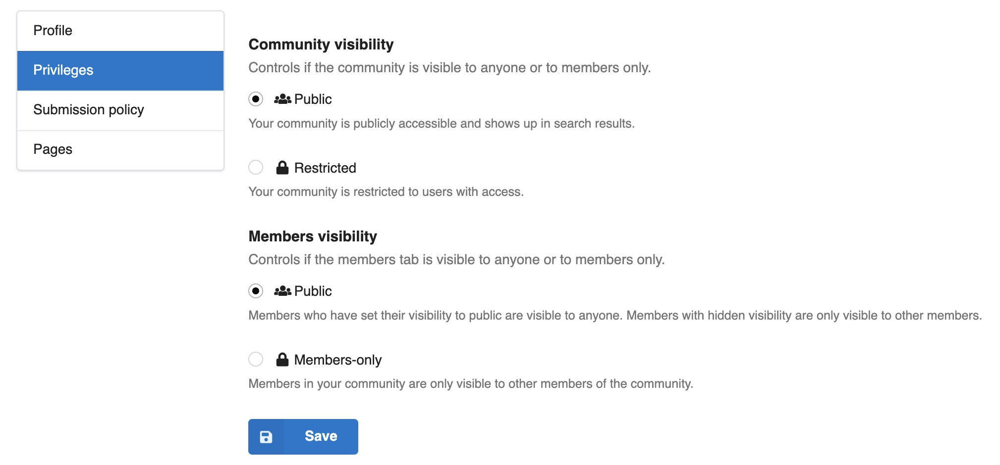
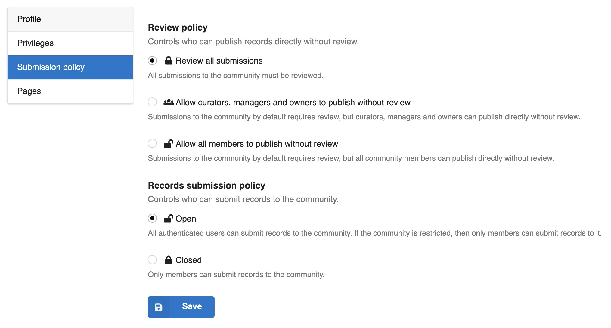
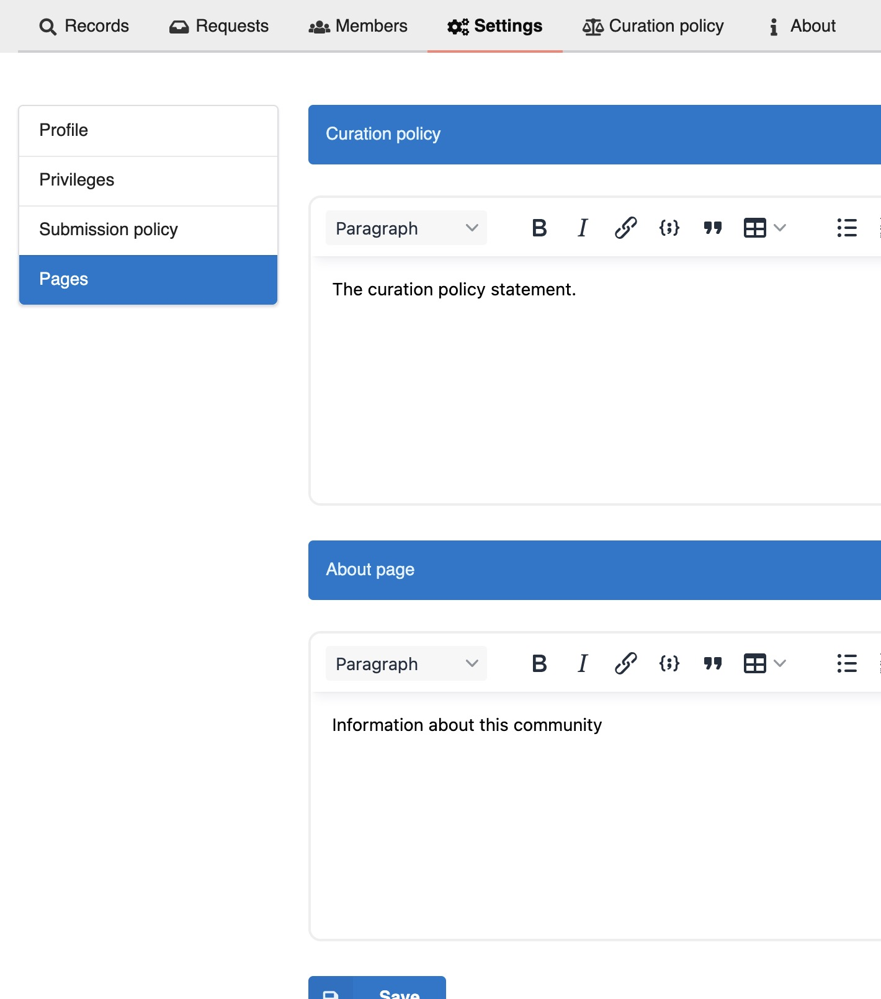
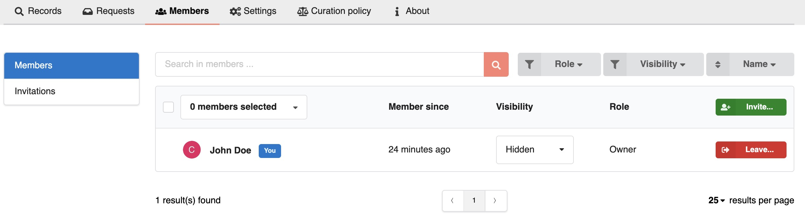
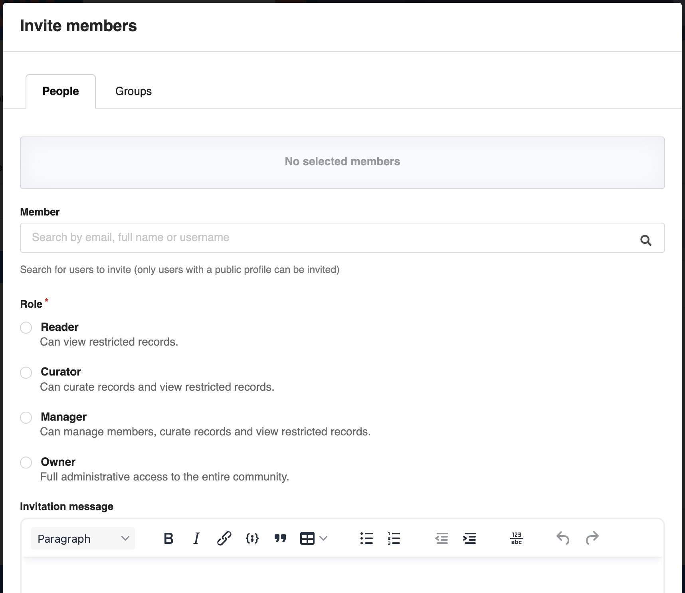
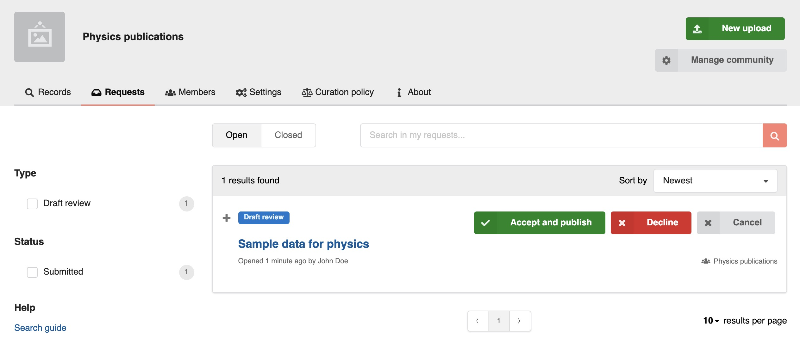

# Communities

## What is a Community?

In InvenioRDM, a **Community** is your dedicated space to organize, highlight, and manage a collection of [records](records.md). It acts as a **collaborative hub** within the InvenioRDM platform, bringing together content connected by a shared theme, project, or institutional purpose.

As a community manager, communities enable you to:

- **Group Content**: Easily gather and display records relevant to your community, providing a focused browse experience for your users.
- **Establish Visual Identity**: Give your community a distinct look and feel. When creating a new community, you can choose the name and write a description, upload your own logo, and define the URL slug. This helps you establish a clear brand, ensuring your users immediately know they're in the right place and fostering a sense of belonging.
- **Curate**: Take control over which records are included in your community, ensuring high-quality content and metadata.
- **Manage Members**: Define who can contribute to and manage your community. You can assign different roles to members, such as administrators, curators, or contributors, to delegate tasks and streamline your workflow.
- **Decide who can submit**: Control which users or groups are allowed to submit new records directly to your community.
- **Pages**: Create custom pages, such as an About page or a Curation Policy, to provide your users with essential information and guidelines specific to your community.

## Create a community

When creating a community, you can choose its name and identifier, which is used as a `slug` for its URL:

!!! tip

    The identifier (and the slug) is not persistent, and can be changed in the settings panel.

## Community settings

### Profile

The **Profile** section in the Settings panel, you can provide your community's information and upload its logo.

You can also change its identifier and delete the community.

!!! tip

    Deleting a community does not delete its records. It only removes the community association from each record.

### Privileges

The **Privileges** section allows you to define who can view your community and its members, giving you fine-grained control over visibility.

#### Community visibility

This setting controls whether your community is visible to the public or restricted to its members only.

- **Public**: Your community is publicly accessible and appears in search results, allowing anyone to discover and browse its records.
- **Restricted**: Your community is restricted to users with explicit access. Only community's members or authorized users will be able to view its records

Both **public** and **restricted** communities can contain **restricted records**, and thus
not all records in a public community may be visible to everyone. A **restricted**
community on the other hand may **only contain restricted records**.

#### Members visibility

This setting determines who can see the list of members within your community.

- **Public**: Members who have chosen to set their individual profile visibility to "public" will be visible to anyone. Members with "hidden" visibility will only be visible to other members of the community.
- **Members-only**: Only other members of your community can view the list of members. No member information will be publicly displayed.

### Submission Policy

The **Submission policy** section allows you to define who can submit records to your community and whether those submissions require review before publication.

#### Review policy

This setting controls who can publish records directly to your community without a review step.

- **Review all submissions**: All submissions to your community **must** undergo a review process before being published. This ensures strict quality control.
- **Allow curators, managers, and owners to publish without review**: Submissions by default require review. However, users with the roles of **curator, manager, or owner** can publish records directly without needing a review.
- **Allow all members to publish without review**: By default, submissions require review. However, **all community members** can publish records directly to the community without requiring a separate review process.

!!! tip

    If you allow publishing without a review, InvenioRDM will still create a review [request](requests.md). This request is automatically accepted without sending a [notification](notifications.md).

#### Records submission policy

This setting controls which users are allowed to submit records to your community.

- **Open**: All authenticated users are permitted to submit records to your community. If your community is set to "Restricted" under Privileges, only members can submit records.
- **Closed**: Only members of your community can submit records.

### Pages

The **Pages** section allows you to create and edit custom content pages for your community. These pages are an excellent way to provide additional information, guidelines, or resources to your users.

- **Curation policy**: Use this rich text editor to clearly outline your community's curation policy. This helps contributors understand the standards and criteria for content inclusion.
- **About page**: Use this rich text editor to provide general information about your community. You can include details such as its mission, goals, scope, or any other relevant information for your members and visitors.

## Members

The **Members** tab in your community's navigation allows you to view and manage all individuals and groups associated with your community. You can see their roles, visibility settings, and when they joined.

The main "Members" view provides a comprehensive list of your current community members. As a owner of your community, you can search for existing members, change its visibility and role.

You can invite new members to collaborate in your community. The search autocompletion will look for existing users or groups in your system. Members can invited with a role:

- **Reader**: Can view restricted records within the community.
- **Curator**: Can curate records (e.g., add/remove records to/from the community) and view restricted records.
- **Manager**: Can manage other members, curate records, and view restricted records.
- **Owner**: Has full administrative access to the entire community, including all settings and permissions.

This operation will create an invitation request and the user will receive an e-mail [notification](notifications.md). Once approved, the user will become a member. Be aware that **groups will be immediately added**, without request or notification.

## Requests

In the **Requests** tab, you can view all [requests](./requests.md) for your community. It allows you to manage both draft reviews and inclusion requests, and any other kind of request.

The request page provides a dedicated space for communication. You can **have a conversation with the submitter** directly within the request, and you can **accept or decline the inclusion request** based on your community's curation policies.

When a submission requires expert input or peer review, you can **assign reviewers** to give specific users or groups access to review the inclusion request. This allows you to share the request with external experts, collaborators outside your community, or community members who normally wouldn't have access (such as readers). Reviewers can provide feedback on the research publication draft or assess whether a record meets your community's inclusion criteria. They participate in the request conversation and share their expertise to help you make an informed curation decision, while the possibility to accept or decline the request remains to the community responsibles (curators, managers and owners).

You can find the high-level architecture documentation for communities [here](../maintenance/architecture/communities.md) and configuration options for requests and reviewers [here](../operate/customize/requests.md).
