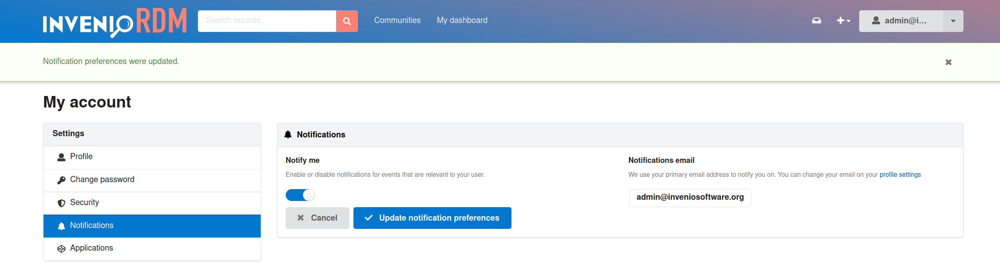

# Notifications

_Introduced in v12_

**Audience**: End-users

Notifications are sent following specific events (e.g. community invitation, community record submission), to inform users of relevant actions. Institutions can define their own available ways of sending notifications. InvenioRDM uses email notifications by default.

Consider the case of submitting a record to a community. When you do this, a notification will be sent to community owners and managers informing them of your request. When they comment on your request, you will receive a notification of said comment. This will allow all participating parties to get informed of relevant actions and updates, without anyone needing to manually observe the site.

## Notification Settings

Available notification settings can be accessed via the account settings page (`<domain>/account/settings/notifications/`). Additionally, the main menu has an entry for easy access:

For personal preferences, it is possible to completely enable or disable receiving notifications. The info on the right hand side will show the channel on which notifications will be received.

