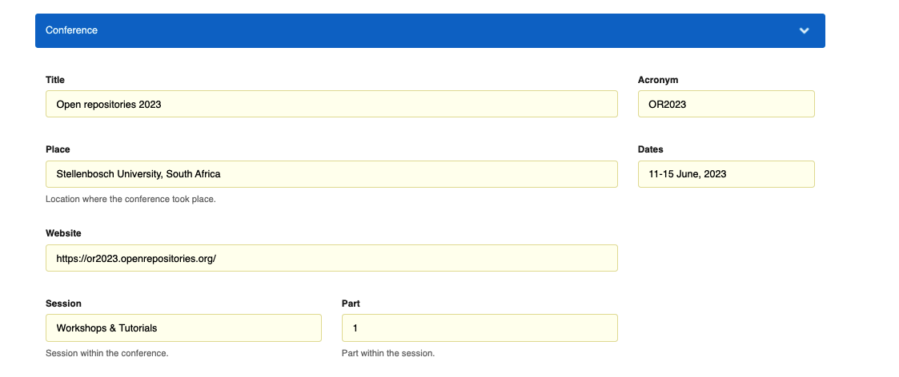
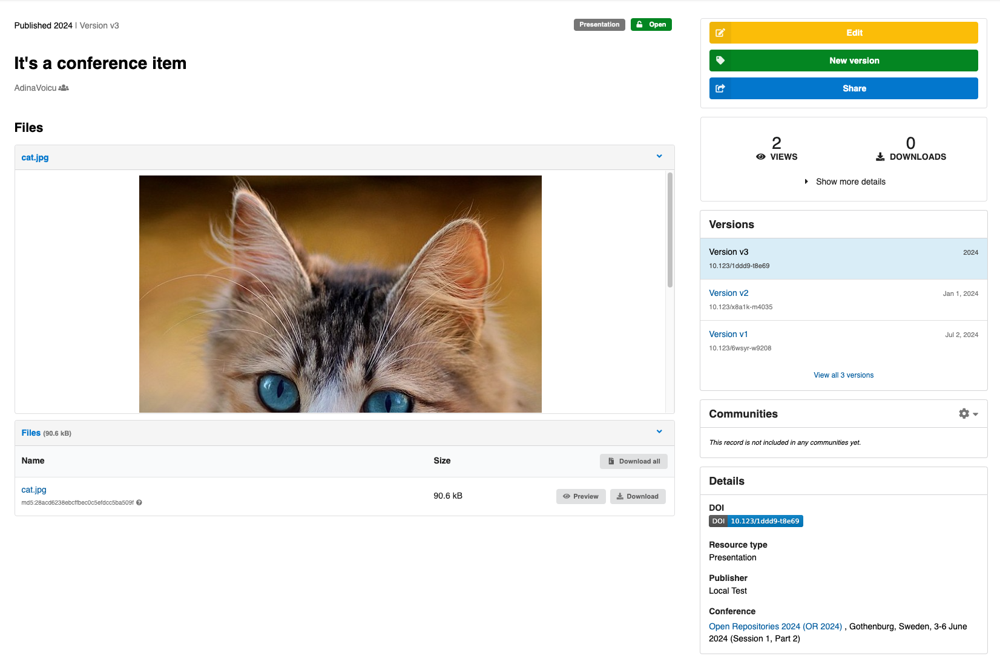
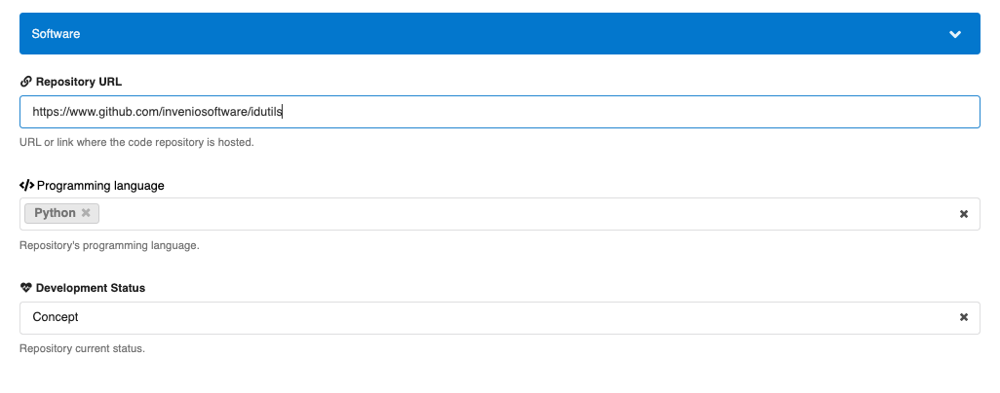
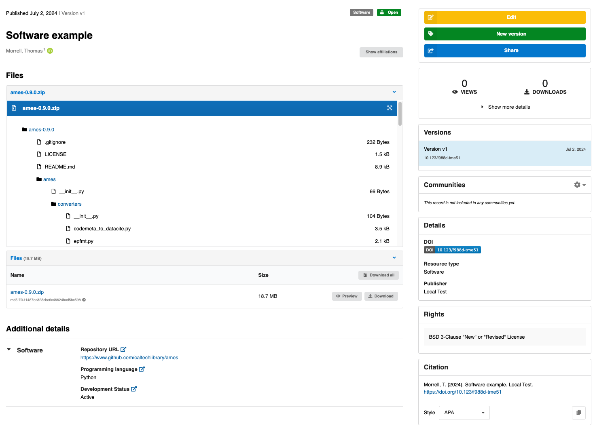

_Introduced in InvenioRDM v12_

This section allows you to provide detailed publication metadata for your upload, depending on whether it is a journal article, a book chapter/report, or a thesis.
These fields are particularly valuable for universities, research institutes, and repositories that manage theses, journal articles, and reports, as they support accurate metadata capture for institutional reporting, discovery, and interoperability.

📰 Journal (for journal articles)

Fill this section if your upload was published in a scholarly journal. 

* Title: The full name of the journal (e.g., Journal of Environmental Studies).
* ISSN: The journal’s International Standard Serial Number (e.g., 2077-9550).
* Volume: The volume in which the article appeared (e.g., 645).
* Issue: The issue number (e.g., 7).
* Page range or article number: Enter either the page range (e.g., 15-23) or article identifier (e.g., A29).

📖 Imprint (for books, chapters, or reports)

Use this if your upload is part of a book or report (e.g., a chapter, contribution, or institutional publication).

* Book or report title: Title of the larger work your submission is part of (e.g., Handbook of Bioethics).
* Place: The city and country where the book/report was published (e.g., Oxford, United Kingdom).
* Pagination: Specific page numbers or page range (e.g., 15-23 or 158).
* ISBN: The book’s International Standard Book Number (e.g., 0-06-251587-X).
* Edition: The edition number, if applicable (e.g., 3 for third edition).

🎓 Thesis (for academic theses)

If your upload is a bachelor’s, master’s, or doctoral thesis, use this section.

* Awarding university: Full name of the institution that granted the degree (e.g., University of Geneva).
* Awarding department: Name of the faculty or department (e.g., Department of Computer Science).
* Thesis type: The level of the thesis (e.g., PhD, Masters, Bachelors).
* Submission date: The date the thesis was officially submitted (format: YYYY-MM-DD
* Defense date: The date the thesis was defended (if applicable).

Once the fields are filled and the record is published, publishing information will be displayed on the record landing page on the right side panel, as follows:

## Meeting

This field can be used to describe a meeting, e.g. a conference.

**Deposit form**

**Landing page**

Meeting information is displayed in the section "Details", under "Conference".

**Metadata**

- **title** `String`: Meeting or conference title.
- **acronym** `String`: Acronym that represents the conference.
- **dates** `String`: Dates when the meeting took place.
- **place** `String`: Location where the meeting took place.
- **session** `String`: Session within the meeting or conference.
- **session_part** `String`: Part within the session.
- **url** `URL`: Link of the conference website.

## CodeMeta

This group of fields contains metadata to describe a software record based on the [CodeMeta standard](https://codemeta.github.io/index.html).

**Deposit form**

**Landing page**

Software information is displayed in the section "Additional details", under the tab "Software".

**Metadata**

- **codeRepository** `URL`: Link to the repository where the related code is located (e.g. Github).
- **programmingLanguage** `Vocabulary`: Name of the programming language used to develop the software from the [vocabulary](https://github.com/inveniosoftware/invenio-rdm-records/blob/e64dd0b81757a391584e63d162d5e6caf6780637/invenio_rdm_records/fixtures/data/vocabularies/contrib/codemeta/programming_languages.yaml).
- **developmentStatus** `Vocabulary`: Description of the development status (e.g. "Active"). Uses a controlled vocabulary defined in [repostatus](http://www.repostatus.org/).

In order to add those fields to record metadata of your instance follow this [guide](../../operate/customize/metadata/optional_fields.md).

