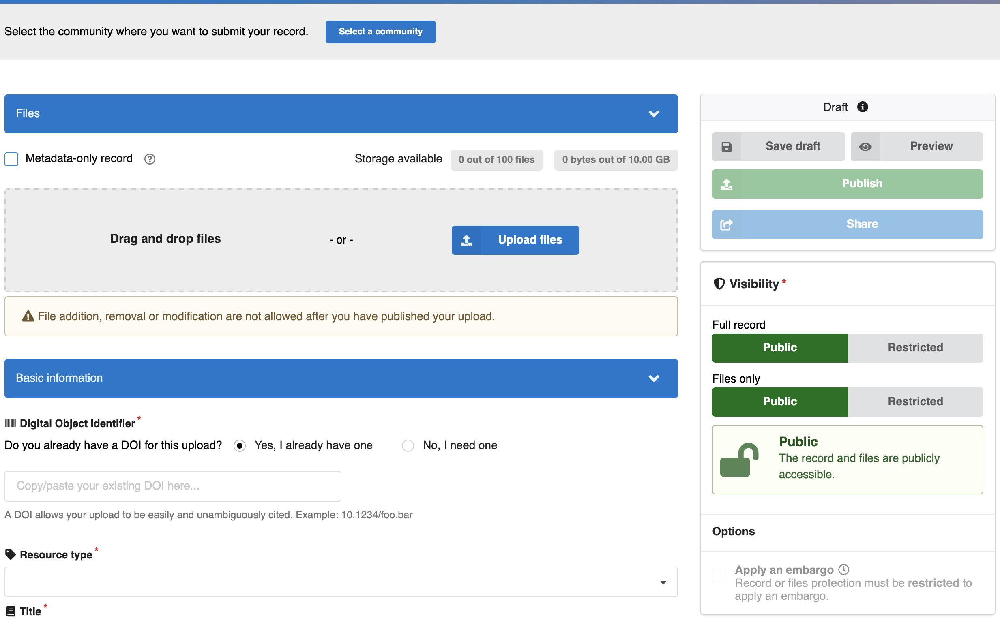
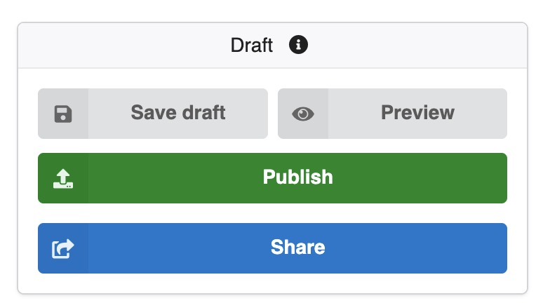
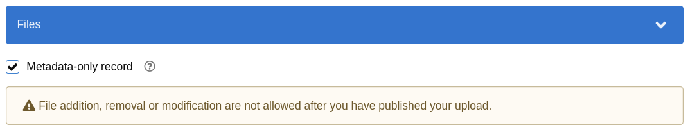
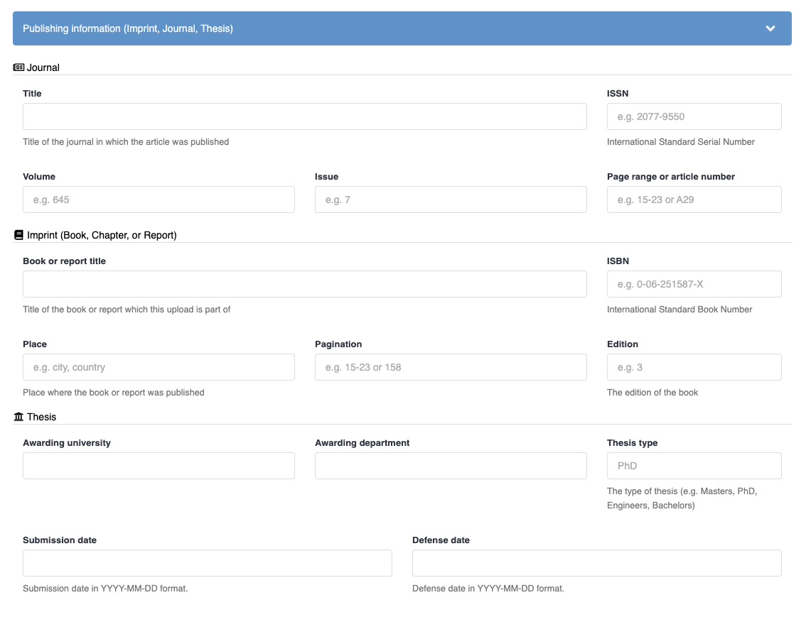
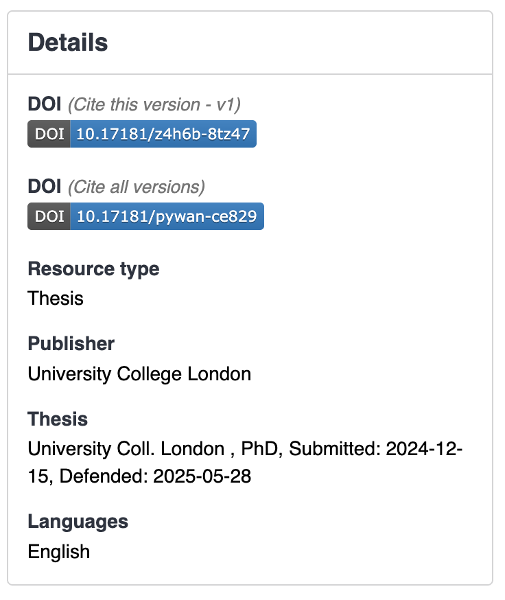
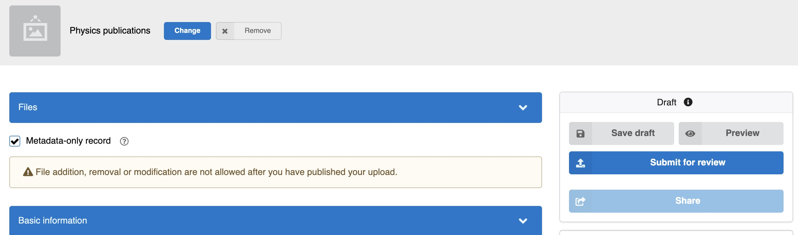
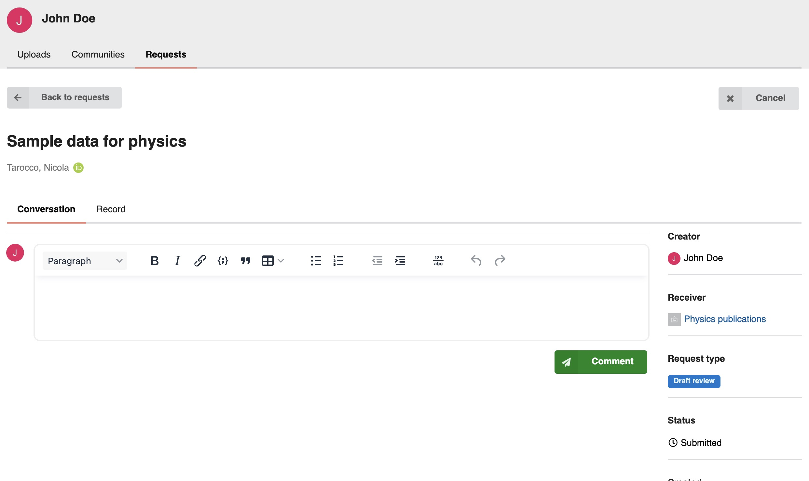

# Upload

You can deposit new records into InvenioRDM by using the **upload form**. To begin, click the "**New upload**" button or link.

This action will open the **deposit form page**, where you can:

- **Select the files** you wish to upload.
- **Fill in the necessary metadata information** about your record.
- **Define access restrictions** to control who can view and access your content.

Once you save your record as a draft for the first time, you gain access to additional features. You can then **preview how your record will appear** on its landing page by using the **Preview** button, and you can also **share it with colleagues** for feedback or collaboration before final publication.

## Metadata-only records

A metadata-only record is a record that contains only descriptive metadata, and no associated files. These types of records can be useful in cases where the resource does not have a corresponding digital object or its files are hosted elsewhere.

The site administrator can choose to enable or disable the creation of metadata-only records. For more on that, see [this section](../operate/customize/metadata/metadata_only.md).

To mark a record as metadata-only, simply select the "Metadata-only record" checkbox when creating a new record:

## Restrict records

A record can be marked as restricted in order to restrict its access to specific users. This is useful for example to share a record with a colleague or team before making it public.

When creating or editing a record, click the "Restricted" checkbox under "Full record" in the "Visibility" section of the form to make the entire record -metadata and files- restricted:

To **only** make the files restricted, click the "Restricted" checkbox under "Files only" in the "Visibility" section.

For a deeper understanding of the high-level architecture behind records, **refer to the dedicated documentation page** located [here](../maintenance/architecture/records.md).

## Add-on metadata fields

InvenioRDM offers **add-on metadata fields** that are not enabled by default. To utilize these, you will need to **add them to your configuration**. These specialized fields are designed for specific publication types, including:

- **Journal articles**
- **Book chapters/reports**
- **Theses**

These add-on fields are particularly valuable for institutions like **universities, research institutes, and repositories** that manage diverse scholarly outputs.

📰 Journal (for journal articles)

Fill this section if your upload was published in a scholarly journal.

- Title: The full name of the journal (e.g., Journal of Environmental Studies).
- ISSN: The journal’s International Standard Serial Number (e.g., 2077-9550).
- Volume: The volume in which the article appeared (e.g., 645).
- Issue: The issue number (e.g., 7).
- Page range or article number: Enter either the page range (e.g., 15–23) or article identifier (e.g., A29).

📖 Imprint (for books, chapters, or reports)

Use this if your upload is part of a book or report (e.g., a chapter, contribution, or institutional publication).

- Book or report title: Title of the larger work your submission is part of (e.g., Handbook of Bioethics).
- Place: The city and country where the book/report was published (e.g., Oxford, United Kingdom).
- Pagination: Specific page numbers or page range (e.g., 15–23 or 158).
- ISBN: The book’s International Standard Book Number (e.g., 0-06-251587-X).
- Edition: The edition number, if applicable (e.g., 3 for third edition).

🎓 Thesis (for academic theses)

If your upload is a bachelor’s, master’s, or doctoral thesis, use this section.

- Awarding university: Full name of the institution that granted the degree (e.g., University of Geneva).
- Awarding department: Name of the faculty or department (e.g., Department of Computer Science).
- Thesis type: The level of the thesis (e.g., PhD, Masters, Bachelors).
- Submission date: The date the thesis was officially submitted (format: YYYY-MM-DD
- Defense date: The date the thesis was defended (if applicable).

Once the fields are filled and the record is published, publishing information will be displayed on the record landing page on the right side panel, as follows:

In order to add those fields to record metadata of your instance follow this [guide](../../operate/customize/metadata/custom_fields/publication-information-config.md).

## Submit to a community

When you are uploading a new record, you have the option to select a community for submission. If you choose a community, the "Publish" button will automatically change to "Submit for review."

When you submit a new draft record to a community, InvenioRDM automatically **creates a new review request**. This allows the community members to review your submission and decide whether to accept it into their community.

**Until the review request is accepted**, your draft record remains private. It will **only be visible to you (the uploader) and the members of that specific community**.
