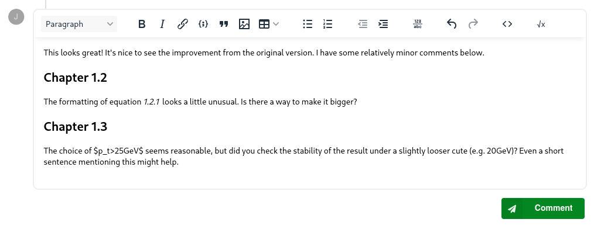
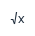
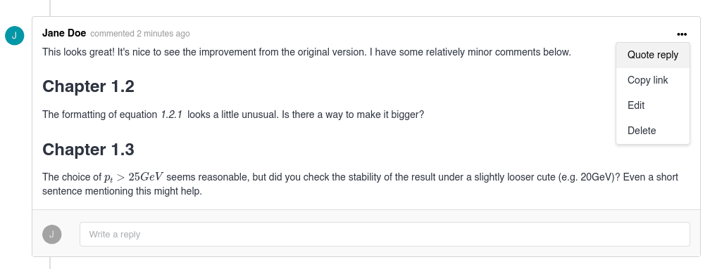
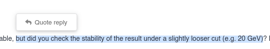
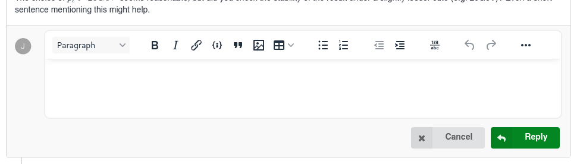
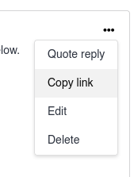
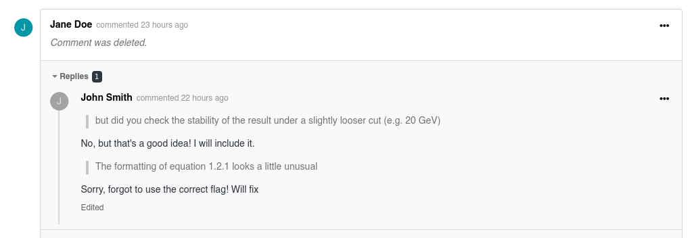
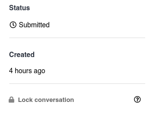
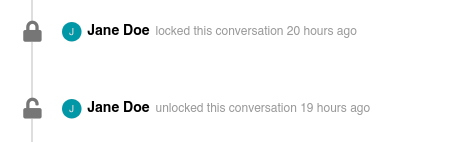

# Requests

In InvenioRDM, requests allow users to manage many different use cases themselves. Some of the available request types are:

*Access*

* Guest access — to allow non-authenticated users access to restricted files of records
* User access — to allow authenticated users access to restricted files of records

*Submission/inclusion*

* Community inclusion — to include a published record in a [community](communities.md)
* Draft review — to include a draft record in a community (internally known as submission)
 
*Membership*

<!-- * Membership request — to join a community as a member -->
* Member invitation — to invite a member to join your community

*Subcommunity*

* Subcommunity request — to add your community as a subcommunity of a parent community
* Subcommunity invitation — to invite a community to be a subcommunity of a parent community

*Moderation*

* [User moderation](./administration.md#user-management) — moderation requests for review by administrators 
* Record deletion — requests from users to administrators to delete their own records
* File modification — requests from users to administrators to delete their own records

## Actions

Requests are resolved via **actions**. The only action available to the user is Cancel, and the receiver of the request can Accept or Decline the request. If the request is accepted, the corresponding action will be executed, and if it is cancelled or declined no action will be taken.

## Comments

Requests come with advanced conversation features allowing everyone involved to discuss in detail.

### Writing a comment

The text editor at the bottom of the page allows you to create a new comment.
This is a feature-rich editor with support for many advanced types of content.
The majority of content is edited in a "what you see is what you get" manner, where the contents of the editor clearly reflect how the comment will look once it is submitted.

#### LaTeX equations

You can surround LaTeX content with one of two 'delimiters' to ensure it's rendered as a mathematical equation:

- `$` for equations inline with text
- `$$` for full-width 'block' equations

**The content is not rendered immediately in the editor.**
However, you can preview it before submitting by clicking the "Preview math equations" button: 

This will show the full comment in a dialog box, exactly as it will be shown to readers.
It will **not** save or submit the comment; it's just a temporary preview.
Once the comment is submitted, the equations will be shown fully-rendered.

All [**math-mode TeX/LaTeX** features](https://www.overleaf.com/learn/latex/Mathematical_expressions) supported by the web-based MathJax rendering engine can be used.
Keep in mind that [environments](https://www.overleaf.com/learn/latex/Environments) are not supported.
You may also encounter [some other differences to normal TeX](https://docs.mathjax.org/en/latest/input/tex/differences.html).

#### Quoting other comments

When writing a [reply to a comment](#replying-to-a-comment), you can include a "quote" of either all or part of the text.
You can also include multiple separate quotes if you want to reply to different sections of the text individually.

To quote the full comment, simply click the action menu (the 3 horizontal dots) on the comment you want to quote, and select "Quote reply":

Alternatively, to quote a part of a comment, highlight the text you wish to quote and click "Quote reply" in the popover that appears:

#### Auto-saved drafts

Your new comment drafts are automatically saved as you type, preventing loss of your comments if you accidentally navigate away from the page.

##### Limitations
The draft is saved locally in your browser and is **not** synchronised to your account.
This means your draft will not show up on a different device or browser, and can be lost if you clear your browser's storage.
Additionally, in-progress edits to existing comments are not saved.

!!! Warning
    Don't rely on auto-saving for storing drafts of long comments over an extended period of time.
    Browser storage can be volatile, and your draft can be lost at any time.
    This feature is solely intended to help recover recent drafts, e.g. in the case of accidentally reloading the page.

### Replying to a comment

To better preserve context, we recommend replying directly to comments through the "Write a reply" box instead of simply writing a new comment at the bottom of the page.
This helps group related information together and makes the review more readable.

To write a reply, simply click the "Write a reply" box.
When clicked, the full rich text editor will appear, and you can use all the same editing tools to compose the reply.

### Sharing a link to a comment

When dealing with requests that have a particularly large number of comments, it can be useful to share a link to a specific comment rather than the entire request.
This way, the recipient will always be taken to the exact comment you intended and it will be clearly highlighted to them.

To copy a link to a comment, click the action menu (the 3 horizontal dots) and select "Copy link":

The link will be copied to your clipboard.
Unauthenticated users might not be able to open the link; it's important that the recipient has access to the request.
For example, they must be a member of the community with the permission to see requests, the submitter of the record, or manually added to the request as a reviewer.
Copying a link does not change the access restrictions of the request.

### Editing or deleting a comment

To edit a comment or reply, simply click the action menu (the 3 horizontal dots) and select "Edit".
Make your changes, and click the "Save" button.
Your changes will be applied immediately, and the comment will be marked with a small "Edited" label visible to all users.

To delete a comment or reply, select "Delete" from the action menu, then confirm your action by clicking "Delete" again in the dialog.
The comment will be deleted immediately, and replaced with a "stub".
Existing replies will **not** be deleted and new replies can still be added.
A link to the stub can still be copied, and existing links to the deleted comment will continue to work.

!!! Warning
    You cannot restore the original comment.
    The content is **deleted permanently**.

### Locking the conversation

In some cases, you may wish to lock the conversation after a certain period of the review is concluded.
When a conversation is locked or unlocked, an event appears in the conversation timeline for all viewers:

- New comments and replies cannot be created by anyone, including community curators
- Existing comments cannot be edited
- Existing comments can still be deleted

To lock a conversation, click the "Lock conversation" button in the right-hand sidebar:

To unlock, click the "Unlock conversation" button.
Community curators (and above) can unlock the conversation at any time.
<!-- TODO: add a link to the community permissions docs once we have written them -->

Locking and unlocking create an event visible to all viewers in the conversation timeline:

